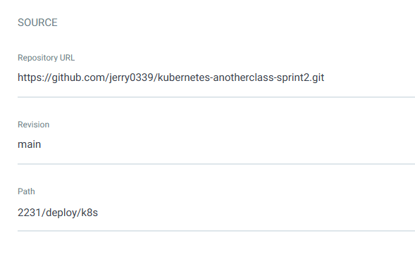
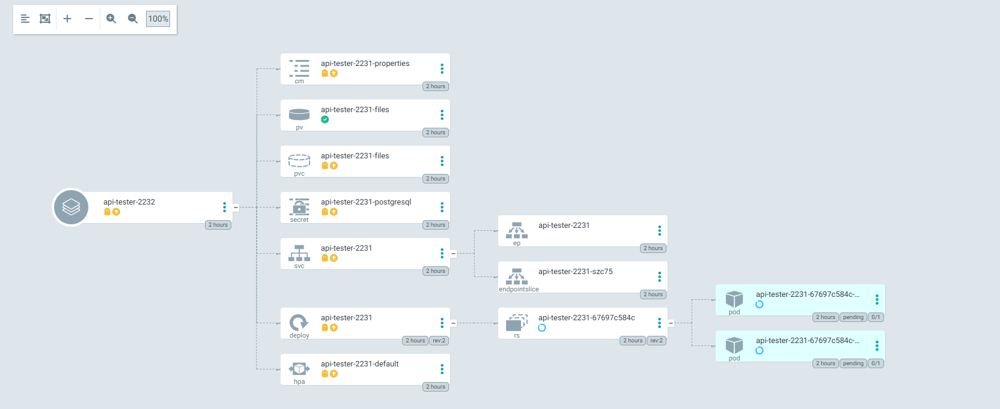

# ArgoCD 이용한 배포 환경 설정
* ArgoCD 아키텍처
* 1.ArgoCD App 생성
* 2.ArgoCD App 배포
* 3.ArgoCD의 Live Manifest vs Desired Manifest 비교
* 4.ArgoCD를 사용하면 좋은점?
* 5.ArgoCD Image Updater 이용한 이미지 자동 배포

 

## ArgoCD 아키텍처
* 

  

## 1. ArgoCD App 생성

### 1.1. GENERAL
* App이름, Project Name, Sync Policy - `Manual` 설정
* 
* Sync Option - `Auto-Create Namespace` 체크해 주면, DESTINATION에 작성한 네임스페이스를 알아서 생성해 줌
* 

 

### 1.2. SOURCE
* git 주소, 브랜치명, 배포할 파일들 위치한 경로 지정
* Path에 지정된 경로에 해당하는 yaml파일들은 모두 배포 대상으로 간주됨, Directory항목에서 디테일하게 설정이 가능함
* 

 

### 1.3. DESTINATION
* cluster url은 apiserver로 접근 가능한 url임, ArgoCD는 Master Node에 설치했으므로
* k8s 초기화시 생성된 svc를 통해 `kubernetes.default.svc` 도메인으로 접근할 수 있음
  * 
* Cluster URL - `https://kubernetes.default.svc`, Namespace 지정
* 

 

### 1.4. Helm
* SOURCE의 Path위치에 helm 설정 파일들이 있으면 해당 파일들을 읽어서 표시해 줌
* 

 

* 환경에 따라 values.yaml 파일을 나누어 두었다면 배포할 values.yaml 설정 파일을 선택 가능함
* 

  

## 2. ArgoCD App 배포
* SYNC 버튼 누르면 배포 옵션 설정 가능
* 기본 OPTIONS
  * PRUNE : GIt에서 자원 삭제 후 배포시 K8S에서는 삭제되지 않으나, 해당 옵션을 선택하면 삭제시킴
  * FORCE : --force 옵션으로 리소스 삭제
  * APPLY ONLY : ArgoCD의 Pre/Post Hook은 사용 안함 (리소스만 배포)
  * DRY RUN : 테스트 배포 (배포에 에러가 있는지 한번 확인해 볼때 사용)
* SYNC OPTIONS
  * SKIP SCHEMA VALIDATION : 매니패스트에 대한 yaml 스키마 유효성 검사를 건너뛰고 배포 (kubectl apply --validate=false)
  * PRUNE LAST : 동기화 작업이 끝난 이후에 Prune(git에 없는 리소스를 제거하는 작업)를 동작시킴
  * RESPECT IGNORE DIFFERENCES : 동기화 상태에서 특정 상태의 필드를 무시하도록 함
  * AUTO-CREATE NAMESPACE : 클러스터에 네임스페이스가 없을 시 argocd에 입력한 이름으로 자동 생성
  * APPLY OUT OF SYNC ONLY : 현재 동기화 상태가 아닌 리소스만 배포
  * SERVER-SIDE APPLY  : 쿠버네티스 서버에서 제공하는 Server-side Apply API 기능 활성화
* SYNCHRONIZE 버튼 누르면 배포 시작됨
* 
* 배포중인 내용들 확인 가능
  * 초록색이면 잘 배포된것, 노란색이면 배포중이거나 뭔가 문제가 있어 pending상태거나 등, 빨간색이면 오류
* 

  

## 3. ArgoCD의 Live Manifest vs Desired Manifest
* `Live Manifest`는 k8s 환경에 배포된 Manifest
* `Desired Manifest`는 GitHub에서 관리되는 Manifest
* k8s에 배포된 리소스를 직접 수정하면 ArgoCD의 Live Manifest에 반영이 되고, ArgoCD의 Live Manifest를 수정해도 k8s의 리소스도 수정되어 반영됨
  * Desired Manifest는 변경되지 않음 (git을 통해서만 변경 가능)
* `diff`는 Live Manifest와 Desired Manifest의 차이를 보여주는것 같지만, k8s에서 리소스 변경하거나 ArgoCD의 Live Manifest에서 리소스 변경시 diff에 표시되지 않을 수도 있음
* 따라서 리소스 스펙 변경 작업시 Git에서 변경하는 것이 원칙임 (GitOps 원칙에 해당됨)
* 

  

## 4. ArgoCD를 사용하면 좋은점?
* ArgoCD는 배포할때 쓰는 툴이고, 배포를 해야하는 상황은 2가지가 있음
  1. 리소스 스펙 변경
  2. App 버전 업데이트 (이미지 변경)
* ArgoCD 없을때 CD 환경
  * 리소스 스펙 변경
    * ArgoCD가 없는 환경에서는 yaml파일 수정후 커밋하고,
    * Jenkins에서 배포 Job 실행하여 변경된 k8s 리소스들 업데이트
  * App 버전 업데이트 (이미지 변경)
    * ArgoCD가 없는 환경에서는 App의 변경된 내용 푸시, Jenkins 배포 Job에서 이미지 빌드후 hub에 업로드하고,
    * helm을 사용하는 경우, `1.리소스 스펙 변경`에서처럼 변경할 필요 없이 helm upgrade ... --set 명령어로 배포 자동화
  * 
* ArgoCD를 사용하면?
  * 리소스 스펙 변경
    * 변경된 yaml파일들 git에 푸시하면 ArgoCD가 변경 감지하여 자동 배포
  * App 버전 업데이트시
    * App의 변경된 내용 푸시, Jenkins 배포 Job에서 이미지 빌드후 hub에 업로드
    * ArgoCD Image Updater가 hub의 이미지 업데이트를 감지하고 자동 배포 (단, helm을 사용해야 함)
  * 

  

## 5. ArgoCD Image Updater 이용한 이미지 자동 배포
* helm을 사용해야 함
  * `helm upgrade ... --set` 명령어를 내부적으로 사용하기 때문
* `todo`