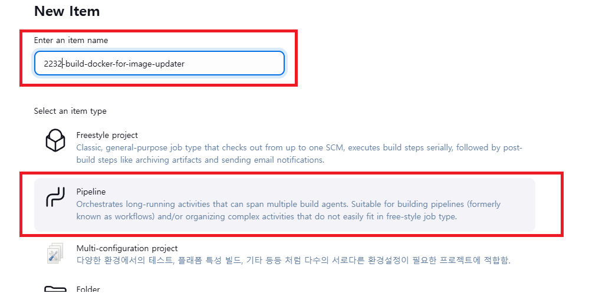
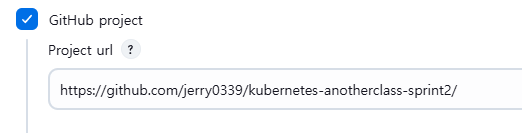
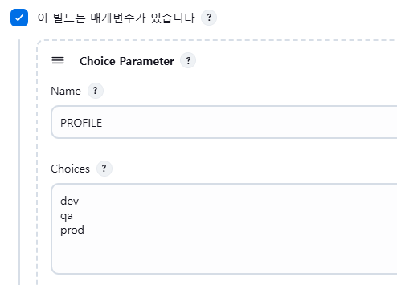
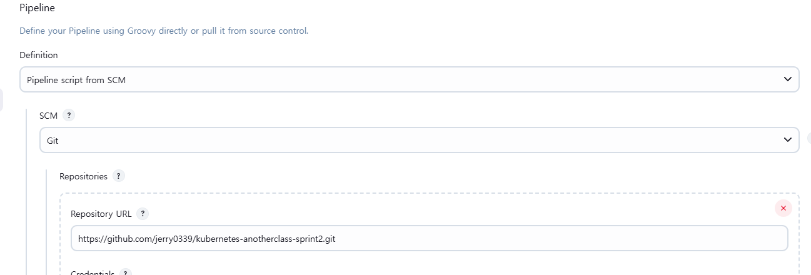
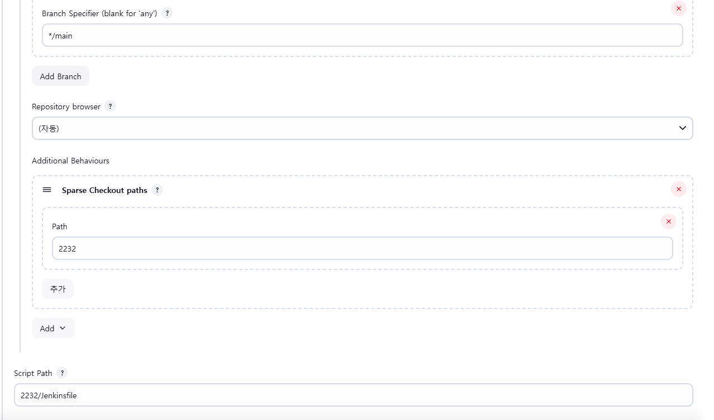
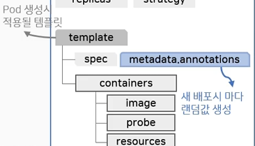

# Jenkins 이용한 CI 환경 설정
* **Jenkins pipeline이용하여 Image 빌드하고 registry에 push하는 내용까지만 진행** (registry: Docker Hub사용)
* [Jenkins 설치](/create-k8s/create-jenkins/jenkins-install.md) 및 CI 환경 세팅을 먼저 진행해야 함
* 아래의 레포 fork하여 진행함
  * https://github.com/k8s-1pro/kubernetes-anotherclass-api-tester
  * https://github.com/k8s-1pro/kubernetes-anotherclass-sprint2
    * 해당 내용중 [2232 디렉토리 내용](https://github.com/jerry0339/kubernetes-anotherclass-sprint2/tree/main/2232) 적용

<br>

## 1. Pipeline Item 생성
* Pipeline Item 생성
  * 
* 이미지 빌드할 Github project url 작성
  * 
* 매개 변수 추가
  * 매개 변수 있으면 아래처럼 추가해 주어야 하는데 Jenkinsfile에 작성해 놓았다면, 처음 빌드시 알아서 추가됨
  * 
* Pipeline Git 설정
  * `Pipeline script from SCM` 으로 정의
  * helm 파일들과 jenkinsfile 그리고 Dockerfile이 위치한 git 레포 url 작성 (clone url)
  * 
* Branch, Sparse Checkout path, 그리고 Script Path 지정
  * `Branch`: */main
  * `Sparse Checkout paths`: git 레포에서 설정 정보 디렉토리가 여러개로 나뉘어져 있을 경우 디렉토리 지정 ex. 2232
  * `Script Path`: git 레포에서 Jenkinsfile이 위치한 경로 지정 ex. 2232/Jenkinsfile
  * 
* 위 내용 모두 설정 완료 후 저장

<br><br>

## 2. Dockerfile 확인
* [참고 링크](https://github.com/jerry0339/kubernetes-anotherclass-sprint2/blob/main/2232/build/docker/Dockerfile)
* Dockerfile 확인, 설명
  ```dockerfile
  FROM openjdk:17 
  # COPY A B -> A이름의 파일을 B이름으로 복사
  COPY ./app-0.0.1-SNAPSHOT.jar /usr/src/myapp/app.jar
  # `-D 옵션`으로 Java 시스템 속성을 설정하여 Spring Boot 애플리케이션에 필요한 환경변수 값 전달, 지정된 JAR 파일 실행
  ENTRYPOINT ["java", "-Dspring.profiles.active=${spring_profiles_active}", "-Dapplication.role=${application_role}", "-Dpostgresql.filepath=${postgresql_filepath}", "-jar", "/usr/src/myapp/app.jar"]
  # 포트 설정
  EXPOSE 8080
  # 해당 이미지의 컨테이너의 Home 디렉토리 경로
  WORKDIR /usr/src/myapp
  ```
* 도커파일 `ENTRYPOINT`명령을 통해 아래와 같은 App의 설정정보에 값을 전달할 수 있음
  * `${spring_profiles_active}`, `${application_role}`, `${postgresql_filepath}`에 해당하는 내용
  * 애플리케이션의 설정 정보 예시
    ```yaml
    spring:
      profiles:
        active: local

    # App Port
    server:
      port: 8080

    # App 정보
    application:
      role: "ALL"
      version: "Api Tester v1.0.0"

    # Database 접속 정보 위치 (Secret으로 주입)
    postgresql:
      filepath: "/usr/src/myapp/datasource/postgresql-info.yaml"
    ```
* `${spring_profiles_active}`, `${application_role}`, `${postgresql_filepath}`는 환경변수로부터 값을 가져오는데
  * 아래와 같이 Pod 설정에 configMapRef으로, ConfigMap을 통해 전달 받을 수 있음
  * Deployment와 ConfigMap 예시
    ```yaml
    apiVersion: apps/v1
    kind: Deployment
    spec:
      # ...
      template:
        # ...
        spec:
          containers:
            - name: api-tester-2121
              image: jerry0339/api-tester:v1.0.0
              imagePullPolicy: Always
              ports:
                - containerPort: 8080
                  name: http
              envFrom:
                - configMapRef: # ConfigMap 설정
                    name: api-tester-2121-properties
    ```
    ```yaml
    apiVersion: v1
    kind: ConfigMap
    metadata:
      name: api-tester-2121-properties
      # ...
    data: # ${spring_profiles_active}, ${application_role}, ${postgresql_filepath}에 대응되는 데이터들
      spring_profiles_active: "dev"
      application_role: "ALL"
      postgresql_filepath: "/usr/src/myapp/datasource/postgresql-info.yaml"
    ```

<br><br>

## 3. Jenkins Credentials 설정
* Docker Hub 계정 및 k8s Config Credential 등록
* 젠킨스 관리 - Security의 Credentials - System - Global credentials (unrestricted) - Add Credentials
* 
* 이후 아래와 같이 Docker Hub 계정 정보 등록
  * ID(docker_password)의 경우 해당 Credential의 ID로 Jenkinsfile에서 사용할 예정 
* 

<br>

* k8s config 정보도 등록 (jenkins vm에서 **kubectl필요한 경우에만 등록**하면 됨)
* 

<br><br>

## 4. Image Versioning & imagePullPolicy
* 아래 내용은 Jenkinsfile을 이용한 파이프라인 설정을 보기전에, 이미지 태깅 전략에 대한 내용
* 이미지 tag(버전에 해당)로 latest를 사용할 경우 (ex. dev환경),
  * 마지막 배포 버전인지? 최신 안정화 버전인지? 구분이 명확하지 않음
  * 다른 버전으로 롤백을 해야하는 경우 혼란
  * 이미지가 latest로 계속 푸시되기 때문에 `imagePullPolicy:always`를 사용해야 배포 가능
    * imagePullPolicy?: k8s container 리소스 설정 정보에 해당
      * IfNotPresent - k8s Node에 해당 이미지 있으면 먼저 사용, 없으면 hub 확인
      * Always - 항상 hub에서 이미지 가져옴, hub연결 안될시 Pod생성 에러
    * cf. 아래와 같은 옵션으로 IfNotPresent를 사용할 수도 있음
    * 
* 따라서 `1.0.2`와 같은 명시적인 tag를 사용하고 imagePullPolicy로 IfNotPresent를 사용하는 것이 좋음
  * 5에서 확인할 Jenkinsfile에는 `x.y.z-날짜.시간` 형식의 tag를 사용
  * ex. jerry0339/api-tester:1.1.2-250405.160804

<br><br>

## 5. Jenkinsfile 확인
```groovy
pipeline {
    agent any

    tools {
        gradle 'gradle-8.11.1'
        jdk 'jdk-17'
    }

    parameters {
        // 배포 환경 선택
        choice(choices: ['dev', 'qa', 'prod'], name: 'PROFILE', description: '배포 환경 선택')
    }

    environment {
        DOCKERHUB_USERNAME = 'jerry0339'
        GITHUB_URL = 'https://github.com/jerry0339/kubernetes-anotherclass-sprint2.git'

        APP_VERSION = '1.1.2'
        // %y%m%d.%H%M%S: 년월일.시분초
        // default: UTC 기준, 한국 시간(KST)으로 변경하려면 Jenkins JVM 옵션 변경해야 함
        BUILD_DATE = sh(script: "echo `date +%y%m%d.%H%M%S`", returnStdout: true).trim()
        // %y%m%d.%H%M%S: 년월일.시분초
        TAG = "${APP_VERSION}-" + "${BUILD_DATE}"

        // 실습 넘버링
        CLASS_NUM = '2232'
    }

    stages {
        stage('소스파일 체크아웃') {
            steps {
                // 소스코드를 가져올 Github 주소
                git branch: 'main', url: 'https://github.com/jerry0339/kubernetes-anotherclass-api-tester.git'
            }
        }

        stage('소스 빌드') {
            steps {
                // 755권한 필요 (윈도우에서 Git으로 소스 업로드시 권한은 644)
                sh "chmod +x ./gradlew"
                sh "gradle clean build"
            }
        }

        stage('릴리즈파일 체크아웃') {
            steps {
                checkout scmGit(branches: [[name: '*/main']],
                        extensions: [[$class: 'SparseCheckoutPaths',
                                      sparseCheckoutPaths: [[path: "/${CLASS_NUM}"]]]],
                        userRemoteConfigs: [[url: "${GITHUB_URL}"]])
            }
        }

        stage('컨테이너 빌드 및 업로드') {
            steps {
                // jar 파일 복사
                sh "cp ./build/libs/app-0.0.1-SNAPSHOT.jar ./${CLASS_NUM}/build/docker/app-0.0.1-SNAPSHOT.jar"

                script{

                    // 도커 로그인 - Jenkins Credentials에 저장된 데이터 이용
                    withCredentials([usernamePassword(credentialsId: 'docker_password', passwordVariable: 'PASSWORD', usernameVariable: 'USERNAME')]) {
                        sh "echo " + '${PASSWORD}' + " | docker login -u " + '${USERNAME}' + " --password-stdin"
                    }

                    // 도커 빌드 및 업로드
                    sh "docker build ./${CLASS_NUM}/build/docker -t ${DOCKERHUB_USERNAME}/api-tester:${TAG}"
                    sh "docker push ${DOCKERHUB_USERNAME}/api-tester:${TAG}"

                    // 도커 이미지 삭제
                    sh "docker rmi ${DOCKERHUB_USERNAME}/api-tester:${TAG}"
                }
            }

            post {
                always {
                    // 도커 로그아웃
                    sh "docker logout"
                }
            }
        }
    }
}
```