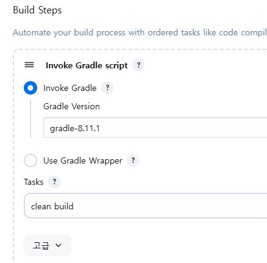
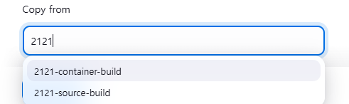
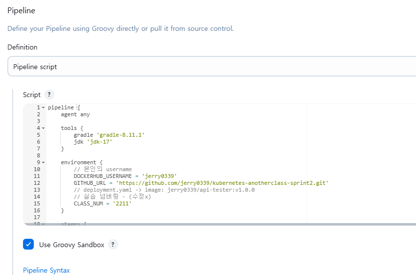
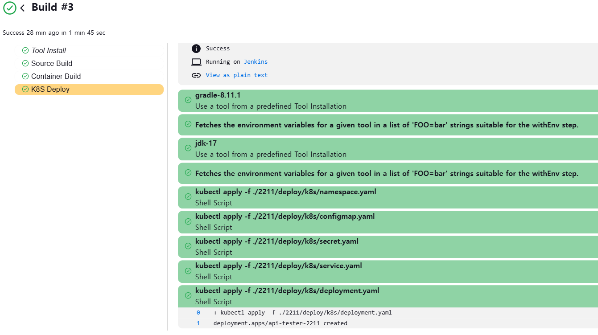
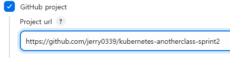
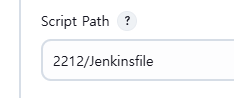
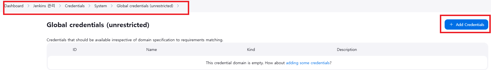
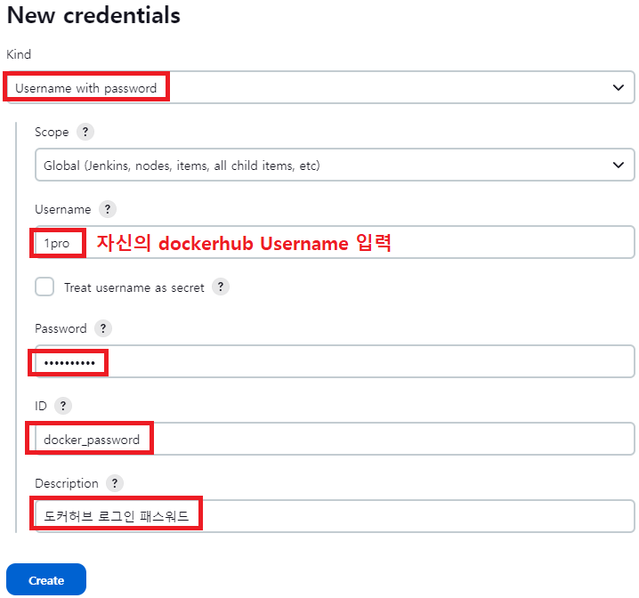
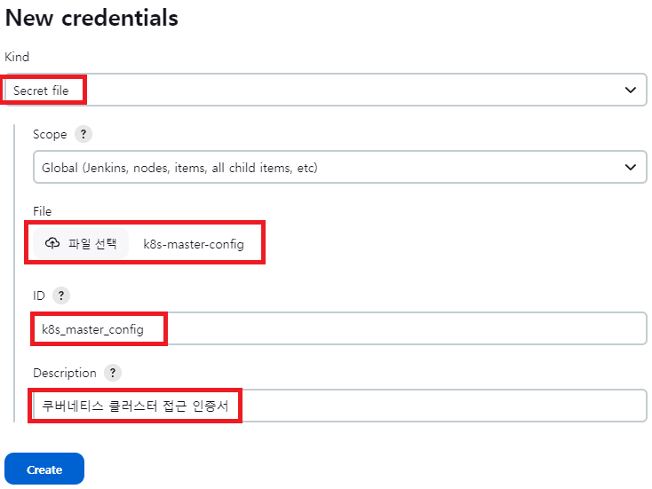

# Jenkins 이용한 CI 환경 설정
* [Jenkins 설치](/create-k8s/create-jenkins/jenkins-install.md)를 먼저 진행해야 함
* 아래의 레포 fork하여 진행함
  * https://github.com/k8s-1pro/kubernetes-anotherclass-api-tester
  * https://github.com/k8s-1pro/kubernetes-anotherclass-sprint2

<br>

## 1. 프로젝트 빌드 Item 생성
* 아래 내용들 적용 후 빌드 테스트
* Github project에 url 작성
  * `https://github.com/jerry0339/kubernetes-anotherclass-api-tester/`
* 소스 코드 관리 - Git 에서 Repository URL과 브랜치 설정
  * `https://github.com/jerry0339/kubernetes-anotherclass-api-tester.git`
  * `*/main`
* Build Steps - Invoke Gradle script 항목에서
  * vm에 설치한 gradle 버전 설정
  * Tasks에 `clean build` 스크립트 추가
  * 

<br><br>

## 2. 컨테이너 이미지 빌드 Item 생성
* 아래 내용들 적용 후 빌드 테스트
* Github project 항목에 url 작성
  * `https://github.com/jerry0339/kubernetes-anotherclass-sprint2/`
* 소스 코드 관리 - Git 에서 Repository URL과 브랜치 설정 항목 2개에
  * `https://github.com/jerry0339/kubernetes-anotherclass-sprint2.git` 작성
  * `*/main` 작성
* 소스 코드 관리 - Git - Additional Behaviours 항목에서
  * `Sparse Checkout paths` 항목 추가후 `2121/build/docker` 작성
  * Git Repository에서 `2121/build/docker`경로의 파일들만 받아오는 설정임
* Build Steps 항목에서
  * `Execute shell` 항목 추가후 아래 내용 작성
    ```sh
    # jar 파일 복사 - docker file 위치한 경로로 app-0.0.1-SNAPSHOT.jar 복사
    cp /var/lib/jenkins/workspace/2121-source-build/build/libs/app-0.0.1-SNAPSHOT.jar ./2121/build/docker/app-0.0.1-SNAPSHOT.jar

    # 도커 빌드 - 이미지 docker hub id 확인
    docker build -t jerry0339/api-tester:v1.0.0 ./2121/build/docker
    docker push jerry0339/api-tester:v1.0.0
    ```

### 2.1. Dockerfile 내용 확인
* k8s 환경에서 이미지 빌드시 필요한 내용들 정리
* dockerfile 명령들 역할
  ```dockerfile
  FROM openjdk:17 
  # COPY A B -> A이름의 파일을 B이름으로 복사
  COPY ./app-0.0.1-SNAPSHOT.jar /usr/src/myapp/app.jar
  # `-D 옵션`으로 Java 시스템 속성을 설정하여 Spring Boot 애플리케이션에 필요한 환경변수 값 전달, 지정된 JAR 파일 실행
  ENTRYPOINT ["java", "-Dspring.profiles.active=${spring_profiles_active}", "-Dapplication.role=${application_role}", "-Dpostgresql.filepath=${postgresql_filepath}", "-jar", "/usr/src/myapp/app.jar"]
  # 포트 설정
  EXPOSE 8080
  # 해당 이미지의 컨테이너의 Home 디렉토리 경로
  WORKDIR /usr/src/myapp
  ```
* 도커파일 ENTRYPOINT명령을 통해 아래의 설정정보에 값을 전달할 수 있음
  * `${spring_profiles_active}`, `${application_role}`, `${postgresql_filepath}`에 해당하는 내용
  * 애플리케이션의 설정 정보 예시
    ```yaml
    spring:
      profiles:
        active: local

    # App Port
    server:
      port: 8080

    # App 정보
    application:
      role: "ALL"
      version: "Api Tester v1.0.0"

    # Database 접속 정보 위치 (Secret으로 주입)
    postgresql:
      filepath: "/usr/src/myapp/datasource/postgresql-info.yaml"
    ```
* ${spring_profiles_active}, ${application_role}, ${postgresql_filepath}는 환경변수로부터 값을 가져오는데
  * 아래와 같이 Pod 설정에 configMapRef으로, ConfigMap을 통해 전달 받을 수 있음
  * Deployment와 ConfigMap 예시
    ```yaml
    apiVersion: apps/v1
    kind: Deployment
    spec:
      # ...
      template:
        # ...
        spec:
          containers:
            - name: api-tester-2121
              image: jerry0339/api-tester:v1.0.0
              imagePullPolicy: Always
              ports:
                - containerPort: 8080
                  name: http
              envFrom:
                - configMapRef: # ConfigMap 설정
                    name: api-tester-2121-properties
    ```
    ```yaml
    apiVersion: v1
    kind: ConfigMap
    metadata:
      name: api-tester-2121-properties
      # ...
    data: # ${spring_profiles_active}, ${application_role}, ${postgresql_filepath}에 대응되는 데이터들
      spring_profiles_active: "dev"
      application_role: "ALL"
      postgresql_filepath: "/usr/src/myapp/datasource/postgresql-info.yaml"
    ```


<br><br>

## 3. Deploy Item 생성
* Item 생성시 Copy from 으로 Item 생성 - 2의 컨테이너 빌드 Item을 복사
* 
* 소스 코드 관리 - Git - Additional Behaviours - Sparse Checkout paths 항목의 내용을
  * `2121/deploy/k8s` 으로 변경
* Build Steps - Execute shell 항목의 내용을 아래 스크립트로 변경
  ```sh
  kubectl apply -f ./2121/deploy/k8s/namespace.yaml
  kubectl apply -f ./2121/deploy/k8s/pv.yaml
  kubectl apply -f ./2121/deploy/k8s/pvc.yaml
  kubectl apply -f ./2121/deploy/k8s/configmap.yaml
  kubectl apply -f ./2121/deploy/k8s/secret.yaml
  kubectl apply -f ./2121/deploy/k8s/service.yaml
  kubectl apply -f ./2121/deploy/k8s/hpa.yaml
  kubectl apply -f ./2121/deploy/k8s/deployment.yaml
  ```
* 저장 이후 빌드해 주면, 위의 Execute shell 항목의 내용들이 k8s-cluster에 적용됨

<br><br>

## 4. Jenkins Pipeline 기본 구성 만들기
* jenkins item 생성시 pipeline으로 생성후, pipeline script를 정의하면 됨
* 
* Script 내용 정리
  * agent는 추후 설명
  * stages에는 파이프라인의 콘솔에서 단계별로 진행상황을 볼 수 있도록 해줌
  * 

<br>

* pipeline script 예시
  ```groovy
  pipeline {
      agent any

      tools {
          gradle 'gradle-8.11.1'
          jdk 'jdk-17'
      }

      environment {
          // 본인의 username
          DOCKERHUB_USERNAME = 'jerry0339'
          GITHUB_URL = 'https://github.com/jerry0339/kubernetes-anotherclass-sprint2.git'    
          // 실습 넘버링
          CLASS_NUM = '2211'
      }

      stages {
          stage('Source Build') {
              steps {
                  // 소스파일 체크아웃
                  git branch: 'main', url: 'https://github.com/jerry0339/kubernetes-anotherclass-api-tester.git'

                  // 소스 빌드
                  // 755권한(+x) 필요 (윈도우에서 Git으로 소스 업로드시 권한은 644)
                  sh "chmod +x ./gradlew"
                  sh "gradle clean build"
              }
          }

          stage('Container Build') {
              steps {
                  // 릴리즈파일 체크아웃 - Pipeline Syntax 에서 아래 내용 추출 가능
                  checkout scmGit(branches: [[name: '*/main']], 
                      extensions: [[$class: 'SparseCheckoutPaths', 
                      sparseCheckoutPaths: [[path: "/${CLASS_NUM}"]]]], 
                      userRemoteConfigs: [[url: "${GITHUB_URL}"]])

                  // jar 파일 복사
                  sh "cp ./build/libs/app-0.0.1-SNAPSHOT.jar ./${CLASS_NUM}/build/docker/app-0.0.1-SNAPSHOT.jar"

                  // 컨테이너 빌드 및 업로드
                  sh "docker build -t ${DOCKERHUB_USERNAME}/api-tester:v1.0.0 ./${CLASS_NUM}/build/docker"
                  sh "docker push ${DOCKERHUB_USERNAME}/api-tester:v1.0.0"
              }
          }

          stage('K8S Deploy') {
              steps {
                  // 쿠버네티스 배포
                  sh "kubectl apply -f ./${CLASS_NUM}/deploy/k8s/namespace.yaml"
                  sh "kubectl apply -f ./${CLASS_NUM}/deploy/k8s/configmap.yaml"
                  sh "kubectl apply -f ./${CLASS_NUM}/deploy/k8s/secret.yaml"
                  sh "kubectl apply -f ./${CLASS_NUM}/deploy/k8s/service.yaml"
                  sh "kubectl apply -f ./${CLASS_NUM}/deploy/k8s/deployment.yaml"
              }
          }
      }
  }
  ```

<br><br>

## 5. git으로 jenkins script 받아서 파이프라인 생성
* script 저장된 git레포 입력
* 
* pipeline 설정에서 `pipeline script from SCM`으로 1,2 내용과 같이 git 정보 입력
  * Sparse Checkout paths은 2212로 진행함
  * 추가로 Script Path에 pipeline script의 위치를 지정해 주어야 함 - 위에 입력한 git레포에서 jenkinsfile이 저장된 위치에 해당
  * 


<br><br>

## 6. Hub Image Versioning & PullPolicy
* 잦은 배포, versioning 무의미한 경우
  * ex. dev환경
  * latest tag 사용
  * pullPolicy: Always - (항상 hub에서 이미지 가져옴, hub연결 안될시 Pod생성 에러)
* 계획된 배포, versioning 필수 
  * ex. prod 환경
  * 명시적인 tag 사용 (ex.1.0.2)
  * pullPolicy: IfNotPresent - (Node에 해당 이미지 있으면 먼저 사용, 없으면 hub 확인)

### 6.1. latest tag 사용시 문제점 및 해결 방법
* 위의 dev환경을 예시로든 `latest tag 사용 / pullPolicy: Always` 방식을 사용시 문제점
  * 1: latest - 마지막 배포 버전인지? 최신 안정화 버전인지? 구분이 명확하지 않음
    * cf. latest는 최신 안정화 버전의 의미로 사용하는 것이 좋음
  * 2: 현재 latest 이미지에 문제가 생겨 다른 버전으로 롤백을 해야하는 경우, 롤백이 어려움
  * 해결 방법 - 배포시 마다 새 태그 달기
    * image: api-tester:1.0.2-`20250301.2efd9254s93` (날짜, Git커밋No 또는 Jenkins Bild Seq)
    * pullPolicy: IfNotPresent

### 6.2. 배포시 날짜 이용한 태그 달기 (Jenkinsfile)
* 아래 스크립트는 [해당 링크](https://github.com/jerry0339/kubernetes-anotherclass-sprint2/blob/main/2224/Jenkinsfile)의 일부분임
* `"${APP_VERSION}-" + "${BUILD_DATA}"` 으로 태그 생성, 이미지 빌드 후 삭제, 헬름 배포까지
  ```groovy
  environment {
    APP_VERSION = '1.0.1'
    BUILD_DATE = sh(script: "echo `date +%y%m%d.%d%H%M`", returnStdout: true).trim()
    // 위에 date 포맷 오류가 있어요. %y%m%d.%H%M%S가 맞습니다)
    TAG = "${APP_VERSION}-" + "${BUILD_DATA}"

  stage('컨테이너 빌드 및 업로드') {
    steps {
    script{
      // 도커 빌드
        sh "docker build ./2224/build/docker -t ${DOCKERHUB_USERNAME}/api-tester:${TAG}"
        sh "docker push ${DOCKERHUB_USERNAME}/api-tester:${TAG}"
        sh "docker rmi ${DOCKERHUB_USERNAME}/api-tester:${TAG}"   // 이미지 삭제

  stage('헬름 배포') {
    steps {
      withCredentials([file(credentialsId: 'k8s_master_config', variable: 'KUBECONFIG')]) {
        sh "helm upgrade api-tester-2224 ./2224/deploy/helm/api-tester -f ./2224/deploy/helm/api-tester/values-dev.yaml" +
          ...
          " --set image.tag=${TAG}"   // Deployment의 Image에 태그 값 주입
  ```

<br><br>

## 7. Jenkins Credentials 설정
* 해당 내용 적용시 [jenkins세팅시](/create-k8s/create-jenkins/jenkins-install.md)에서 적용한 docker login해제와 ~/.kube/config 파일을 삭제해도 됨
  * `sudo su - jenkins -s /bin/bash`
  * docker login설정을 logout하고,
    * `docker logout`이후 `cat ~/.docker/config.json` 명령어로 확인
    * 다시 로그인시 `docker login -u jerry0339`
  * `.kube/config`경로에 저장된 config파일을 삭제 해도 Jenkins를 통해 배포할 수 있음
    * `mv ~/.kube/config ~/.kube/config-temp` 로 테스트
    * `mv ~/.kube/config-temp ~/.kube/config` 로 복구

### 7.1. Docker Hub 계정 및 k8s Config Credential 등록
* 젠킨스 관리 - Security의 Credentials - System - Global credentials (unrestricted) - Add Credentials
* 

<br>

* 이후 아래와 같이 Docker Hub 계정 정보 등록
  * ID의 경우 해당 Credential의 ID로 Jenkinsfile에서 사용할 예정 (docker_password)
* 

<br>

* k8s config 정보도 등록
* 

<br>

### 7.2. Jenkinsfile과 비교
* 아래 스크립트는 [해당 링크](https://github.com/jerry0339/kubernetes-anotherclass-sprint2/blob/main/2224/Jenkinsfile)의 일부분
  ```groovy
  // Docker 사용
  steps {
    script{
      // 위에서 등록한 Docker Hub 계정 정보 Credential에 대응됨
      withCredentials([usernamePassword(credentialsId: 'docker_password', passwordVariable: 'PASSWORD', usernameVariable: 'USERNAME')]) {
        sh "echo " + '${PASSWORD}' + " | docker login -u " + '${USERNAME}' + " --password-stdin"
      }
      // ...
    }

  // Kubernetes config 사용
  steps {
    // 위에서 등록한 k8s config 파일 정보 Credential에 대응됨
    withCredentials([file(credentialsId: 'k8s_master_config', variable: 'KUBECONFIG')]) { 
      // --kubeconfig 적용시 default적용된 config파일 대신 ${KUBECONFIG}를 쓰겠다는 뜻. KUBECONFIG에는 위에서 등록한 암호화된 config파일 내용이 들어감
      sh "kubectl apply -f ./2224/deploy/kubectl/namespace-dev.yaml --kubeconfig " + '${KUBECONFIG}' 
      sh "helm upgrade api-tester-2224 ./2224/deploy/helm/api-tester -f ./2224/deploy/helm/api-tester/values-dev.yaml" +
          " -n anotherclass-222-dev --install --kubeconfig " + '${KUBECONFIG}'
    }
  }
  ```