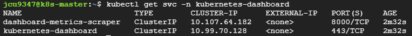
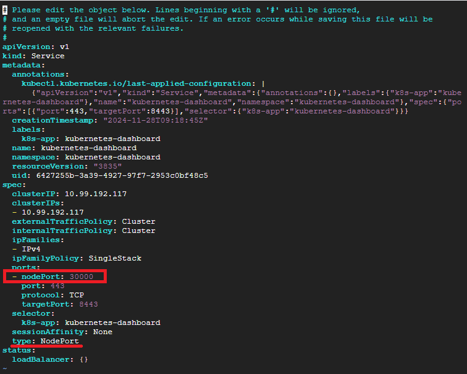
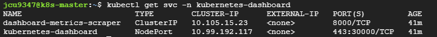
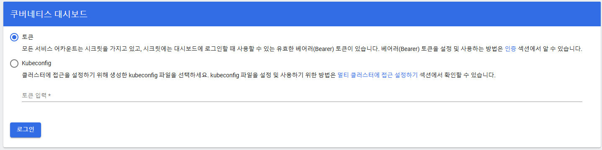

# dashboard 설치 과정
* K8s의 **대시보드 구축 방법**을 정리
* [참고한 블로그](https://jongsky.tistory.com/113)
* [참고한 공식 문서](https://kubernetes.io/ko/docs/tasks/access-application-cluster/web-ui-dashboard/)


## Dashboard 서비스 설치
```sh
# Dashboard 설치
kubectl apply -f https://raw.githubusercontent.com/kubernetes/dashboard/v2.7.0/aio/deploy/recommended.yaml

# 서비스 잘 설치되었는지 확인
kubectl get svc -n kubernetes-dashboard

# Dashboard 파드가 Running 상태인지 확인
kubectl get pods -n kubernetes-dashboard
```
* 

<br>

## Dashboard 설정 변경 - NodePort
* 외부 접속을 위해 ClusterIP에서 NodePort 설정 변경
```sh
# type과 port번호 변경
kubectl edit svc kubernetes-dashboard -n kubernetes-dashboard

# dashboard Running 상태인지 확인
kubectl get svc -n kubernetes-dashboard
```
* 
* 잘 변경 됐다면, TYPE이 `NodePort`로 바뀌고 PORT가 `443:30000/TCP`로 변경되어야 한다.
* 

<br>

## 대시보드 로그인
* 대시보드 로그인창 접근이 가능한지 확인
  * https://{ip또는domain}:30000/#/login
  * 

<br>

## 

```sh

```

<br>

## 

```sh

```

<br>
