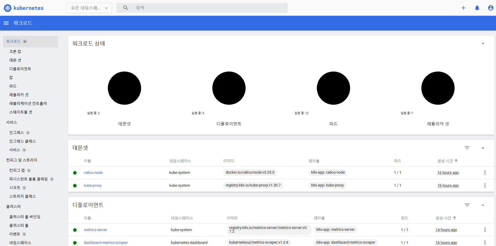

# Dashboard 설치 과정
* K8s의 **대시보드 구축 방법**을 정리
* k8s cluster의 master노드가 생성되어 있어야 함
* [참고한 블로그](https://jongsky.tistory.com/113)
* [참고한 공식 문서](https://kubernetes.io/ko/docs/tasks/access-application-cluster/web-ui-dashboard/)


## Dashboard 서비스 설치
```sh
# Dashboard 설치
kubectl apply -f https://raw.githubusercontent.com/kubernetes/dashboard/v2.7.0/aio/deploy/recommended.yaml

# 서비스 잘 설치되었는지 확인
kubectl get svc -n kubernetes-dashboard
```
* 

<br>

## tolerations 추가
```sh
tolerations:
- key: "node-role.kubernetes.io/control-plane"
  operator: "Exists"
  effect: "NoSchedule"
```

```sh
# 해당 명령어로 deployment파일에 접근, 위의 tolerations 내용 추가
kubectl edit deployment kubernetes-dashboard -n kubernetes-dashboard
kubectl edit deployment dashboard-metrics-scraper -n kubernetes-dashboard

# Deployment Running 확인
kubectl get deployment -n kubernetes-dashboard

# Dashboard 파드가 Running 상태인지 확인
kubectl get pods -n kubernetes-dashboard

# Pod 로그 확인
kubectl logs dashboard-metrics-scraper-6d6d6f9fc7-cl6cg -n kubernetes-dashboard
kubectl logs kubernetes-dashboard-7fc7cb6fff-67mjp -n kubernetes-dashboard

# 모두 확인
kubectl get ing,all -n kubernetes-dashboard
```

<br>

## Dashboard 설정 변경 - NodePort
* 외부 접속을 위해 ClusterIP에서 NodePort 설정 변경
```sh
# type변경과 port번호 추가
# - nodePort: 31000 추가, type: NodePort 변경
kubectl edit svc kubernetes-dashboard -n kubernetes-dashboard

# dashboard Running 상태인지 확인
kubectl get svc -n kubernetes-dashboard
```
* 
* 잘 변경 됐다면, TYPE이 `NodePort`로 바뀌고 PORT가 `443:30000/TCP`로 변경되어야 한다.
* 

<br>

## 대시보드 로그인 페이지 확인
* 대시보드 로그인창 접근이 가능한지 확인
  * https://{ip또는domain}:30000/#/login
  * 

<br>

## 계정 생성을 위한 yaml 파일 생성
* 파일 2개 생성
  * 아무 위치에 생성해도 상관없음 (아래에서는, /etc/kubernetes/dashboard 경로에 생성함)
  * 서비스 계정 생성을 위한 yaml 파일 (`dashboard-adminuser.yaml`)
    ```yaml
    apiVersion: v1
    kind: ServiceAccount
    metadata:
      name: admin-user
      namespace: kubernetes-dashboard
    ```
  * 권한 부여할 yaml 파일 (`dashboard-clusterrolebinding.yaml`)
    ```yaml
    apiVersion: rbac.authorization.k8s.io/v1
    kind: ClusterRoleBinding
    metadata:
      name: admin-user
    roleRef:
      apiGroup: rbac.authorization.k8s.io
      kind: ClusterRole
      name: cluster-admin
    subjects:
    - kind: ServiceAccount
      name: admin-user
      namespace: kubernetes-dashboard
    ```
* 명령어
  ```sh
  sudo mkdir -p /etc/kubernetes/dashboard

  sudo vi /etc/kubernetes/dashboard/dashboard-adminuser.yaml

  sudo vi /etc/kubernetes/dashboard/dashboard-clusterrolebinding.yaml
  ```

<br>

## yaml 파일 적용하기

```sh
# yaml 파일이 위치한 경로로 이동
cd /etc/kubernetes/dashboard

# 적용
kubectl apply -f dashboard-adminuser.yaml
kubectl apply -f dashboard-clusterrolebinding.yaml
```
* 

<br>

## 토큰 생성 및 로그인
* 토큰을 생성하고 해당 토큰으로 로그인 하면됨

```sh
kubectl -n kubernetes-dashboard create token admin-user
```
* 
* 

<br>

## 대시보드 로그인 생략하기
* 생략 버튼 추가 하기

```sh
# `spec.template.spec.containers.args:`에  `- --enable-skip-login` 추가, `- --enable-insecure-login` 추가
kubectl edit deployment kubernetes-dashboard -n kubernetes-dashboard
```
* 
* 
<br>

## Metrics Server 설치하기
* [Metrics Server 설치](/create-k8s-cluster/create-metrics-server/create-metrics-server.md)