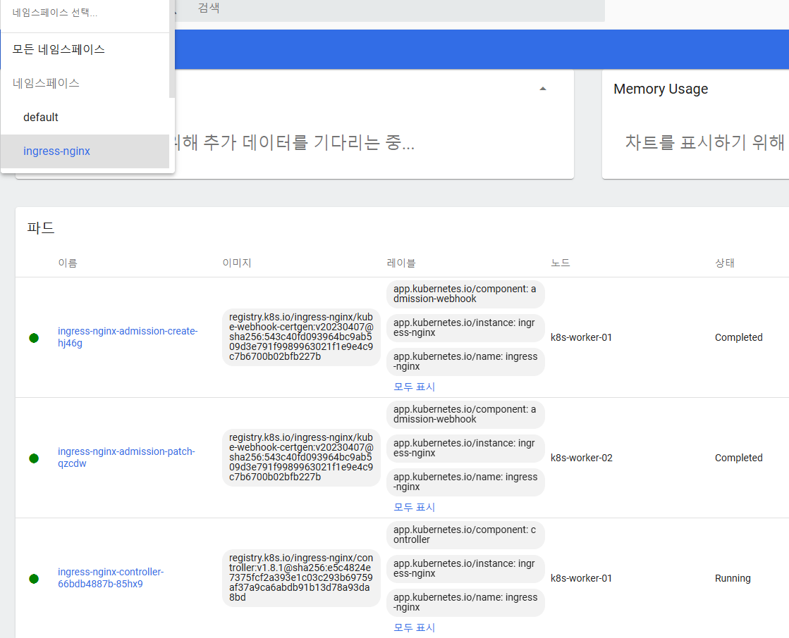
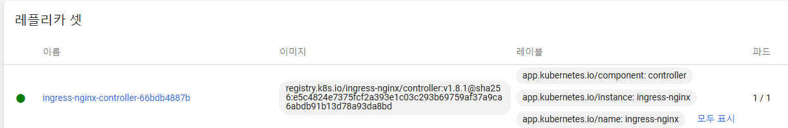
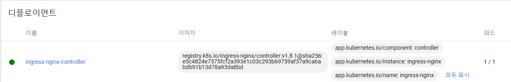
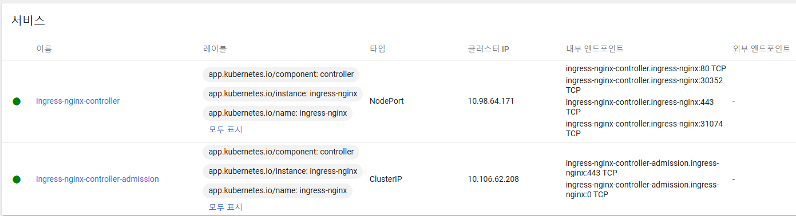
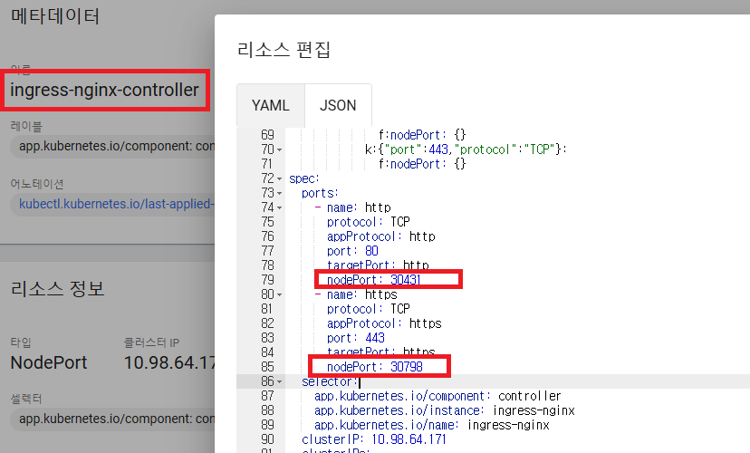

# Ingress Controller 생성 및 활용
* Ingress Controller를 생성 방법
* Ingress를 이용한 Service Load Balancing 방법
* Ingress를 이용한 Canary 배포 방법
* Ingress HTTPS 설정

<br>

## 1. Nginx 설치
* k8s `1.27`버전 이상에서 설치 가능한 버전
* Nginx가 설치에 포함되어 있음
* 해당 버전으로 설치시, NodePort Service 별도로 생성 안해도 됨
* ```sh
  kubectl apply -f https://raw.githubusercontent.com/kubernetes/ingress-nginx/controller-v1.8.2/deploy/static/provider/baremetal/deploy.yaml
  ```
* 
* 
* 
* **서비스도 생성됨**
* 

<br><br>

## 2. 80, 443 포트의 노드포트 확인
* Ingress 사용을 위해 http/https의 노드포트 번호를 확인
* Nginx설치시 생성된 ingress-nginx-controller Service에서 확인이 가능함
* 

<br><br>

## 3. Ingress 생성하기
* 1.27 버전 이상에서의 Ingress 설정임
* 예시로 설명
  * Shopping 파드 & 서비스
  * Customer 파드 & 서비스
  * Order 파드 & 서비스
  * Ingress 설정 정보
* Shopping 파드와 서비스 설정 정보
* ```yaml
  apiVersion: v1
  kind: Pod
  metadata:
    name: pod-shopping
    labels:
      category: shopping
  spec:
    containers:
    - name: container
      image: kubetm/shopping
  ---
  apiVersion: v1
  kind: Service
  metadata:
    name: svc-shopping
  spec:
    selector:
      category: shopping
    ports:
    - port: 8080
  ```
* Customer 파드와 서비스 설정 정보
* ```yaml
  apiVersion: v1
  kind: Pod
  metadata:
    name: pod-customer
    labels:
      category: customer
  spec:
    containers:
    - name: container
      image: kubetm/customer
  ---
  apiVersion: v1
  kind: Service
  metadata:
    name: svc-customer
  spec:
    selector:
      category: customer
    ports:
    - port: 8080
  ```
* Order 파드와 서비스 설정 정보
* ```yaml
  apiVersion: v1
  kind: Pod
  metadata:
    name: pod-order
    labels:
      category: order
  spec:
    containers:
    - name: container
      image: kubetm/order
  ---
  apiVersion: v1
  kind: Service
  metadata:
    name: svc-order
  spec:
    selector:
      category: order
    ports:
    - port: 8080
  ```
* Ingress를 통한 서비스 접근 방법
  * master노드 ip를 통해 Ingress에 접근하면 됨, 포트는 Ingress설정에서 80, 443에 대한 노드포트 정보 확인해야 함(위의 2. 항목 확인)
    * ex. `curl 192.168.56.30:30431/order`
  * root 페이지(`/`)에 접근시 Shopping 서비스에 접근
  * `/customer`에 접근시 Customer 서비스에 접근
  * `/order`에 접근시 Order 서비스에 접근
* Ingress 설정정보
* ```yaml
  apiVersion: networking.k8s.io/v1
  kind: Ingress
  metadata:
    name: service-loadbalancing
  spec:
    ingressClassName: nginx
    rules:
    - http:
        paths:
        - path: /
          pathType: Prefix
          backend:
            service:
              name: svc-shopping
              port:
                number: 8080
        - path: /customer
          pathType: Prefix
          backend:
            service:
              name: svc-customer
              port:
                number: 8080
        - path: /order
          pathType: Prefix
          backend:
            service:
              name: svc-order
              port:
                number: 8080
  ```

<br><br>

## 4. Canary 배포

<br><br>

## 5. HTTPS 설정