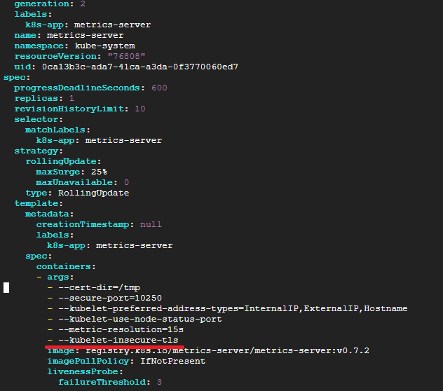

# Metrics Server 설치 과정
* K8s의 metrics-server 설치 방법과 HA구성 방법을 정리
* k8s cluster가 구축되어 있어야 함
* [참고한 블로그](https://nangman14.tistory.com/81#3.%20Metrics-server%EB%A5%BC%20%EB%8D%94%20%EC%9E%98%20%EC%9D%B4%EC%9A%A9%ED%95%98%EA%B8%B0-1)

<br>

## Metrics Server 설치
* kubelet과 metrics server가 tls 통신을 주고받기 위한 CA 인증서를 신뢰하는 과정을 수행하지 않았으므로 그대로 배포하면 x509 에러가 발생
  * 프로덕션 환경에서는 CA 인증서를 신뢰하는 과정을 수행해야 겠지만 현재는 테스트 과정이므로 CA 인증서를 확인하지 않도록 Deployment의 파라미터를 변경
```sh
# 설치
kubectl apply -f https://github.com/kubernetes-sigs/metrics-server/releases/latest/download/components.yaml
```

<br>

## TLS 설정 수정
* x509 에러 임시 해결
```sh
- --kubelet-insecure-tls
- --kubelet-preferred-address-types=InternalIP
```

```sh
# spec.template.spec.containers.args 란에 위의 내용을 추가
kubectl edit deployment metrics-server -n kube-system
```

## 동작 확인
```sh
# API 서비스가 등록되어 있는지 확인
kubectl get apiservices | grep metrics

# deployment 정상 동작 확인
kubectl get deployment metrics-server -n kube-system

# Pod 작동 확인
kubectl get pods -n kube-system | grep metrics-server
```

<br>

## `Metrics API not available` 발생할 경우
* Metrics Server가 설치되었지만, kubectl top 명령어를 사용할 때 "Metrics API not available" 오류가 발생하는 경우
  * Metrics Server가 kubelet과의 통신에 실패했기 때문
* 일단 TLS 설정 수정 해야함

### 1. Host Network 사용 설정

```sh
spec:
  template:
    spec:
      hostNetwork: true
```

* 위의 `hostNetwork: true` 내용을 metrics-server에 추가
```sh
kubectl edit deployment.apps/metrics-server -n kube-system
```

### 2. Kube-apiserver 설정 확인
```sh
# - --enable-aggregator-routing=true 내용 추가
sudo vi /etc/kubernetes/manifests/kube-apiserver.yaml
```

### 3. `kubectl top` 명령어로 확인

<br>

### metrics server 체크
```sh
# metrics server가 Running 상태인지 확인
kubectl get pods -n kube-system
kubectl logs -n kube-system metrics-server-79cdf6bcc6-rmnfx
kubectl logs -n kube-system kube-apiserver-k8s-master

kubectl get pods -n kubernetes-dashboard
kubectl logs -n kubernetes-dashboard dashboard-metrics-scraper-6d6d6f9fc7-2qj46
kubectl logs -n kubernetes-dashboard kubernetes-dashboard-7fc7cb6fff-nnx9m

kubectl logs metrics-server-6d97fd69d6-nh45d -n kube-system
kubectl logs metrics-server-d5865ff47-5klpk -n kube-system
kubectl describe pod metrics-server-d5865ff47-5klpk -n kube-system
kubectl describe pod metrics-server-6d97fd69d6-nh45d -n kube-system


# metrics server가 정상적으로 동작하고 있는지 확인
kubectl top nodes

kubectl get ing,all -n kubernetes-dashboard
```
* 
* 
* 