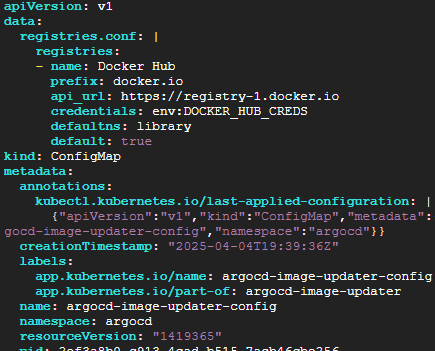
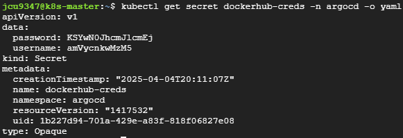

# Argo CD
* Master 노드에서 Helm으로 ArgoCD 설치하기

<br>

## 1. Helm Repository 추가
```sh
helm repo add argo https://argoproj.github.io/argo-helm
helm repo update
```

<br><br>

## 2. 네임스페이스 생성
```sh
kubectl create namespace argocd
```

<br><br>

## 3. ArgoCD 설치
* argocd-server 파드에 접근하기 위한 설정이 필요함
  * argocd-server 파드는 apiserver 역할을 하는 파드
  * ingress 컨트롤러가 있다면 LoadBalancer type으로, 없다면 NodePort type으로 설치하면 됨
* NodePort type으로 설치
    ```sh
    # values.yaml 파일 생성
    cat > argocd-values.yaml <<EOF
    server:
      service:
        type: NodePort
        nodePortHttps: 32000
    EOF

    # helm으로 설치
    helm install argocd argo/argo-cd -f argocd-values.yaml -n argocd
    ```
* ingress 컨트롤러 배포된 경우, LoadBalancer type으로 설치
    ```sh
    # values.yaml 파일 생성
    cat > argocd-values.yaml <<EOF
    server:
      service:
        type: LoadBalancer
      ingress:
        enabled: true
    EOF

    # helm으로 설치
    helm install argocd argo/argo-cd -f argocd-values.yaml -n argocd
    ```

<br><br>

## 4. LoadBalancer type 으로 변경
* ingress 컨트롤러가 배포되어 있어야 함
* 3에서 NodePort로 설치하고나서 LoadBalancer type 으로 변경하고자 하는 경우
    ```sh
    # values.yaml 파일 생성
    cat > argocd-values.yaml <<EOF
    server:
      service:
        type: LoadBalancer
      ingress:
        enabled: true
    EOF

    # Helm 업그레이드 (helm으로 argocd 설치된 경우에만, 없을 경우 helm install 명령어 사용)
    helm upgrade argocd argo/argo-cd -f argocd-values.yaml -n argocd

    # 업데이트 내용 확인
    kubectl get svc argocd-server -n argocd
    ```

<br><br>

## 5. 대시보드 접속하기
* NodePort type 설정시, `https://{도메인}:32000`으로 접속
* LoadBalancer type 설정시, Ingress 컨트롤러가 배포되어 있어야 하며 SSL/TLS 설정이 없으면 HTTP 기본 포트(80)로만 접근 가능함 주의
* ArgoCD 대시보드 admin 계정 비밀번호 조회
    ```sh
    # 대시보드 초기 비밀번호 조회
    kubectl -n argocd get secret argocd-initial-admin-secret \
      -o jsonpath="{.data.password}" | base64 -d; echo
    ```
* ID는 admin으로, 위에서 조회한 비밀번호를 입력하고 로그인
* 

<br><br>

## 6. ArgoCD Image Updater 추가 설치
* 컨테이너 이미지 변경 감지 및 자동 배포를 하기 위해 ArgoCD Image Updater를 설치하고 적용하는 과정

### 6.1. ArgoCD Image Updater 설치
```sh
# 설치
kubectl apply -n argocd -f https://raw.githubusercontent.com/argoproj-labs/argocd-image-updater/stable/manifests/install.yaml

# argocd-image-updater 파드 확인
kubectl get pods -n argocd
```

<br>

### 6.2. Docker Hub 접속 설정
* 계정정보 Secret 생성후 환경 변수 참조
  ```sh
  # Docker Hub 접속 설정 위한 Secret 생성
  # username과 password 입력
  kubectl create secret generic dockerhub-creds \
    --from-literal=username="username입력" \
    --from-literal=password="password입력" \
    -n argocd

  # 환경 변수에서 Secret 참조 (아래 내용 그대로 입력)
  kubectl set env deployment argocd-image-updater \
    -n argocd \
    DOCKER_HUB_CREDS='$(username):$(password)' \
    --from=secret/dockerhub-creds
  ```

<br>

* argocd-image-updater-config 컨피그맵에 아래의 `data:` 설정 정보 추가
  ```sh
  kubectl edit configmap argocd-image-updater-config -n argocd
  ```
  ```yaml
  data:
    registries.conf: |
      registries:
      - name: Docker Hub
        prefix: docker.io
        api_url: https://registry-1.docker.io
        credentials: env:DOCKER_HUB_CREDS
        defaultns: library
        default: true
  ```
* 예시
  * 

<br>

* 수정 후, Image Updater 파드를 재시작 하고 잘 적용되었는지 확인
  ```sh
  # Image Updater 파드 재시작
  kubectl rollout restart deployment argocd-image-updater -n argocd

  # Docker Hub 자격 증명을 저장한 Secret 확인
  kubectl get secret dockerhub-creds -n argocd -o yaml
  ```
* 

<br><br>

## 7. Argo Rollouts 추가 설치
```sh
```