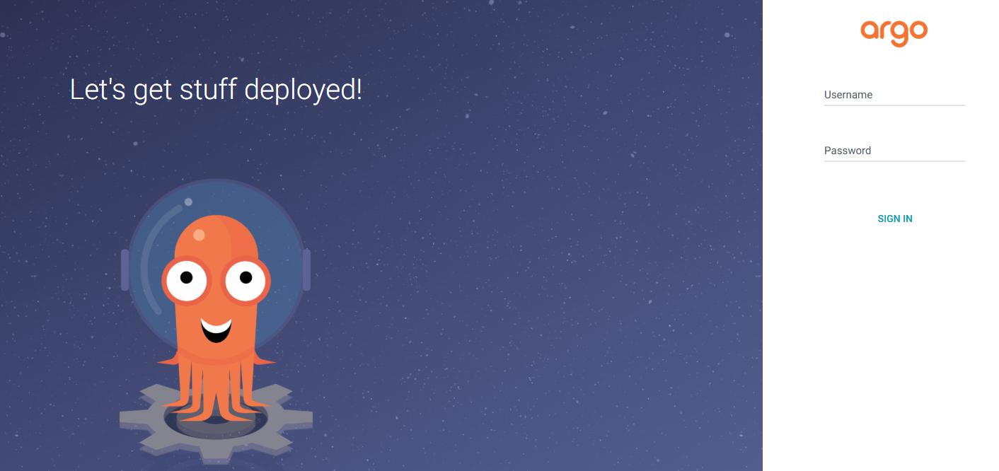
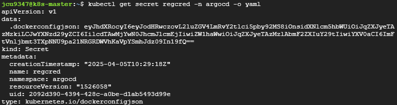
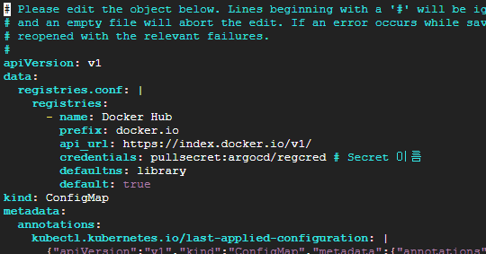
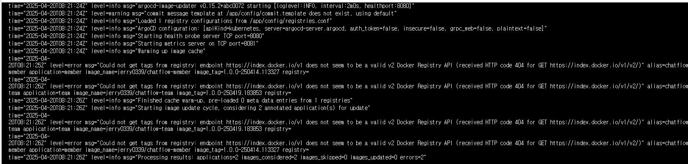

# Argo CD
* Master 노드에서 Helm으로 ArgoCD 설치하기

<br>

## 1. Helm Repository 추가
```sh
helm repo add argo https://argoproj.github.io/argo-helm
helm repo update
```

<br><br>

## 2. 네임스페이스 생성
```sh
kubectl create namespace argocd
```

<br><br>

## 3. ArgoCD 설치
* argocd-server 파드에 접근하기 위한 설정이 필요함
  * argocd-server 파드는 apiserver 역할을 하는 파드
  * ingress 컨트롤러가 있다면 LoadBalancer type으로, 없다면 NodePort type으로 설치하면 됨
* NodePort type으로 설치
    ```sh
    # values.yaml 파일 생성
    cat > argocd-values.yaml <<EOF
    server:
      service:
        type: NodePort
        nodePortHttps: 32000
    EOF

    # helm으로 설치
    helm install argocd argo/argo-cd -f argocd-values.yaml -n argocd
    ```
* ingress 컨트롤러 배포된 경우, LoadBalancer type으로 설치
    ```sh
    # values.yaml 파일 생성
    cat > argocd-values.yaml <<EOF
    server:
      service:
        type: LoadBalancer
      ingress:
        enabled: true
    EOF

    # helm으로 설치
    helm install argocd argo/argo-cd -f argocd-values.yaml -n argocd
    ```

<br><br>

## 4. LoadBalancer type 으로 변경
* ingress 컨트롤러가 배포되어 있어야 함
* 3에서 NodePort로 설치하고나서 LoadBalancer type 으로 변경하고자 하는 경우
    ```sh
    # values.yaml 파일 생성
    cat > argocd-values.yaml <<EOF
    server:
      service:
        type: LoadBalancer
      ingress:
        enabled: true
    EOF

    # Helm 업그레이드 (helm으로 argocd 설치된 경우에만, 없을 경우 helm install 명령어 사용)
    helm upgrade argocd argo/argo-cd -f argocd-values.yaml -n argocd

    # 업데이트 내용 확인
    kubectl get svc argocd-server -n argocd
    ```

<br><br>

## 5. 대시보드 접속하기
* NodePort type 설정시, `https://{도메인}:32000`으로 접속 (설정 포트 확인)
* LoadBalancer type 설정시, Ingress 컨트롤러가 배포되어 있어야 하며 SSL/TLS 설정이 없으면 HTTP 기본 포트(80)로만 접근 가능함 주의
* ArgoCD 대시보드 admin 계정 비밀번호 조회
    ```sh
    # 대시보드 초기 비밀번호 조회
    kubectl -n argocd get secret argocd-initial-admin-secret \
      -o jsonpath="{.data.password}" | base64 -d; echo
    ```
* ID는 admin으로, 위에서 조회한 비밀번호를 입력하고 로그인
* 

<br><br>

## 6. ArgoCD Image Updater 추가 설치
* 컨테이너 이미지 변경 감지 및 자동 배포를 하기 위해 ArgoCD Image Updater를 설치하고 적용하는 과정

### 6.1. ArgoCD Image Updater 설치
```sh
# 설치
kubectl apply -n argocd -f https://raw.githubusercontent.com/argoproj-labs/argocd-image-updater/stable/manifests/install.yaml

# argocd-image-updater 파드 확인
kubectl get pods -n argocd
```

<br>

### 6.2. Docker Hub 접속 설정
* Secret 생성 - regcred 이름으로 생성함
  ```sh
  kubectl create secret docker-registry regcred \
    --docker-server=https://index.docker.io/v1/ \
    --docker-username='DOCKER_USERNAME' \
    --docker-password='DOCKER_PASSWORD' \
    --docker-email='EMAIL' \
    -n argocd
  ```
* Secret 생성 후, Docker Hub Secret 확인
  ```sh
  # Secret 확인
  kubectl get secret regcred -n argocd -o yaml
  ```
  * 
* argocd-image-updater-config 컨피그맵에 아래의 registry 설정 정보 추가 (Docker Hub로 사용)
  ```sh
  kubectl edit configmap argocd-image-updater-config -n argocd
  ```
  ```yaml
  data:
    registries.conf: |
      registries:
        - name: Docker Hub
          prefix: docker.io
          api_url: https://index.docker.io/v1/
          credentials: pullsecret:argocd/regcred
          defaultns: library
          default: true
  ```
* 예시
  * 
* argocd-image-updater-config 컨피그맵의 data에 추가한 registry 설정 설명
  * `name: Docker Hub`: 레지스트리 이름
  * `prefix: docker.io`: 이미지의 레지스트리를 식별하는 접두사 (Docker Hub 이미지는 docker.io 접두사 사용)
  * `api_url: https://index.docker.io/v1/`: 레지스트리의 API 서버 주소 (Docker hub의 API 주소에 해당)
  * `credentials: pullsecret:argocd/regcred`: 해당 레지스트리의 인증 정보 (Docker Hub의 계정 정보에 해당)
  * `defaultns: library`: 네임스페이스 생략시, library라는 네임스페이스를 기본으로 사용 (Docker Hub의 경우, 사용자명이 없으면 기본으로 library를 사용 ex. library/nginx:latest)
  * `default: true`: 해당 레지스트리(Docker Hub)를 기본 레지스트리로 설정 (prefix인 `docker.io` 생략 가능)
* annotation 설정에서 prefix를 통해 argocd-image-updater-config 컨피그맵에 등록한 registry 정보를 참조할 수 있고, 위처럼 registry 정보에 등록된 내용은 annotaion에서 생략 가능
  * ex. ArgoCD에 등록된 App에 `argocd-image-updater.argoproj.io/image-list: jerry0339/api-tester`와 같은 annotaion을 추가한 경우
    * credentials 정보를 입력해 주지 않고 registry prefix를 지정해 주지 않아도,
    * argocd-image-updater-config 컨피그맵의 registry 설정에서 `default: true` 설정으로 `prefix: docker.io`를 사용하고 `credentials` 정보가 들어가 있기 때문에
    * 이미지 지정시 `docker.io/jerry0339/api-tester`와 같이 지정하지 않아도 되는 것이며
    * credentials을 참조하기 위해 `argocd-image-updater.argoproj.io/pullsecret: argocd/regcred`와 같은 annotation을 추가해 주지 않아도 되는 것임

<br>

* cf. ArgoCD Image Updater 삭제하고 싶은 경우
  * kubectl delete -n argocd -f https://raw.githubusercontent.com/argoproj-labs/argocd-image-updater/stable/manifests/install.yaml
* cf. argocd-image-updater 이용한 이미지 자동 배포
  * [argocd 문서 참고](/CICD/cd-argocd/argocd.md)

<br><br>

### 6.3. ArgoCD Image Updater 점검
* 이미지 업데이터가 동작하지 않는 경우 argocd-image-updater에 해당하는 파드의 로그를 확인하면 됨
  * 아래 이미지처럼 에러 메시지 확인 가능
  * 
* argocd 재시작
  ```
  kubectl -n argocd rollout restart deployment argocd-image-updater
  ```

<br><br>

## 7. Argo Rollouts 추가 설치
* helm repo 추가
  ```sh
  helm repo add argo https://argoproj.github.io/argo-helm
  helm repo update
  ```
* rollouts-values.yaml
  ```yaml
  controller:
    replicas: 1

  dashboard:
    enabled: true
    service:
      type: NodePort
      portName: dashboard
      port: 3100
      targetPort: 3100
      nodePort: 32100
  ```
* helm 으로 설치
  ```sh
  helm upgrade --install argo-rollouts argo/argo-rollouts \
    --namespace argo-rollouts \
    --create-namespace \
    -f rollouts-values.yaml
  ```
* Rollout CLI 설치
  ```sh
  curl -LO https://github.com/argoproj/argo-rollouts/releases/latest/download/kubectl-argo-rollouts-linux-amd64
  chmod +x kubectl-argo-rollouts-linux-amd64
  sudo mv kubectl-argo-rollouts-linux-amd64 /usr/local/bin/kubectl-argo-rollouts
  # 설치 확인
  kubectl argo rollouts version
  ```
* 설치 확인
  ```sh
  kubectl get pods -n argo-rollouts
  kubectl get svc -n argo-rollouts
  ```
  