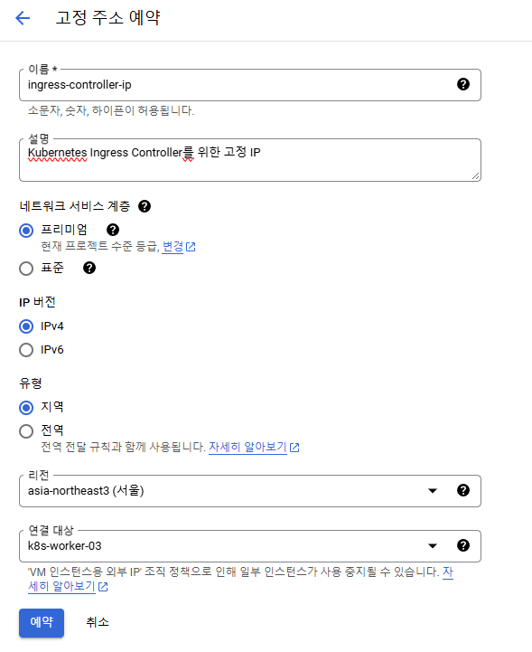
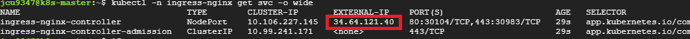

# Ingress Controller 배포하기
* GCP 환경에서 k8s cluster를 구성했기 때문에 GCP의 service를 활용하여 External IP를 할당

## 1. External IP를 어떻게 할당해야 할까?
1. `GCP Static IP 예약` 이용하여 `NodePort 타입의 Ingress Controller`를 배포하는 방식
   * 비용에 대한 부담이 적고 설정하기 간편
   * 하지만 낮은 가용성 - External IP에 해당하는 노드에 장애가 생기면 서비스 전체에 영향
   * 따라서 dev 환경에 사용하기 좋을듯
2. `GCP LoadBalancer`를 이용하여 `LoadBalancer 타입의 Ingress Controller`를 배포하는 방식
   * 비용 부담이 큼 - 트래픽이 많을수록 비용도 커짐
   * 고가용성 - GCP 헬스 체크로 5초 내 자동 트래픽 전환?
   * 프로덕션 환경에 사용하기 적합
3. Keepalived VIP 이용하여 NodePort `NodePort 타입의 Ingress Controller`를 배포하는 방식
   * 적절한 비용과 가용성이라고 함
   * 구현 난이도가 높고 관리 부담이 있다고 함
   * 비용에 민감할 경우 사용 고려해보면 좋을듯
   * 필요한 경우 생기면 직접 설정해 봐야 할듯

## 2. NodePort 타입의 Ingress Controller 배포하기 - Static IP 이용
* 브라우저는 기본적으로 http://도메인 요청 시 80번 포트를 사용하지만
* NodePort 서비스는 30000-32767 포트 범위에서만 작동하기 때문에
* NodePort 타입의 Ingress Controller를 사용하면 주소에 해당하는 NodePort가 들어가야 함
* 간편한 설정으로 dev 환경에 적합한 방법임

<br>

### 2.1. 외부 고정 IP 주소 예약하기
* 고정 IP를 사용하지 않고 **기본으로 할당된 외부 IP를 사용해도 상관없음**
* vm이 재실행되어도 변경되지 않는 고정 IP 주소를 이용하여 External IP로 할당
* GCP에서 Ingress Controller Service의 External IP로 할당할 Static IP 예약 (NodePort 설정임)
  * `VPC 네트워크 - IP 주소 - 외부 고정 IP 주소 예약`에서 아래의 내용들 입력하여 IP 예약
    * 연결 대상 vm은 worker노드로 지정 - Master 노드에 추가 부하를 주는 것은 클러스터 안정성에 영향을 줄 수 있기 때문
  * 

<br>

### 2.2. Ingress Controller 배포
* k8s 1.30 버전과 호환되는 Ingress Controller 4.9.1 버전으로 배포
  * `k8s-worker-03`노드에 연결한 고정 IP `34.64.121.40`
    ```sh
    helm repo add ingress-nginx https://kubernetes.github.io/ingress-nginx

    helm repo update

    helm upgrade --install ingress-nginx ingress-nginx/ingress-nginx \
    --version 4.9.1 \
    --namespace ingress-nginx --create-namespace \
    --set controller.service.externalIPs[0]=34.64.121.40 \
    --set controller.service.type=NodePort \
    --set controller.nodeSelector."kubernetes\.io/hostname"=k8s-worker-03 \
    --set controller.config.use-forwarded-headers="true"

    # External IP 할당 확인
    kubectl -n ingress-nginx get svc -o wide
    ```
  * 

<br>


