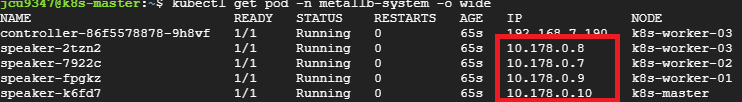
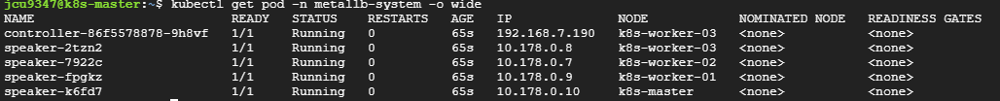
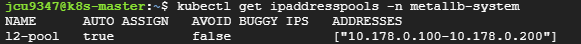
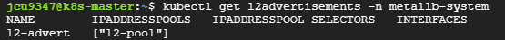
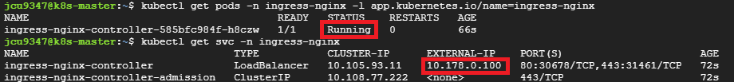

# Ingress Controller 배포
* `On-premise` 또는 `Bare Metal` 환경에서 Ingress Controller를 배포하면 External IP 할당이 되지 않아 Ingress를 온전히 사용할 수 없음
  * Bare Metal: 하드웨어 상에 어떤 소프트웨어도 설치되어 있지 않은 상태의 물리 서버.
  * External IP가 할당되지 않으면, Ingress controller은 서비스 타입으로 로드밸런서를 사용할 수 없음
    * 노드포트로 접근하거나 HostNetwork로 접근해야 함
* Kubernetes에서 클라우드 서비스를 사용하지 않고 Ingress Controller를 배포하고 사용하려면?
   1. MetalLB 설치 - External IP 할당가능
   2. NodePort + External IP 수동 설정 - 특정 노드의 IP를 직접 지정
   3. HostNetwork + DaemonSet 방식 - 인그레스 컨트롤러를 호스트 네트워크에 직접 노출
   4. 외부 로드밸런서(HAProxy) 연동 - HAProxy를 물리 서버에 설치하고 NodePort 서비스 생성하여 HAProxy에서 노드포트 서비스로 요청 전달
* MetalLB를 설치하고 Ingress Controller를 배포하여 External IP를 할당하는 방법에 대해 알아보자.

<br><br>

## 1. MetalLB의 2가지 모드? (L2 모드를 중점으로)
* 설치전 MetalLB 개념 확인
* MetalLB는 2가지 모드를 지원
  * `L2 모드` - [참고링크](https://malwareanalysis.tistory.com/271)
  * `BGP 모드` - [참고링크](https://malwareanalysis.tistory.com/272)
* L2 모드는 speaker 데몬셋이 생성한 Pod중 리더 Speaker Pod를 선출하여, GARP프로토콜을 이용하여 해당 노드로 ExternalIP 패킷이 오도록 설정
  * 즉, 각 ExternalIP(VIP)마다 독립적인 리더 Speaker Pod가 선출되는 것이며 ExternalIP에 해당하는 서비스(LoadBalancer)별로 트래픽 처리 리더가 분리되어 있음을 의미
  * ExternalIP에 전달되는 패킷들은 리더 Speaker Pod로부터 kube-proxy/iptables규칙에 따라서 분산되어 패킷이 pod로 전달
  * speaker pod들은 HostNetwork모드로 동작하여 pod IP는 노드 IP로 갖음
  * 
  * 단점
    * 특정 ExternalIP에 트래픽이 많을수록 해당 ExternalIP를 관리하는 리더 Speaker 파드가 위치한 노드에 부하가 발생
    * 리더 Speaker Pod가 다운되는 경우, 새로운 리더가 선출되기 전까지 해당 ExternalIP에 대한 일시적인 네트워크 장애가 발생
* BGP 모드는 외부 라우터를 통해서 로드밸런서 External IP를 관리
  * 리더 Speaker Pod를 이용하는 L2모드와 달리 외부 라우터 설정이 필요하므로 네트워크 엔지니어가 필요함
  * speaker pod가 장애나더라도 매우 짧은 시간안에 장애복구할 수 있다는 장점이 있음
* 아래에서 MetalLB `L2 모드`를 이용하여 External IP를 할당하는 방법을 알아보자.

<br><br>

## 2. MetalLB 설치
* MetalLB를 먼저 설치하고 설정을 완료한 뒤 Ingress Controller를 배포하면 External IP를 바로 할당받을 수 있기 때문에 먼저 설치
* k8s 1.21 이상 버전이라면 `0.14.x` 이상의 버전의 MetalLB 사용하면 됨
  * MetalLB 0.14.5 (LTS)로 설치
    ```sh
    kubectl apply -f https://raw.githubusercontent.com/metallb/metallb/v0.14.5/config/manifests/metallb-native.yaml
    
    # speaker 데몬셋으로 생성되는 pod들 확인(데몬셋이므로 노드 개수만큼), controller 생성 확인
    kubectl get pod -n metallb-system -o wide
    ```
  * 

<br><br>

## 3. IP Address Pool 및 L2 Advertisement 설정
* IP Address Pool 설정시 v0.13.2 이후부터 CRD(Custom Resource Definition) 방식만 지원하므로, `kind: ConfigMap`로 사용하면 안됨
* 아래의 두 CRD를 모두 생성해야 L2 모드가 활성화됨
    ```yaml
    # IPAddressPool 예시 (metallb-system 네임스페이스 필수)
    apiVersion: metallb.io/v1beta1
    kind: IPAddressPool # 커스텀 리소스
    metadata:
    name: l2-pool
    namespace: metallb-system
    spec:
    addresses:
    - 10.178.0.100-10.178.0.200  # 사용 가능한 IP 범위 지정, 노드와 동일한 서브넷으로 IP범위를 지정해야 함!!
    ---
    # L2Advertisement 예시 (IPAddressPool 연결 필수)
    apiVersion: metallb.io/v1beta1
    kind: L2Advertisement # 커스텀 리소스
    metadata:
    name: l2-advert
    namespace: metallb-system
    spec:
    ipAddressPools:
    - l2-pool  # 위에서 정의한 IPAddressPool 이름과 일치해야 함
    ```
    ```sh
    # 위 yaml 파일 내용을 대시보드에서 바로 등록하거나 파일로 생성하여 아래와 같이 적용하면 됨
    kubectl apply -f metallb-config.yaml
    ```
* 두 커스텀 리소스가 잘 생성되었는지 확인
    ```sh
    # IPAddressPool 등록 확인
    kubectl get ipaddresspools -n metallb-system
    kubectl describe ipaddresspool l2-pool -n metallb-system

    # L2Advertisement 등록 확인
    kubectl get l2advertisements -n metallb-system
    kubectl describe l2advertisement l2-advert -n metallb-system
    ```
* 
* 

<br><br>

## 4. Ingress Controller 배포
* 현재 사용중인 k8s 버전은 1.30.11
* Kubernetes 1.30과 호환되는, Ingress Controller의 최신 안정 버전인 `4.9.1` 버전으로 설치
    ```sh
    # NGINX Ingress Controller 4.9.1 설치 (LoadBalancer 타입 지정)
    # --set controller.service.type=LoadBalancer: MetalLB가 External IP를 할당하도록 설정
    # --set controller.ingressClassResource.default=true: NGINX Ingress Controller를 클러스터의 기본 IngressClass로 설정
    helm upgrade --install ingress-nginx ingress-nginx \
    --repo https://kubernetes.github.io/ingress-nginx \
    --version 4.9.1 \
    --namespace ingress-nginx \
    --create-namespace \
    --set controller.service.type=LoadBalancer \
    --set controller.ingressClassResource.default=true

    # 파드 상태 확인
    kubectl get pods -n ingress-nginx -l app.kubernetes.io/name=ingress-nginx

    # External IP 할당 확인
    kubectl get svc -n ingress-nginx
    ```
* 

<br><br>

## 5. Ingress 배포하기
* 