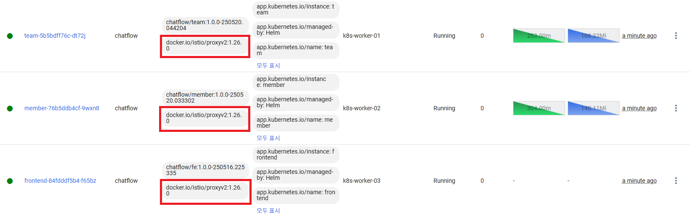
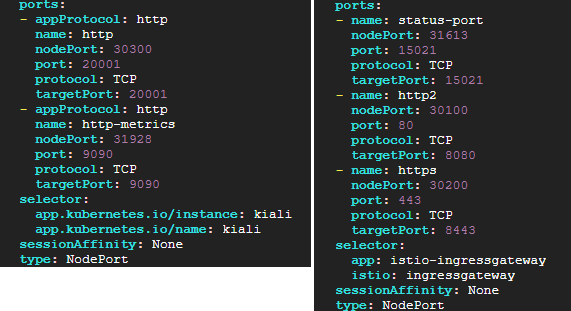
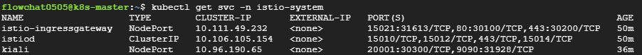
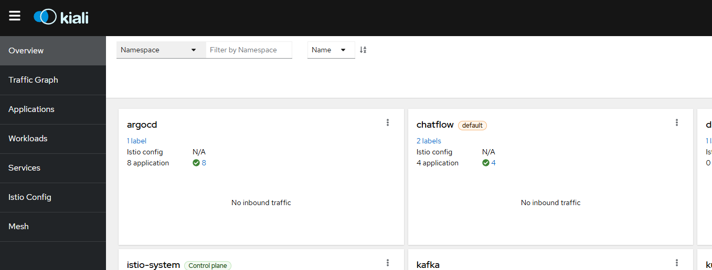

# Istio(+Envoy)와 Kiali 설치 방법

## 1. Istioctl & Istio & Envoy 설치
* Istioctl 설치
  ```sh
  curl -L https://istio.io/downloadIstio | sh -

  cd istio-*

  export PATH=$PWD/bin:$PATH

  istioctl version
  ```

* Istio 설치 (기본 프로필 사용 - default)
  * 설치후 istio-ingressgateway 서비스를 NodePort 타입으로 변경 (external-ip 없는 경우)
  ```sh
  istioctl install --set profile=default -y
  ```

* Envoy Proxy 설치
  * 원하는 네임스페이스에 사이드카 자동주입 활성화
  ```sh
  kubectl label namespace {namespace} istio-injection=enabled
  ```
  * 네임스페이스를 지정하여 설치하여도, 기존에 생성되어 있던 Pod에는 사이드카가 생성되지 않으므로 재시작해 주어야 함
  * Envoy Proxy 사이드카가 잘 설치되었다면 아래와 같이 Pod에 이미지가 추가된 모습을 확인 가능
  * 
  
### Envoy Proxy 사이드카 추가시 주의점
* Gateway와 VirtualService로 라우팅 설정을 해주지 않으면 API에 접근이 불가능함
  * Gateway 및 VirtualService 설정은 4번 항목 참고...
* cf. 정적 리소스는 접근이 가능함 (ex. swagger-ui/index.html)


<br><br>

## 2. Kiali 설치
* Helm repo 등록
  ```sh
  helm repo add kiali https://kiali.org/helm-charts
  helm repo update
  kubectl create namespace kiali-operator
  ```
* Kiali Operator 설치
  ```sh
  helm install kiali-operator kiali/kiali-operator -n kiali-operator
  ```
* Kiali Custom Resource 생성
  * `external_services.prometheus.url`에는 prometheus datasource 주소 입력하면 됨
  ```sh
  cat <<EOF | kubectl apply -f -
  apiVersion: kiali.io/v1alpha1
  kind: Kiali
  metadata:
    name: kiali
    namespace: istio-system
  spec:
    auth:
      strategy: anonymous
    external_services:
      prometheus:
        url: "http://nps.flowchat.shop:32090"
  EOF
  ```

<br><br>

## 3. NodePort 타입 서비스 변경 및 설치 점검
* svc중 istio-ingressgateway 서비스를 NodePort타입으로 변경 (external-ip 할당 안되는 경우)
* svc중 kiali 서비스를 NodePort타입으로 변경
  ```sh
  kubectl get pods -n istio-system
  kubectl get pods -n kiali-operator
  kubectl get svc -n istio-system
  ```
* 
* 

<br>

* 이후 nodePort를 이용하여 Kiali 서비스 접근시 Kiali UI 확인 가능함
* 
