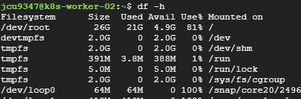
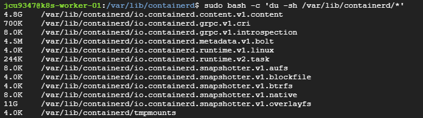

# k8s trouble-shooting
* 메모리나 디스크 부족으로 생긴 이슈들
* 노드의 디스크 사용량이 증가함에 따라 Kubernetes는 단계적으로 대응
  * 먼저 특정 임계값(예: 80% 부근)을 넘으면 DiskPressure 상태를 설정하여 신규 파드 배치를 막음
  * 더 높은 임계값(예: 85% 또는 90%)을 넘으면 기존 파드를 축출하여 디스크 공간을 확보
    * 이때 evicted pod가 생김

## 1. Kubernates Evicted Status Pod 삭제하기
* 디스크 메모리 부족(85%가 넘음)으로 Evicted Pod가 다수 생김
* Evicted Status인 pod를 한번에 지우는 스크립트
  ```sh
  kubectl -n default delete pods --field-selector=status.phase=Failed
  ```

<br><br>

## 2. 디스크 정리
* 디스크 용량 확인 - `df -h`
* 
* 위의 이미지는 `/var/lib/containerd` 경로의 데이터가 차지하는 용량이 `/dev/root` 파일 시스템에 포함되는 경우임
* 따라서 `/var/lib/containerd` 경로의 데이터를 정리해 주어야 함
* `sudo bash -c 'du -sh /var/lib/containerd/*'` 명령어로 차지하는 용량 확인
* 
* `.v1.content`이 4.8G, `.v1.overlayfs`이 11G를 차지
  * `.v1.content`: containerd가 관리하는, 실행 중이거나 중지된 컨테이너의 이미지가 저장됨
  * `.v1.overlayfs`: containerd가 관리하는, 실행 중이거나 중지된 컨테이너의 파일 시스템 스냅샷이 저장됨
### 2.1. 사용하지 않는 이미지 삭제
```sh
sudo crictl rmi --prune
```
### 2.2. 중지된 컨테이너 삭제
* 중지된(Exited) 상태 컨테이너 확인
  ```sh
  sudo crictl --runtime-endpoint unix:///run/containerd/containerd.sock ps -a -q --state Exited
  ```
* 쉘 스크립트 작성 - `vi remove-exited-containers.sh`
  ```sh
  # 중지된 컨테이너 ID를 변수에 저장
  EXITED_CONTAINERS=$(sudo crictl --runtime-endpoint unix:///run/containerd/containerd.sock ps -a -q --state Exited)

  # 변수에 내용이 있는지 확인하고 삭제 실행
  if [ -n "$EXITED_CONTAINERS" ]; then
    echo "Deleting exited containers: $EXITED_CONTAINERS"
    sudo crictl --runtime-endpoint unix:///run/containerd/containerd.sock rm $EXITED_CONTAINERS
  else
    echo "No exited containers found to remove."
  fi
  ```
* 권한 부여 및 실행
  ```sh
  chmod +x remove-exited-containers.sh
  ./remove-exited-containers.sh
  ```
* 이후 `df -h` 명령어로 용량을 다시 확인해 보자.

<br><br>

## 3. Eviction Threahold 조정하기
* [참고링크](https://velog.io/@langoustine/%EC%BF%A0%EB%B2%84%EB%84%A4%ED%8B%B0%EC%8A%A4-Eviction-Threahold-%EC%A1%B0%EC%A0%95)
* 디스크 용량 확인
  * `df -h`
* 루트 파일 시스템의 디스크 공간이 86%로 Eviction Threshold 기본값인 85%를 초과하여 evicted pod가 계속해서 생기는 상황
* kubelet config 파일 위치 확인
  ```sh
  ps -ef | grep "kubelet --" | grep -v grep
  ```
* kubelet 설정파일에 원하는 Eviction Threshold 값을 기입하여 반영
  ```sh
  # write 권한 추가
  sudo chmod 666 /var/lib/kubelet/config.yaml
  # config파일 일반적인 위치
  sudo vi /var/lib/kubelet/config.yaml

  # config.yaml 파일의 마지막 줄에 아래의 내용 추가
  evictionHard:
    imagefs.available: 5% # 사용 가능한 디스크 공간이 전체의 5% 미만이면 DiskPressure 상태를 True로 활성화 (default: 15%)
    memory.available: 50Mi # 노드의 사용 가능한 메모리가 50MB 미만이면 MemoryPressure 상태를 True로 활성화 (default: 100MB)
    nodefs.available: 5% # 사용 가능한 디스크 공간이 전체의 5% 미만이면 DiskPressure 상태를 True로 활성화 (default: 10%)
    nodefs.inodesFree: 5% # 노드의 파일 시스템에서 사용 가능한 inode가 전체의 5% 미만이라면 DiskPressure 상태를 True 상태로 활성화 (default: 5%)

  # 위 내용 추가후 권한 복구
  sudo chmod 644 /var/lib/kubelet/config.yaml

  # kubelet 재시작, status 확인
  sudo systemctl restart kubelet
  sudo systemctl status kubelet
  ```
  ```sh
  # 복붙용
  evictionHard:
    imagefs.available: 5%
    memory.available: 50Mi
    nodefs.available: 5%
    nodefs.inodesFree: 5%
  ```

## 4. 리소스 제거시 완전히 삭제가 안되는 경우
* kubelet에 문제가 생겨 리소스 정리를 완전히 마치지 못했을 때 해당
* namespace기준 ,아래 명령어로 완전히 삭제 되었는지 확인 가능
  ```sh
  kubectl api-resources --verbs=list --namespaced -o name | xargs -n 1 kubectl get --show-kind --ignore-not-found -n {네임스페이스명}
  ```
* kubelet 재시작 해주면 됨
  ```sh
  sudo systemctl restart kubelet
  ```