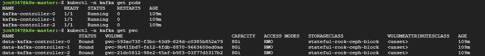

# kafka Cluster 구축
* StorageClass있어야 함
  * [참고 - rook-ceph](/create-k8s-environment/create-storage-solution/create-rook-ceph-using-helm.md)
* k8s cluster와 helm 3.x 버전 설치되어 있어야 함


## 1. Helm 이용한 Kafka 배포
```sh
helm repo add bitnami https://charts.bitnami.com/bitnami
helm repo update
```

<br><br>

## 2. KRaft 모드 개념 (Zookeeper 제외 설정), ZooKeeper와 비교
* [참고링크](https://adjh54.tistory.com/639)
* ZooKeeper는 클러스터의 메타데이터를 관리하는 Controller의 역할을 함
  * 메타데이터 - Kafka 클러스터의 상태와 구성 정보를 나타냄
    * 토픽 정보, 파티션-브로커 매핑, 브로커 정보, 컨트롤러 정보, ACL 및 인증 관련 데이터 등
  * 하지만 cluster의 규모가 커지는 경우, ZooKeeper노드와 브로커 노드가 늘어나면서 관리하기 어렵고 성능 저하 문제가 발생할 수 있음
* ZooKeeper (Kafka Raft와 비교)
  * ZooKeeper 사용시 클러스터를 별도로 관리해야 함
    * ZooKeeper사용시 최소 6노드가 필요함 - ZooKeeper 3대 + Kafka 브로커 3대로 총 6노드
    * KRaft 모드보다 관리하기 복잡함, 모니터링 및 유지보수에 추가적인 리소스
  * 장애 발생시 ZooKeeper와 브로커를 모두 디버깅 해야 하므로 복구하는데 오래 걸림
  * cluster의 규모가 클수록 브로커와 ZooKeeper간의 통신에 오버헤드도 커짐
* KRaft (ZooKeeper와 비교)
  * KRaft모드로 생성되는 노드(k8s에서 파드)가 Raft프로토콜을 이용하여 브로커와 컨트롤러 역할을 동시에 수행
  * ZooKeeper 클러스터 운영 불필요함 - 시스템 구성에 CPU/메모리 사용량 약 30% 절감
  * 메타데이터가 Kafka 내부에서 관리되므로 외부 시스템과 통신하는 지연 시간이 감소
* KRaft Config 설명 - 아래 yaml파일 확인
  * `process.roles=broker,controller`: KRaft 모드 활성화
    * 단일 노드가 브로커(데이터 처리)와 컨트롤러(메타데이터 관리) 역할을 동시에 수행
  * `controller.quorum.voters=...`: Raft 쿼럼 구성
    * 설정에 명시된 3개 노드 간 메타데이터 동기화
    * 3개 노드 중 2개 이상 정상 작동시 클러스터 운영 가능 (N/2 + 1 장애 허용)
  * `listeners=PLAINTEXT://0.0.0.0:9092,CONTROLLER://0.0.0.0:9093`: 9092(브로커), 9093(컨트롤러) 포트 동시 개방

<br><br>

## 3. KRaft 모드 설정하기
* KRaft 모드 구성 및 브로커의 PV생성을 위한 PVC설정이 필요함 - `kafka-values.yaml` 설정
  * KRaft모드 설정으로 생성된 파드는 **브로커와 컨트롤러 역할을 동시에 수행**함
  * storageClass의 경우 rook-ceph환경에서 생성한 storageClass를 사용
* `kafka-values.yaml` 설정 파일 정보
  ```yaml
  # values-kafka.yaml
  global:
    storageClass: "stateful-rook-ceph-block"

  kafka:
    replicaCount: 3  # Worker Node 3개에 대응
    kraft:
      enabled: true  # KRaft 모드 활성화
    persistence:
      size: 20Gi     # PVC 크기 지정 - test환경에서는 5Gi 충분, allowVolumeExpansion: true설정이 storageclass에 있으므로 확장도 가능
      # existingClaim: ""  # 기존 PVC 사용할 경우, 이름 지정
    configurationOverrides:
      - "process.roles=broker,controller" # 단일 노드가 브로커(데이터 처리)와 컨트롤러(메타데이터 관리) 역할을 동시에 수행
      - "node.id=${HOSTNAME##*-}" # 각 노드별 고유 ID 설정 - 노드 이름이 k8s-worker-01~03일 경우 StatefulSet 인덱스(0,1,2) 자동 할당
      - "controller.quorum.voters=0@kafka-0.kafka-headless:9093,1@kafka-1.kafka-headless:9093,2@kafka-2.kafka-headless:9093" # 노드는 3개 사용할 예정이므로 3개 지정
      - "listeners=PLAINTEXT://:9092,CONTROLLER://:9093"
      - "advertised.listeners=PLAINTEXT://$(POD_IP):9092"
  ```

<br><br>

## 4. Kafka 설치하고 점검하기
```sh
# kafka 설치
helm install kafka bitnami/kafka --namespace kafka --create-namespace -f values-kafka.yaml
```
```sh
# pod 점검
kubectl -n kafka get pods # 설정한 개수만큼 있어야 함 - controller와 broker 역할을 동시에 수행하는 파드이므로 노드 개수만큼만

# PVC 생성 확인(배포 1분 후 실행)
kubectl -n kafka get pvc

# Pod 환경변수 확인
kubectl exec kafka-controller-0 -n kafka -- env # 파드 이름 확인

# node.id 자동 할당 결과
kubectl exec kafka-controller-0 -n kafka -- cat /opt/bitnami/kafka/config/server.properties | grep node.id # 파드 이름 확인
```
* Pod 생성 및 PVC 생성 점검
* 