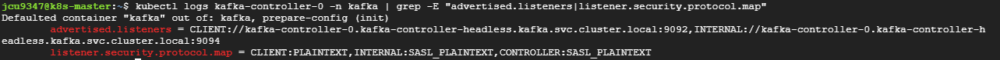
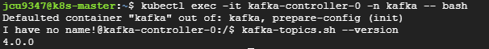

# kafka Cluster 구축
* StorageClass있어야 함
  * [참고 - rook-ceph](/create-k8s-environment/create-storage-solution/create-rook-ceph-using-helm.md)
* k8s cluster와 helm 3.x 버전 설치되어 있어야 함


## 1. Helm 이용한 Kafka 배포
```sh
helm repo add bitnami https://charts.bitnami.com/bitnami
helm repo update
```

<br><br>

## 2. KRaft 모드 개념 (Zookeeper 제외 설정), ZooKeeper와 비교
* [참고링크](https://adjh54.tistory.com/639)
* ZooKeeper는 클러스터의 메타데이터를 관리하는 Controller의 역할을 함
  * 메타데이터 - Kafka 클러스터의 상태와 구성 정보를 나타냄
    * 토픽 정보, 파티션-브로커 매핑, 브로커 정보, 컨트롤러 정보, ACL 및 인증 관련 데이터 등
  * 하지만 cluster의 규모가 커지는 경우, ZooKeeper노드와 브로커 노드가 늘어나면서 관리하기 어렵고 성능 저하 문제가 발생할 수 있음
* ZooKeeper (Kafka Raft와 비교)
  * ZooKeeper 사용시 클러스터를 별도로 관리해야 함
    * ZooKeeper사용시 최소 6노드가 필요함 - ZooKeeper 3대 + Kafka 브로커 3대로 총 6노드
    * KRaft 모드보다 관리하기 복잡함, 모니터링 및 유지보수에 추가적인 리소스
  * 장애 발생시 ZooKeeper와 브로커를 모두 디버깅 해야 하므로 복구하는데 오래 걸림
  * cluster의 규모가 클수록 브로커와 ZooKeeper간의 통신에 오버헤드도 커짐
* KRaft (ZooKeeper와 비교)
  * KRaft모드로 생성되는 노드(k8s에서 파드)가 Raft프로토콜을 이용하여 브로커와 컨트롤러 역할을 동시에 수행
  * ZooKeeper 클러스터 운영 불필요함 - 시스템 구성에 CPU/메모리 사용량 약 30% 절감
  * 메타데이터가 Kafka 내부에서 관리되므로 외부 시스템과 통신하는 지연 시간이 감소
* KRaft Config 설명 - 아래 yaml파일 확인
  * `process.roles=broker,controller`: KRaft 모드 활성화
    * 단일 노드가 브로커(데이터 처리)와 컨트롤러(메타데이터 관리) 역할을 동시에 수행
  * `controller.quorum.voters=...`: Raft 쿼럼 구성
    * 설정에 명시된 3개 노드 간 메타데이터 동기화
    * 3개 노드 중 2개 이상 정상 작동시 클러스터 운영 가능 (N/2 + 1 장애 허용)
  * `listeners=PLAINTEXT://0.0.0.0:9092,CONTROLLER://0.0.0.0:9093`: 9092(브로커), 9093(컨트롤러) 포트 동시 개방

<br><br>

## 3. KRaft 모드 설정하기
* KRaft 모드 구성 및 브로커의 PV생성을 위한 PVC설정이 필요함 - `kafka-values.yaml` 설정
  * KRaft모드 설정으로 생성된 파드는 **브로커와 컨트롤러 역할을 동시에 수행**함
  * storageClass의 경우 rook-ceph환경에서 생성한 storageClass를 사용 - [참고 링크](/create-k8s-environment/create-storage-solution/create-rook-ceph.md)
* `kafka-values.yaml` 설정 파일 정보
  ```yaml
  # kafka-values.yaml
  global:
    storageClass: "stateful-rook-ceph-block"

  kafka:
    replicaCount: 3  # Worker Node 3개에 대응
    kraft:
      enabled: true  # KRaft 모드 활성화
    listeners:
      client:
        protocol: PLAINTEXT  # SASL_PLAINTEXT → PLAINTEXT로 변경, 설치할때 --set옵션으로 주긴 하지만 그래도 추가하는 것이 좋음
    persistence:
      size: 5Gi     # PVC 크기 지정 - 20G 권장, allowVolumeExpansion: true설정이 storageclass에 있으므로 확장도 가능
      # existingClaim: ""  # 기존 PVC 사용할 경우, 이름 지정
    configurationOverrides:
      - "process.roles=broker,controller" # 단일 노드가 브로커(데이터 처리)와 컨트롤러(메타데이터 관리) 역할을 동시에 수행
      - "node.id=${HOSTNAME##*-}" # 각 노드별 고유 ID 설정 - 노드 이름이 k8s-worker-01~03일 경우 StatefulSet 인덱스(0,1,2) 자동 할당
      - "controller.quorum.voters=0@kafka-controller-0.kafka-controller-headless.kafka.svc.cluster.local:9093,1@kafka-controller-1.kafka-controller-headless.kafka.svc.cluster.local:9093,2@kafka-controller-2.kafka-controller-headless.kafka.svc.cluster.local:9093" # FQDN 직접 명시
      - "advertised.listeners=CLIENT://kafka-controller-${HOSTNAME##*-}.kafka-controller-headless.kafka.svc.cluster.local:9092"
      - "listeners=CLIENT://:9092,CONTROLLER://:9093"
      - "listener.security.protocol.map=CLIENT:PLAINTEXT"
      - "num.partitions=6"       # 자동 생성되는 토픽의 파티션 개수 설정
      - "num.network.threads=3"  # 기본값 5 -> 3으로 감소 설정 (test 환경 용도)
      - "num.io.threads=5"       # 기본값 8 -> 5로 감소 설정 (test 환경 용도)
      - "min.insync.replicas=2"  # 기본값 1 -> acks: "all" 사용시, ISR 파티션 개수 설정, 데이터 처리 속도에 큰 영향을 미치므로 신뢰성과의 trade-off 고려
    resources: # 아래 설정은 test환경 최소 사양 세팅
      requests:
        cpu: "250m"      # default - 250m : Pod가 계속 재시작 된다면 500m으로 늘릴 필요 있음
        memory: "1.5Gi"  # default - 2.5Gi
      limits:
        cpu: "1"         # default - 1
        memory: "2.5Gi"  # default - 8.5Gi
    monitoring:
      jmx:
        enabled: true  # 모니터링 활성화 - Prometheus와 연결 가능
  ```

<br><br>

## 4. Kafka 설치하고 점검하기
* kafka 설치
  ```sh
  helm install kafka bitnami/kafka \
    --namespace kafka \
    --create-namespace \
    -f kafka-values.yaml \
    --set listeners.client.protocol=PLAINTEXT # SASL_PLAINTEXT에서 PLAINTEXT로 바꾸어서 적용
  ```
* kafka 파드 점검하기
  ```sh
  # pod 점검
  kubectl -n kafka get pods # 설정한 개수만큼 있어야 함 - controller와 broker 역할을 동시에 수행하는 파드이므로 노드 개수만큼만

  # PVC 생성 확인(배포 1분 후 실행)
  kubectl -n kafka get pvc

  # Pod 환경변수 확인
  kubectl exec kafka-controller-0 -n kafka -- env # 파드 이름 확인

  # node.id 자동 할당 결과
  kubectl exec kafka-controller-0 -n kafka -- cat /opt/bitnami/kafka/config/server.properties | grep node.id # 파드 이름 확인

  # 브로커 로그 확인
  kubectl logs kafka-controller-0 -n kafka | grep -E "advertised.listeners|listener.security.protocol.map"
  ```
* 
* 브로커 로그는 아래와 같아야 함. `CLIENT:PLAINTEXT` 확인 `SASL_PLAINTEXT` 아님!!
* 
* kafka 버전 확인 방법
  ```
  kubectl exec -it kafka-controller-0 -n kafka -- bash # kafka 파드에 접속후
  kafka-topics.sh --version # 버전 확인
  ```
  * 

<br><br>

## 5. Spring Application Pod와 연결
* Kafka 브로커&컨트롤러 파드는 Headless Service로 접근(clusterIP:None)
* application.yaml 파일에 아래와 같은 kafka 설정 추가하면 됨, group-id는 서비스별로 정하는 것이 좋은듯
  ```yaml
  spring:
    kafka:
      bootstrap-servers: "kafka-controller-headless.kafka.svc.cluster.local:9092"
      properties:
        security.protocol: PLAINTEXT  # 프로토콜 명시
        bootstrap.servers.protocol.map: CLIENT:PLAINTEXT
        # client.id: spring-kafka-client  # (옵션) 클라이언트 ID 지정
      producer:
        key-serializer: org.apache.kafka.common.serialization.StringSerializer
        value-serializer: org.apache.kafka.common.serialization.StringSerializer
      consumer:
        group-id: test-service-group
        auto-offset-reset: earliest
        key-deserializer: org.apache.kafka.common.serialization.StringDeserializer
        value-deserializer: org.apache.kafka.common.serialization.StringDeserializer
  ```

<br><br>

## 6. Kafka 클러스터에 접근할 수 있는 Pod 생성 (클라이언트 도구)
* 해당 파드의 이미지는 Bitnami의 Kafka Docker 이미지로, Kafka 관리 및 테스트에 필요한 모든 CLI 명령어가 포함되어 있음
  * [참고 공식 문서](https://docs.bitnami.com/aws/infrastructure/kafka/administration/run-producer-consumer/)
  * Bitnami Kafka는 기본적으로 /opt/bitnami/kafka/bin에 명령어가 있으므로 참고
* Pod 생성 및 실행
  ```sh
  kubectl run kafka-client --restart='Never' --image docker.io/bitnami/kafka:latest --namespace kafka --command -- sleep infinity
  kubectl exec -it kafka-client -n kafka -- bash
  ```
* 명령어
  ```sh
  # 브로커 주소 예시 : kafka-controller-0.kafka-controller-headless.kafka.svc.cluster.local

  # 토픽 생성 - 복제 개수의 최대치는 브로커의 개수
  kafka-topics.sh --bootstrap-server <브로커주소>:9092 --create --topic <토픽이름> --partitions <파티션개수> --replication-factor <복제개수>
  kafka-topics.sh --bootstrap-server kafka-controller-0.kafka-controller-headless.kafka.svc.cluster.local:9092 --create --topic test --partitions 3 --replication-factor 3

  # 클러스터에 존재하는 모든 토픽 목록 확인
  /opt/bitnami/kafka/bin/kafka-topics.sh --list --bootstrap-server <브로커주소>:9092
  /opt/bitnami/kafka/bin/kafka-topics.sh --list --bootstrap-server kafka-controller-2.kafka-controller-headless.kafka.svc.cluster.local:9092

  # 토픽 삭제
  kafka-topics.sh --bootstrap-server <브로커주소>:9092 --delete --topic <토픽이름>
  kafka-topics.sh --bootstrap-server kafka-controller-0.kafka-controller-headless.kafka.svc.cluster.local:9092 --delete --topic test

  # 토픽 수정
  kafka-topics.sh --bootstrap-server <브로커주소>:9092 --alter --topic <토픽명> --partitions <새_파티션_개수>

  # 토픽의 파티션 개수 확인
  /opt/bitnami/kafka/bin/kafka-topics.sh --describe --topic <토픽명> --bootstrap-server <브로커주소>:9092
  /opt/bitnami/kafka/bin/kafka-topics.sh --describe --topic test --bootstrap-server kafka-controller-0.kafka-controller-headless.kafka.svc.cluster.local:9092

  # 메시지 전송 (Producer) - 명령어 입력 후 메시지 작성시 전송됨
  kafka-console-producer.sh --bootstrap-server <브로커주소>:9092 --topic <토픽명>
  kafka-console-producer.sh --bootstrap-server kafka-controller-0.kafka-controller-headless.kafka.svc.cluster.local:9092 --topic test-topic

  # 메시지 소비1 (Consumer) - 메시지부터 처음부터(--from-beginning) 끝까지 모두 읽어서 출력, `--from-beginning` 옵션 빼면 새로 들어오는 메시지 출력됨, value만 출력됨
  kafka-console-consumer.sh --bootstrap-server <브로커주소>:9092 --topic <토픽명> --from-beginning
  kafka-console-consumer.sh --bootstrap-server kafka-controller-0.kafka-controller-headless.kafka.svc.cluster.local:9092 --topic test-topic --from-beginning

  # 메시지 소비2 (Consumer) - key데이터도 있는 경우, (--property print.key=true --property key.separator="-") 옵션에 의해 `key-value` 형태로 출력됨
  kafka-console-consumer.sh --bootstrap-server <브로커주소>:9092 --topic <토픽명> --property print.key=true --property key.separator="-" --from-beginning

  # 컨슈머 그룹 목록 조회
  kafka-consumer-groups.sh --bootstrap-server <브로커주소>:9092 --list
  kafka-consumer-groups.sh --bootstrap-server kafka-controller-0.kafka-controller-headless.kafka.svc.cluster.local:9092 --list

  # 특정 컨슈머 그룹의 오프셋 정보 확인 (Consumer Lag 확인)
  kafka-consumer-groups.sh --bootstrap-server <브로커주소>:9092 --group <그룹명> --describe
  kafka-consumer-groups.sh --bootstrap-server kafka-controller-0.kafka-controller-headless.kafka.svc.cluster.local:9092 --group test-group --describe
  ```
