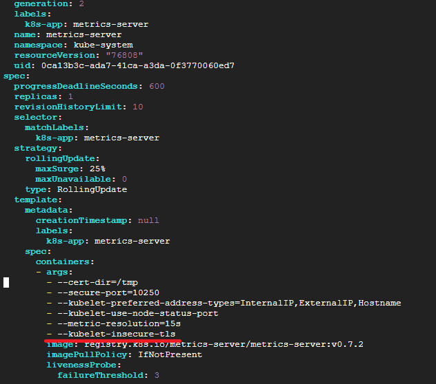
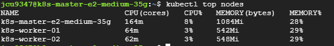
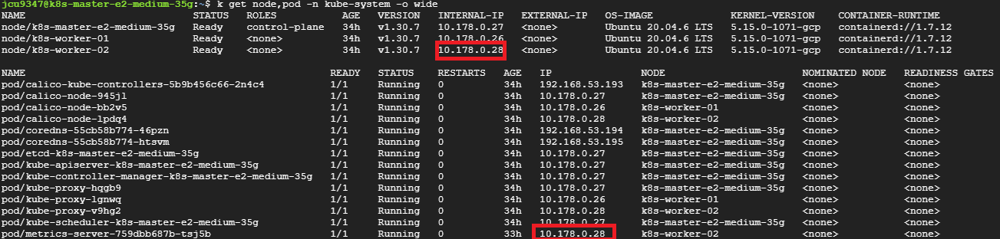
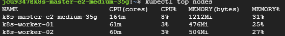
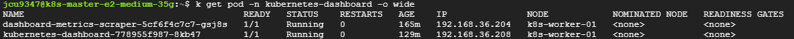
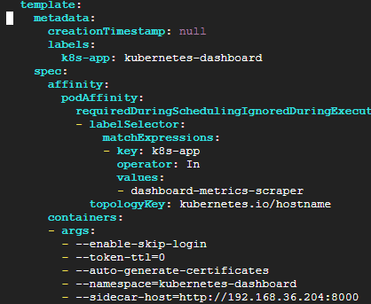

# Metrics Server 설치 과정
* K8s의 metrics-server 설치 방법과 HA구성 방법을 정리
* k8s cluster가 구축되어 있어야 함
* [참고한 블로그](https://nangman14.tistory.com/81#3.%20Metrics-server%EB%A5%BC%20%EB%8D%94%20%EC%9E%98%20%EC%9D%B4%EC%9A%A9%ED%95%98%EA%B8%B0-1)

<br><br>

## 1. Metrics Server 설치
* v0.6.3 설치
* kubelet과 metrics server가 tls 통신을 주고받기 위한 CA 인증서를 신뢰하는 과정을 수행하지 않았으므로 그대로 배포하면 x509 에러가 발생
  * 프로덕션 환경에서는 CA 인증서를 신뢰하는 과정을 수행해야 겠지만 현재는 테스트 과정이므로 CA 인증서를 확인하지 않도록 Deployment의 파라미터를 변경
  ```sh
  # 설치
  kubectl apply -f https://github.com/kubernetes-sigs/metrics-server/releases/download/v0.7.0/components.yaml
  ```

<br><br>

## 2. TLS 설정 수정
* x509 에러 임시 해결하기 위한 과정
```sh
- --kubelet-insecure-tls
```

```sh
# spec.template.spec.containers.args 란에 위의 내용을 추가
kubectl edit deployment metrics-server -n kube-system
```
* 


<br><br>

## 3. 동작 확인
* `kubectl top` 명령어가 잘 실행되어야 설치가 완료된 것
```sh
# API 서비스가 등록되어 있는지 확인
kubectl get apiservices | grep metrics

# deployment 정상 동작 확인
kubectl get deployment metrics-server -n kube-system

# Pod 작동 확인
kubectl get pods -n kube-system | grep metrics-server

# kubectl top 명령어 확인
kubectl top nodes
```
* 

<br><br>

## 4. 이외에 Metrics 설치가 잘 안된 경우 해볼 수 있는 것들
* 아래의 두가지 **네트워크 설정**을 점검한 이후 아래 내용들은 해결되었음
  1. vm이 `같은 vpc내에 있는지` 확인 - 보통 cloud에서 하나의 계정의 같은 그룹내에 생성된 vm이면 같은 vpc내에 있음
  2. Master 노드와 Worker노드 사이의 접근을 허용 (방화벽 `whitelist 설정`)
     * ~~master노드의 방화벽 설정으로, 모든 worker노드가 master노드의 모든 포트에 접근이 가능하도록 설정 (private, public 모두)~~
     * ~~worker노드의 방화벽 설정으로, master 노드가 해당하는 worker 노드의 모든 포트에 접근이 가능하도록 설정 (private, public 모두)~~
     * 그냥 같은 VPC내의 모든 vm끼리의 통신을 허용하는 규칙 하나만 생성해 주면 됨

<br>

## 4.1. `Metrics API not available`
* Metrics Server가 설치되었지만, kubectl top 명령어를 사용할 때 "Metrics API not available" 오류가 발생하는 경우
  * Metrics Server가 Node의 kubelet과의 통신에 실패했기 때문

* 왜인지 모르겠지만... metrics-server의 template설정에 `hostNetwork=true`옵션을 추가하면 해결이 된다. 
  * `hostNetwork=true`옵션은 Pod가 자신이 배포된 node의 IP와 동일하게 설정되도록 하는 옵션이다.
  * 
* 설정 방법
  ```sh
  # `hostNetwork: true` 옵션을 metrics-server 설정에 추가
  # spec.template.spec: 하위에 추가하면 됨
  kubectl edit deployment metrics-server -n kube-system
  ```
* Metrics Server 동작 체크
  ```sh
  # metrics server의 Pod가 Running 상태인지 확인
  kubectl get pods --all-namespaces
  ```

  ```sh
  # metrics server가 정상적으로 동작하고 있는지 확인
  kubectl top nodes
  ```
* 


<br>

## 4.2. kubernetes-dashboard 파드에서의 Metric client health check failed 이슈 해결
* 아래 내용들은 Metrics Server 설치를 위한 근본적인 해결책이 아님 - kubernetes-dashboard 에서의 Metrics Server 동작 문제 해결 위함
* Metric client health check failed 확인
* kubernetes-dashboard파드와 dashboard-metrics-scraper파드가 서로 다른 노드에 배치되어 접근을 못하는 상황임 (7에서 해결)
  * 노드끼리의 통신이 잘 안되고 있는 경우
```sh
# kubernetes-dashboard파드의 이름을 확인후
kubectl get pod -n kubernetes-dashboard

# 로그를 확인해 보면 아래와 같은 오류 메시지가 생길 수 있음
# Metric client health check failed: the server is currently unable to handle the request (get services dashboard-metrics-scraper). Retrying in 30 seconds.
kubectl logs -n kubernetes-dashboard kubernetes-dashboard-778955f987-8kb47
```

### 4.2.1. kubernetes-dashboard파드와 dashboard-metrics-scraper파드 같은 노드 배치하기
* 다른 네트워크 설정 없이, 두 파드를 같은 노드에 배치하여 Pod IP로 바로 접근하여 health check 문제 해결
* 특정 노드를 선택하여 kubernetes-dashboard파드와 dashboard-metrics-scraper파드를 같은 노드에 배치하기
* 배치할 노드에 label 하나 붙여줌 (app=dashboard)
* nodeAffinity로 dashboard-metrics-scraper파드가 할당될 노드 설정
  ```sh
  kubectl label nodes {배치할노드의hostname} app=dashboard
  kubectl edit deployment -n kubernetes-dashboard dashboard-metrics-scraper
  # spec.template.spec 하위에 입력
  affinity:
    nodeAffinity:
      requiredDuringSchedulingIgnoredDuringExecution:
        nodeSelectorTerms:
        - matchExpressions:
          - key: app
            operator: In
            values:
            - dashboard
  ```

* podAffinity로 kubernetes-dashboard파드를 dashboard-metrics-scraper와 같은 노드로 할당되도록 설정
  ```sh
  kubectl edit deployment -n kubernetes-dashboard kubernetes-dashboard

  # 아래의 affinity 설정을 spec.template.spec 하위에 입력
  # dashboard-metrics-scraper pod와 같은 노드에 할당되도록 podAffinity 설정
  affinity:
    podAffinity:
      requiredDuringSchedulingIgnoredDuringExecution:
      - labelSelector:
          matchExpressions:
          - key: k8s-app
            operator: In
            values:
            - dashboard-metrics-scraper
        topologyKey: kubernetes.io/hostname
  ```

* 같은 노드에 할당되었는지 확인, dashboard-metrics-scraper-IP 확인
  ```sh
  # k8s-worker-01 노드에 모두 할당됨
  # 아래 이미지의 경우 192.168.36.204
  k get pod -n kubernetes-dashboard -o wide
  ```
  * 

### 4.2.2. kubernetes-dashboard에 sidecar 추가하기
* sidecar 패턴?
  * 사이드카 패턴은 원래 사용하려고 했던 기본 컨테이너의 기능을 확장하거나 보조하는 용도의 컨테이너를 추가하는 패턴
  * ex. demon set - logging agent
* kubernetes-dashboard의 deployment 설정에서 sidecar 추가
  ```sh
  # spec.template.spec.containers.args: - --sidecar-host=http://{dashboard-metrics-scraper-IP}:8000
  kubectl edit deployment -n kubernetes-dashboard kubernetes-dashboard
  ```
  * 
