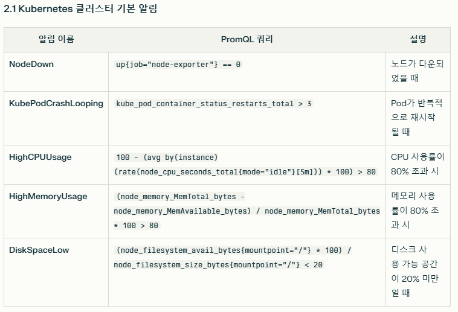
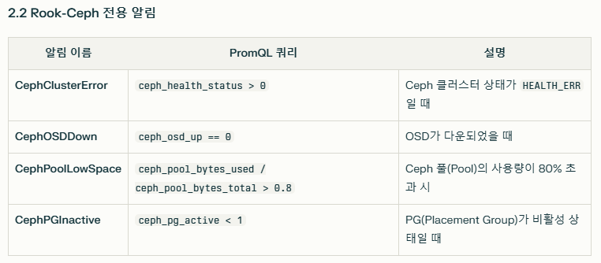

# kube-prometheus-stack 으로 Prometheus와 Grafana 설치
* 아래 내용들이 모두 설치되기 때문에 리소스를 많이 잡아 먹음
  * Prometheus
  * Prometheus Operator
  * Alertmanager
  * Grafana
  * kube-state-metrics
  * node-exporter

<br>

## 1. prometheus-community 레포 추가
> helm 3 이상 설치되어 있어야 함

* **Prometheus와 Grafana 그리고 AlertManager**를 설치를 위한 Helm repo 추가
  ```sh
  helm repo add prometheus-community https://prometheus-community.github.io/helm-charts
  helm repo update
  ```
* 설치 버전 helm v3.15.4 기준
  * Prometheus v3.2.1
  * AlertManager v0.28.1
  * Grafana v11.6.0


<br><br>

## 2. 설정 정보 정의
* StatefulSet에서 동작 가능한 StorageClass로 생성된 PV가 필요함
  * [rook-ceph설치 및 StorageClass생성](/create-k8s-environment/create-storage-solution/create-rook-ceph.md)
* alertmanager는 알림 관련 기능인데 statefulSet을 위한 StorageClass 설정이 없다면, 일단 false로 비활성화
  * `alertmanager.enabled:false` 설정시 alertmanager가 설치되지 않으므로 필요한 경우 삭제후 재설치 해야 함
* `monitoring-values.yaml`설정 정보
  * 아래는 테스트 환경 기준 resource 설정임
  ```yaml
  # monitoring-values.yaml
  ## Prometheus 컴포넌트
  prometheus:
    prometheusSpec:
      resources:
        limits:
          memory: 512Mi
          cpu: 500m
        requests:
          memory: 256Mi
          cpu: 250m
      retention: 5d  # 데이터 보존 기간 축소
      scrapeInterval: 60s  # 스크랩 간격 확대

  ## Alertmanager
  alertmanager:
    enabled: true
    alertmanagerSpec:
      resources:
        limits:
          memory: 128Mi
          cpu: 100m
        requests:
          memory: 64Mi
          cpu: 50m
    config:
      global:
        resolve_timeout: 3m
      receivers:
      - name: discord
        discord_configs: # 웹훅 url 입력, secret으로도 관리할수도 있는데 관련 설정은 문서 찾아봐야 할듯
        - webhook_url: "https://discord.com/api/webhooks/1361806782636228788/x1ty6HOqHxJGbFFDDhXiTD-0fOwfl6VM6XZWZd0NKvvYlFnHu8Q9u1qO6YmVrkHJSNeD"
      route:
        receiver: discord
        group_wait: 10s
        group_interval: 5m

  ## Grafana
  grafana:
    resources:
      limits:
        memory: 256Mi
        cpu: 200m
      requests:
        memory: 128Mi
        cpu: 100m
    adminPassword: "monitoring123!"

  ## 부가 컴포넌트 cpu, memory 최소화
  kubeStateMetrics:
    resources:
      limits:
        memory: 128Mi
        cpu: 100m
      requests:
        memory: 64Mi
        cpu: 50m

  prometheus-node-exporter:
    resources:
      limits:
        memory: 64Mi
        cpu: 100m
      requests:
        memory: 32Mi
        cpu: 50m

  ## 저장소
  prometheus:
    prometheusSpec:
      storageSpec:
        volumeClaimTemplate:
          spec:
            storageClassName: stateful-rook-ceph-block # 
            resources:
              requests:
                storage: 5Gi  # 저장소 크기 최소화
  ```

<br><br>

## 3. kube-prometheus-stack 설치
* monitoring 네임스페이스로 kube-prometheus-stack를 설치
* 설치되는 컴포넌트
  * Prometheus
  * Prometheus Operator
  * Alertmanager
  * Grafana
  * kube-state-metrics
  * node-exporter
* 위에서 정의한 monitoring-values.yaml 설정 정보 적용
  ```sh
  helm upgrade --install monitoring prometheus-community/kube-prometheus-stack \
    -n monitoring --create-namespace \
    -f monitoring-values.yaml
  ```

<br><br>

## 4. 디코 알림 설정 (`todo`)
* Prometheus와 AlertManager이용하여 알림 추가하기 - discord와 연결하여 알림 받기
* `todo`: 알림 규칙 설정
  * 
  * 
  ```
  server:
    files:
      alerting_rules.yml:
        groups:
          - name: ceph-alerts
            rules:
              - alert: CephClusterError
                expr: ceph_health_status > 0
                labels:
                  severity: critical
                annotations:
                  summary: "Ceph cluster is in error state!"
                  description: "Ceph cluster health status is {{ $value }}."

              - alert: CephOSDDown
                expr: ceph_osd_up == 0
                for: 5m
                labels:
                  severity: critical
                annotations:
                  summary: "Ceph OSD {{ $labels.osd }} is down!"
                  description: "OSD {{ $labels.osd }} has been down for 5 minutes."
  ```