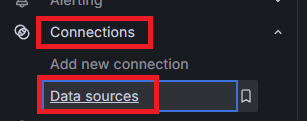
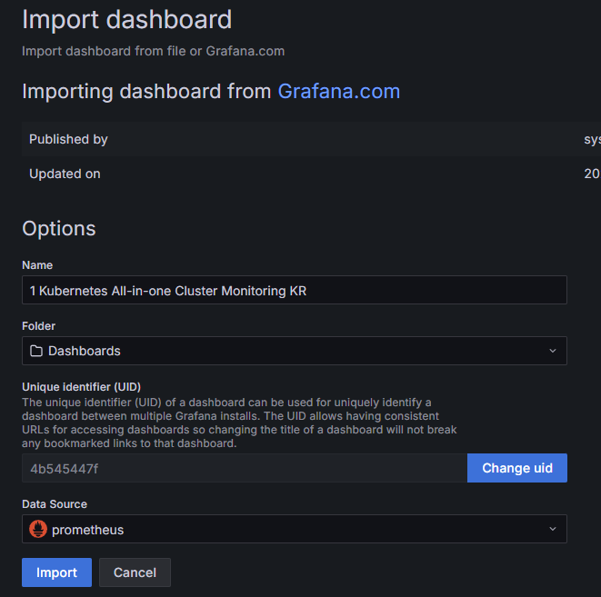
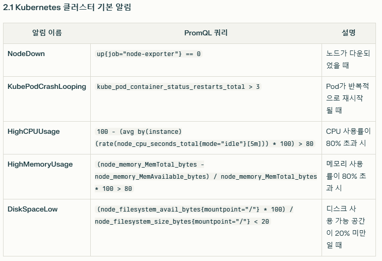
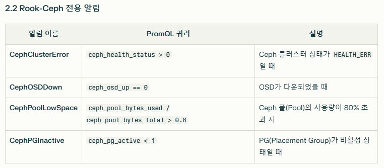

# Monitoring Tools 설치
## Prometheus
* Prometheus는 대상 시스템으로부터 각종 모니터링 지표를 수집하여 저장하고 검색할 수 있는 시스템임
* Prometheus는 그라파나를 통한 시각화를 지원함
* Prometheus는 많은 시스템을 모니터링할 수 있는 다양한 플러그인을 가지고 있음
* Prometheus가 주기적으로 exporter(모니터링 대상 시스템)로부터 pulling 방식으로 메트릭을 읽어서 수집함
* Kubernetes의 메인 모니터링 시스템으로 많이 사용됨
* AlertManager를 통해 수집한 데이터에 대한 알림 설정이 가능함
  * discord, slack 등으로 가능

<br>

## Grafana
* Grafana는 Prometheus를 비롯한 여러 데이터들을 시각화해주는 모니터링 툴임
* Grafana는 시스템 관점(cpu, 메모리, 디스크)의 메트릭 지표를 시각화하는데 특화되어 있음
  * cf. 키바나의 경우 로그 분석에 용이
* Grafana는 다양한 데이터베이스를 선택할 수 있음
  * cf. 키바나의 경우 elasticsearch에 묶인 툴
* 알람기능을 무료로 사용할 수 있음


<br><br>

## 1. Helm이용하여 Prometheus & Grafana 설치하기
> helm 3 이상 설치되어 있어야 함

* **Prometheus와 Grafana 그리고 AlertManager**를 설치를 위한 Helm repo 추가
  ```sh
  helm repo add prometheus-community https://prometheus-community.github.io/helm-charts
  helm repo update
  ```
* 설치 버전 helm v3.15.4 기준
  * Prometheus v3.2.1
  * AlertManager v0.28.1
  * Grafana v11.6.0

<br><br>

## 2. 설정 정보 정의
* StatefulSet에서 동작 가능한 StorageClass로 생성된 PV가 필요함
  * [rook-ceph설치 및 StorageClass생성](/create-k8s-environment/create-storage-solution/create-rook-ceph.md)
* alertmanager는 알림 관련 기능인데 statefulSet을 위한 StorageClass 설정이 없다면, 일단 false로 비활성화
  * `alertmanager.enabled:false` 설정시 alertmanager가 설치되지 않으므로 필요한 경우 삭제후 재설치 해야 함
* `monitoring-values.yaml`설정 정보
  * 테스트 환경 기준으로 요구 자원을 낮게 설정함
  ```yaml
  # monitoring-values.yaml
  ## Prometheus 컴포넌트
  prometheus:
    prometheusSpec:
      resources:
        limits:
          memory: 512Mi
          cpu: 500m
        requests:
          memory: 256Mi
          cpu: 250m
      retention: 5d  # 데이터 보존 기간 축소
      scrapeInterval: 60s  # 스크랩 간격 확대

  ## Alertmanager
  alertmanager:
    enabled: true
    alertmanagerSpec:
      resources:
        limits:
          memory: 128Mi
          cpu: 100m
        requests:
          memory: 64Mi
          cpu: 50m
    config:
      global:
        resolve_timeout: 3m
      receivers:
      - name: discord
        discord_configs: # 웹훅 url 입력, secret으로도 관리할수도 있는데 관련 설정은 문서 찾아봐야 할듯
        - webhook_url: "https://discord.com/api/webhooks/1361806782636228788/x1ty6HOqHxJGbFFDDhXiTD-0fOwfl6VM6XZWZd0NKvvYlFnHu8Q9u1qO6YmVrkHJSNeD"
      route:
        receiver: discord
        group_wait: 10s
        group_interval: 5m

  ## Grafana
  grafana:
    resources:
      limits:
        memory: 256Mi
        cpu: 200m
      requests:
        memory: 128Mi
        cpu: 100m
    adminPassword: "monitoring123!"

  ## 부가 컴포넌트 cpu, memory 최소화
  kubeStateMetrics:
    resources:
      limits:
        memory: 128Mi
        cpu: 100m
      requests:
        memory: 64Mi
        cpu: 50m

  prometheus-node-exporter:
    resources:
      limits:
        memory: 64Mi
        cpu: 100m
      requests:
        memory: 32Mi
        cpu: 50m

  ## 저장소
  prometheus:
    prometheusSpec:
      storageSpec:
        volumeClaimTemplate:
          spec:
            storageClassName: stateful-rook-ceph-block # 
            resources:
              requests:
                storage: 5Gi  # 저장소 크기 최소화
  ```

## 3. kube-prometheus-stack 설치
* monitoring 네임스페이스로 kube-prometheus-stack를 설치
* 설치되는 컴포넌트
  * Prometheus
  * Prometheus Operator
  * Alertmanager
  * Grafana
  * kube-state-metrics
  * node-exporter
* 위에서 정의한 monitoring-values.yaml 설정 정보 적용, repo는 v40.2.0이 안정하다고 함
  ```sh
  helm upgrade --install monitoring prometheus-community/kube-prometheus-stack \
    -n monitoring --create-namespace \
    -f monitoring-values.yaml \
    --version 40.2.0
  ```

<br><br>

### 4. NodePort변경 및 브라우저에서 UI 접속
* 설치 확인
  ```sh
  kubectl get all -n monitoring
  kubectl get svc -n monitoring
  ```
* nodePort로 변경
  * Prometheus 서비스
  * `k edit svc kube-prometheus-stack-prometheus -n monitoring`
  * 
  * Grafana 서비스
  * `k edit svc kube-prometheus-stack-grafana -n monitoring`
  * 
* Grafana 접속 계정 정보 확인
  * PW는 grafana관련 secret에서 비밀번호 확인 또는 `2.설정 정보 정의`항목에서 설정한 adminPassword 확인
  * ID는 admin
* UI 접속 확인 (http)
  * 
  * 

<br><br>

### 5. Grafana에서 Prometheus Datasource 등록하기
* `todo`: kube-prometheus-stack 설치시 기본 생성되는 대시보드 연결하기
* Connections > Datasources 로 진입
* 
* Add Datasource에서 prometheus 검색하여 선택하고 이름(Prometheus - 대문자 주의)과 Prometheus server URL 입력후 Save & test
* 

<br>

### 6. Grafana에 대시보드 Import 하기
* 왼쪽 탭에서 Dashboards - Create Dashboard 선택
* import dashboard 선택하고 dashboard 생성
* `https://grafana.com/grafana/dashboards/`에서 ID 검색
* 

<br>

* 13770 으로 Load후 이전에 생성한 datasource 선택 후 Import
* 

<br>

* 정상적으로 import된 모습
* 

<br>

* 추천 대시보드
* Kubernetes / Views / Global : 15757
* Kubernetes All-in-one Cluster Monitoring KR : 13770 or 17900
* Node Exporter Full : 1860
* Node Exporter for Prometheus Dashboard based on 11074 : 15172
* kube-state-metrics-v2 : 13332


<br><br>

## 7. Prometheus와 AlertManager이용하여 알림 추가하기
* discord와 연결하여 알림 받기
* `todo`: 알림 규칙 설정
  * 
  * 
  ```
  server:
    files:
      alerting_rules.yml:
        groups:
          - name: ceph-alerts
            rules:
              - alert: CephClusterError
                expr: ceph_health_status > 0
                labels:
                  severity: critical
                annotations:
                  summary: "Ceph cluster is in error state!"
                  description: "Ceph cluster health status is {{ $value }}."

              - alert: CephOSDDown
                expr: ceph_osd_up == 0
                for: 5m
                labels:
                  severity: critical
                annotations:
                  summary: "Ceph OSD {{ $labels.osd }} is down!"
                  description: "OSD {{ $labels.osd }} has been down for 5 minutes."
  ```