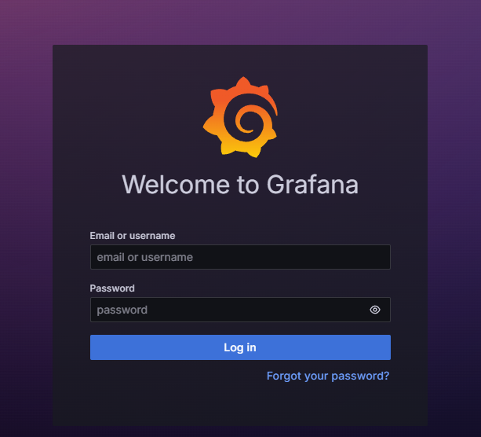
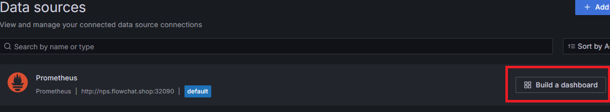

# Monitoring Tools 설치
## Prometheus
* Prometheus는 대상 시스템으로부터 각종 모니터링 지표를 수집하여 저장하고 검색할 수 있는 시스템임
* Prometheus는 그라파나를 통한 시각화를 지원함
* Prometheus는 많은 시스템을 모니터링할 수 있는 다양한 플러그인을 가지고 있음
* Prometheus가 주기적으로 exporter(모니터링 대상 시스템)로부터 pulling 방식으로 메트릭을 읽어서 수집함
* Kubernetes의 메인 모니터링 시스템으로 많이 사용됨
* AlertManager를 통해 수집한 데이터에 대한 알림 설정이 가능함
  * discord, slack 등으로 가능

<br>

## Grafana
* Grafana는 Prometheus를 비롯한 여러 데이터들을 시각화해주는 모니터링 툴임
* Grafana는 시스템 관점(cpu, 메모리, 디스크)의 메트릭 지표를 시각화하는데 특화되어 있음
  * cf. 키바나의 경우 로그 분석에 용이
* Grafana는 다양한 데이터베이스를 선택할 수 있음
  * cf. 키바나의 경우 elasticsearch에 묶인 툴

<br><br>

## 1. Helm 레포 추가
```sh
helm repo add prometheus-community https://prometheus-community.github.io/helm-charts
helm repo add grafana https://grafana.github.io/helm-charts
helm repo update
```

<br><br>

## 2. 설정 파일 정의
* resource 설정은 최소치로 설정함
* `prometheus-values.yaml` 파일 생성
  ```sh
  cat > prometheus-values.yaml <<'EOF'
  # prometheus-values.yaml
  server:
    resources:
      requests:
        cpu: "250m"
        memory: "256Mi"
      limits:
        cpu: "500m"
        memory: "512Mi"
    persistentVolume:
      enabled: true
      storageClass: "stateful-rook-ceph-block"
      accessModes:
        - ReadWriteOnce
      size: 5Gi
  alertmanager:
    enabled: false  # Alertmanager 비활성화
  EOF
  ```
* `grafana-values.yaml` 파일 생성
  ```sh
  cat > grafana-values.yaml <<'EOF'
  # grafana-values.yaml
  resources:
    requests:
      cpu: "100m"
      memory: "128Mi"
    limits:
      cpu: "200m"
      memory: "256Mi"
  persistence: # Grafana의 데이터(대시보드, 사용자 등) 저장하기 위한 설정
    enabled: true # false 설정시 Pod가 삭제/재시작될 때마다 데이터가 모두 사라짐
    type: pvc
    accessModes:
      - ReadWriteOnce
    size: 5Gi
    storageClassName: "general-rook-ceph-block" # storageClass는 `allowVolumeExpansion: true`인 storageClass로 설정
    # existingClaim: "" # 이미 생성된 PVC 사용하는 경우
  EOF
  ```

<br><br>

## 3. Prometheus & Grafana 설치
* monitoring 네임스페이스에 모두 설치
  ```sh
  # Prometheus 설치
  helm install prometheus prometheus-community/prometheus -f prometheus-values.yaml --namespace monitoring --create-namespace

  # Prometheus 설치 확인
  kubectl get all -n monitoring

  # Grafana 설치
  helm install grafana grafana/grafana -f grafana-values.yaml --namespace monitoring

  # Grafana 설치 확인
  kubectl get all -n monitoring

  # Grafana 초기 비밀번호 확인, 또는 k8s 대시보드에서 secret 내용 직접 확인
  kubectl get secret --namespace monitoring grafana -o jsonpath="{.data.admin-password}" | base64 --decode ; echo
  ```

<br><br>

## 4. NodePort변경 및 브라우저에서 UI 접속
* 설치 확인
  ```sh
  kubectl get all -n monitoring
  kubectl get svc -n monitoring
  ```
* nodePort로 변경
  * Prometheus 서비스
  * `kubectl edit svc prometheus-server -n monitoring`
  * 
  * Grafana 서비스
  * `kubectl edit svc grafana -n monitoring`
  * 
* Grafana 접속 계정 정보 확인
  * PW는 grafana secret에서 비밀번호 확인 또는 아래 명령어 입력
    * `kubectl get secret --namespace monitoring grafana -o jsonpath="{.data.admin-password}" | base64 --decode ; echo`
  * ID는 admin
* UI 접속 확인 (http)
  * 
  * 

<br><br>

## 5. Grafana에서 Prometheus Datasource 등록하기
* `todo`: kube-prometheus-stack 설치시 기본 생성되는 대시보드 연결하기
* Connections > Datasources 로 진입
* 
* Add Datasource에서 prometheus 검색하여 선택하고 이름(Prometheus - 대문자 주의)과 Prometheus server URL 입력후 Save & test
* 

<br>

## 6. Grafana에 대시보드 Import 하기
* 5에서 Datasource 생성후 Build a dashboard 선택
* 
* import dashboard 선택하고 save 버튼 클릭하여 dashboard 생성
* `https://grafana.com/grafana/dashboards/`에서 ID 검색
* 

<br>

* 13770 으로 Load후 이전에 생성한 datasource 선택 후 Import
* 

<br>

* 정상적으로 import된 모습
* 

<br>

* 추천 대시보드
* Kubernetes / Views / Global : 15757
* Kubernetes All-in-one Cluster Monitoring KR : 13770 or 17900
* Node Exporter Full : 1860
* Node Exporter for Prometheus Dashboard based on 11074 : 15172
* kube-state-metrics-v2 : 13332

