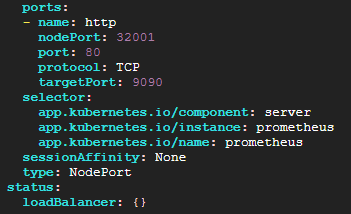
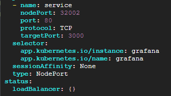
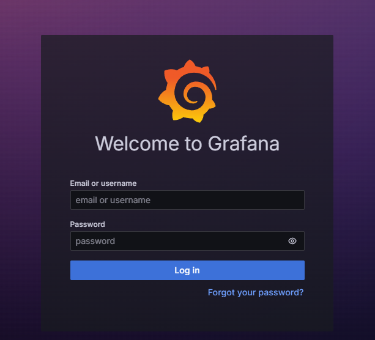
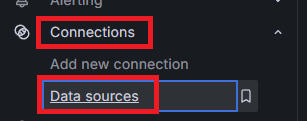
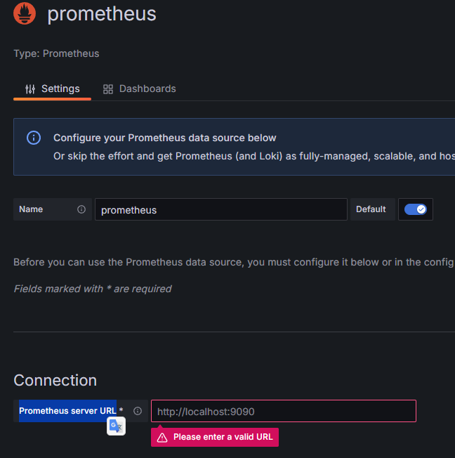
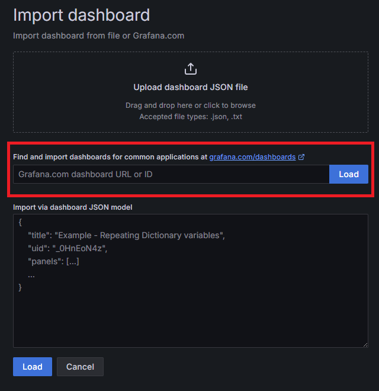
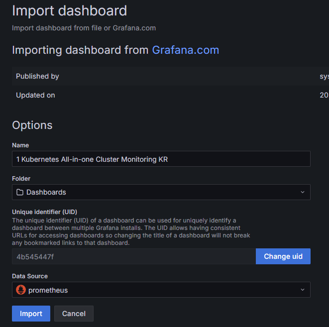
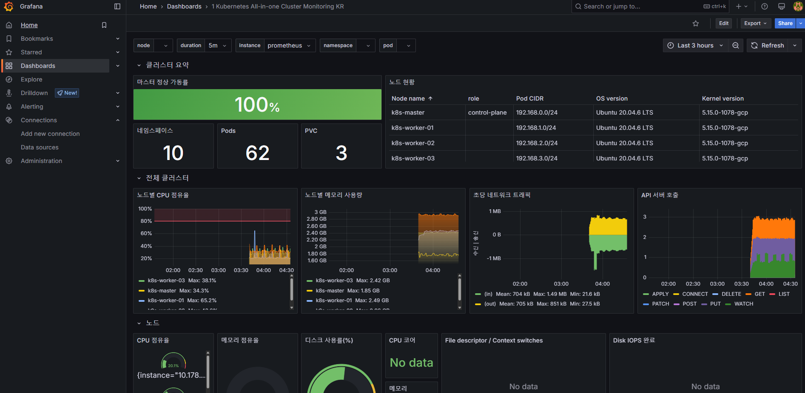

# Prometheus & Grafana 설치
## Prometheus
* 프로메테우스는 대상 시스템으로부터 각종 모니터링 지표를 수집하여 저장하고 검색할 수 있는 시스템임
* 프로메테우스는 그라파나를 통한 시각화를 지원함
* 프로메테우스는 많은 시스템을 모니터링할 수 있는 다양한 플러그인을 가지고 있음
* 프로메테우스가 주기적으로 exporter(모니터링 대상 시스템)로부터 pulling 방식으로 메트릭을 읽어서 수집함
* 쿠버네티스의 메인 모니터링 시스템으로 많이 사용됨

<br>

## Grafana
* 그라파나는 프로메테우스를 비롯한 여러 데이터들을 시각화해주는 모니터링 툴임
* 그라파나는 시스템 관점(cpu, 메모리, 디스크)의 메트릭 지표를 시각화하는데 특화되어 있음
  * cf. 키바나의 경우 로그 분석에 용이
* 그라파나는 다양한 데이터베이스를 선택할 수 있음
  * cf. 키바나의 경우 elasticsearch에 묶인 툴
* 알람기능을 무료로 사용할 수 있음


<br><br>

## 1. Helm이용하여 Prometheus & Grafana 설치하기
> helm 3 이상 설치되어 있어야 함

* Prometheus와 Grafana Helm Chart 리포지토리 추가
    ```sh
    helm repo add prometheus-community https://prometheus-community.github.io/helm-charts
    helm repo add grafana https://grafana.github.io/helm-charts
    helm repo update
    ```

<br><br>

## 2. 네임스페이스 생성 및 Prometheus 설치
* Prometheus & Grafana의 namespace 생성 - monitoring
  ```sh
  kubectl create namespace monitoring
  ```
* prometheus-values.yaml 생성
  * values의 설정 내용 궁금하면 아래 명령어 입력시 파일 생성됨
    * `helm show values prometheus-community/prometheus > prometheus-values.yaml`
  * StorageClass 생성되어 있어야 함
    * [참고 링크 - rook-ceph](/kubernetes-study/create-k8s-environment/create-storage-solution/create-rook-ceph.md)
  * alertmanager는 알림 관련 기능인데 일단 비활성화
    * `enabled:false` 설정시 alertmanager가 설치되지 않으므로 필요한 경우 삭제후 재설치
    ```yaml
    server:
      persistentVolume:
        enabled: true
        storageClass: "rook-ceph-block" 
        size: 8Gi
    alertmanager:
      enabled: false
    ```
* Prometheus 설치
  ```sh
  helm install prometheus prometheus-community/prometheus \
    -f prometheus-values.yaml \
    --namespace monitoring
  ```
* 설치 확인 - `kubectl get all -n monitoring`
* nodePort로 변경
  * `k edit svc prometheus-server -n monitoring`
  * 
* 접속 확인 (http)
  * 

<br><br>

## 3. Grafana 설치
* 1에서 helm chart 레포 생성해야 함
* 설치 및 svc 노드포트로 변경
  ```sh
  helm install grafana grafana/grafana --namespace monitoring
  k edit svc grafana -n monitoring
  ```
  * 
* 비밀번호 확인
  ```sh
  kubectl get secret --namespace monitoring grafana -o jsonpath="{.data.admin-password}" | base64 --decode ; echo
  ```
* 접속 확인 (http)
  * ID는 admin
  * 

<br><br>

## 4. Grafana에서 Prometheus 연결하기
*  Connections > Datasources 로 진입
* 
* Add Datasource에서 prometheus 검색하여 선택하고 Prometheus server URL입력후 Save & test
* 

<br><br>

## 5. Grafana에 대시보드 Import 하기
* 왼쪽 탭에서 Dashboards - Create Dashboard 선택
* import dashboard 선택하 dashboard 생성
* `https://grafana.com/grafana/dashboards/`에서 ID 검색
* 

<br>

* 13770 으로 Load후 아까 생성한 datasource 선택 후 Import
* 

<br>

* 정상적으로 import된 모습
* 

<br><br>

## 5. AlertManager 설정
* todo
  * 디스크 용량 늘려야함
  * AlterManger enable true로 prometheus 다시 설치해야 함
* [Prometheus Alert Manager Expression](https://danykde0til.tistory.com/155)
  ```
  # Node ready
  expr: kube_node_status_condition{condition="Ready",status="true"} == 0
  
  # Memory pressure
  expr: kube_node_status_condition{condition="MemoryPressure",status="true"} == 1
  
  # Disk pressure
  expr: kube_node_status_condition{condition="DiskPressure",status="true"} == 1
  
  # Out of disk
  expr: kube_node_status_condition{condition="OutOfDisk",status="true"} == 1
  
  # Out of capacity
  expr: sum by (node) ((kube_pod_status_phase{phase="Running"} == 1) + on(uid) group_left(node) (0 * kube_pod_info{pod_template_hash=""})) / sum by (node) (kube_node_status_allocatable{resource="pods"}) * 100 > 90
  
  # Container oom killer
  expr: (kube_pod_container_status_restarts_total - kube_pod_container_status_restarts_total offset 10m >= 1) and ignoring (reason) min_over_time(kube_pod_container_status_last_terminated_reason{reason="OOMKilled"}[10m]) == 1
  
  # Job failed
  expr: kube_job_status_failed > 0
  
  # Cronjob suspended
  expr: kube_cronjob_spec_suspend != 0

  # PersistentVolumeClaim pending
  expr: kube_persistentvolumeclaim_status_phase{phase="Pending"} == 1
  
  # PersistentVolume error
  expr: kube_persistentvolume_status_phase{phase=~"Failed|Pending", job="kube-state-metrics"} > 0

  # StatefulSet down
  expr: (kube_statefulset_status_replicas_ready / kube_statefulset_status_replicas_current) != 1
  
  # Readiness probe 실패
  expr : sum by(pod)( kube_pod_info{created_by_kind!="Job"} AND ON (pod, namespace) kube_pod_status_ready{condition="false"} == 1) > 0
  
  # HPA scaling ability
  kube_horizontalpodautoscaler_status_condition{status="false", condition="AbleToScale"} == 1
  
  # Pod not healthy
  min_over_time(sum by (namespace, pod) (kube_pod_status_phase{phase=~"Pending|Unknown|Failed"})[15m:1m]) > 0
  
  # Pod crash looping
  expr: increase(kube_pod_container_status_restarts_total[1m]) > 3
  ```