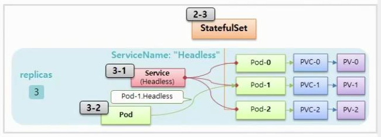
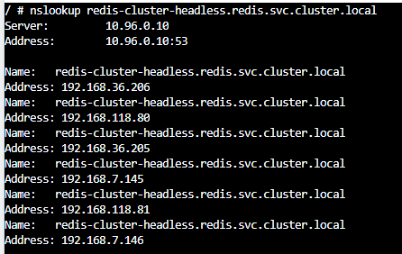
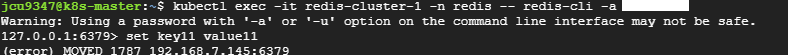

# Redis Cluster 구축 & 간단한 Redis Cluster 개념 정리
* [참고 링크](https://jeongchul.tistory.com/725)
* 목적
  * 빠른 응답을 위한 캐시 데이터 활용
  * k8s 환경에 적용시, stateful set을 이용한 scale in/out이 가능함
  * Redisson 분산락 활용
    * 여러개의 Pod에서 접근할 수 있는 자원에 대한 동시성 문제 해결
    * Redisson 라이브러리를 이용한 pub/sub 분산락으로 락 획득 처리에 대한 부하를 줄일 수 있음
    * 자원이 위치한 DB에서 받아야 할 락에 관련된 부하를, Redis로 분산 가능

<br>

## 1. Redis Cluster helm repo 설치
```sh
helm repo add bitnami https://charts.bitnami.com/bitnami
helm repo update
helm fetch bitnami/redis-cluster --untar
cd redis-cluster
ls # 설치 점검
```

<br><br>

## 2. Redis Cluster 설정 파일 수정
* values.yaml 파일 수정
  ```sh
  cd redis-cluster
  vi values.yaml
  ```
  ```yaml
  # redis-values.yaml 주요 설정
  global:
    storageClass: "rook-ceph-block"  # 생성한 PVC의 StorageClass 이름
    redis:
      password: "your_secure_password"

  cluster:
    nodes: 6  # 최소 3 Masters + 3 Replicas
    replicas: 1

  persistence:
    enabled: true
    size: 8Gi  # PVC 크기와 일치
    storageClass: "rook-ceph-block"

  service:
    type: ClusterIP # default는 Loadbalancer 로 되어 있음 - ingress 추가시 변경해야 할듯
    ports:
      redis: 6379
  ```
* configmap.yaml 파일 수정 (선택)
  ```sh
  vi templates/configmap.yaml

  # configmap.yaml
  # 용량이 8000M 넘어갈시 volatile-lr 정책에 의해 데이터 삭제 옵션, default설정은 용량 넘어갈시 에러발생임
  maxmemory 8000M
  maxmemory-policy volatile-lr
  ```

<br><br>

## 3. Helm으로 Redis Cluster 설치
```sh
helm install redis-cluster bitnami/redis-cluster \
  --namespace redis \
  --create-namespace \
  -f values.yaml
```

<br><br>

## 4. Redis cluster 상태 및 Pods 상태 점검
```sh
kubectl get pods -n redis # 파드 상태 점검
kubectl exec -it redis-cluster-0 -n redis -- \
  redis-cli --cluster check 127.0.0.1:6379 -a {redis_password}
```
* 

<br><br>

## 5. Redis Cluster Headless 서비스 접근 하기, Headless Service 개념
* 다른 Service Pod에서 Redis Cluster 스테이트풀 셋으로 생성된 Redis Pod에 접근하는 방법?
  * Headless Service를 통하여 Pod에서 Pod로 접근이 가능
  * 

<br>

### 5.1. Headless Service 생성 (개념 확인용)
* 위의 4번까지의 내용을 잘 수행했다면 `redis-cluster-headless`라는 Headless 서비스가 생성되었을 것이므로 **Headless Service를 추가적으로 생성할 필요가 없음!**
* 먼저 redis-cluster 스테이트풀 셋의 `spec.serviceName`과 `spec.template.metadata.labels`중 하나(instance로)를 확인
* 위에서 확인한, 같은 이름의 serviceName과 확인한 label을 selector로 지정하여 Headless 서비스를 생성해 주어야 한다.
  * 
  * 
* 위 내용 확인하여 아래 예시와 같은 설정 정보로 Headless service 생성
  ```yaml
  apiVersion: v1
  kind: Service
  metadata:
    name: redis-cluster-headless # Redis Cluster StatefulSet에 설정된 serviceName와 일치해야 함
    namespace: redis  # Redis Cluster가 배포된 네임스페이스
    labels:
      app.kubernetes.io/name: redis-cluster
  spec:
    clusterIP: None  # Headless Service로 설정
    selector:
      app.kubernetes.io/instance: redis-cluster  # StatefulSet의 Label과 일치해야 함
    ports:
      - name: redis
        port: 6379
        targetPort: 6379
  ```

### 5.2. Headless Service로 Redis Pod에 접근하기
* Headless Service가 등록되어 있다면 FQDN(Fully Qualified Domain Name)에 따라 아래와 같은 도메인으로 등록됨
  * `{Headless-Service-name}.{namespace}.svc.cluster.local`
  * 따라서, redis 네임스페이스에 redis-cluster-headless 이름으로 생성했다면, 
    * redis-cluster-headless.redis.svc.cluster.local으로 coreDNS(k8s service discovery)에 service에 대한 도메인이 등록됨
  * CoreDNS는 Pod로 생성되어 클러스터내에 위치해 있기 때문에, 클러스터 네트워크 대역에 해당하는 출발지(즉, 같은 대역폭)에서 `nslookup` 명령어로 확인 가능함
  * 
* StatefulSet으로 생성된 Pod에도 도메인을 통해 바로 접근이 가능함
  * `{Pod-Name},{Headless-Service-Name}.{Namespace}.svc.cluster.local` - ex. redis-cluster-0.redis-cluster-headless.redis.svc.cluster.local
* Pod의 도메인을 이용하여 Spring 애플리케이션

<br><br>

## 6. Redis CLI 접속
* redis-tool을 설치하면 접속 가능
  ```sh
  sudo apt update
  sudo apt install redis-tools # CLI 사용을 위한 redis-tools 설치
  kubectl exec -it {pod-name} -n redis -- redis-cli -a {redis-password}
  # ex. kubectl exec -it redis-cluster-0 -n redis -- redis-cli -a 1234
  ```
* `MOVED 오류`
  * redis cluster라서 저장하려는 키가 현재 연결된 노드가 아닌 다른 노드에 할당된 슬롯일 수 있음
  * Redis Cluster는 데이터를 16384개의 해시 슬롯으로 분산 저장하며, 각 슬롯은 특정 마스터 노드에서 관리하기 때문
  * 
  * 따라서 해당하는 redis 노드의 pod로 다시 이동후 명령어 수행 가능함
  * 

<br><br>

## 7. Spring 프로젝트에 적용

### 7.1. Redisson 설정 정보 추가
* [해당 링크](https://helloworld.kurly.com/blog/distributed-redisson-lock/)를 참고, AOP를 이용하여 분산락 컴포넌트를 생성
* 분산락 동작&구현 방식?
  1. 락 획득: 특정 자원(ex. resource-A)에 대한 접근 권한을 얻기 위해 락을 설정, 해당 락의 이름을 key값(ex. lock-coupon)으로 redis-cluster에 저장
  2. 락 유지: 락을 획득한 프로세스는 작업을 수행하는 동안 해당 락을 점유할수 있도록 해야 함
     * ex. 다른 프로세스가 `resource-A`에 접근하는 경우 `lock-coupon` key가 redis-cluster에 저장되어 있는지 조회, 있다면 접근 불가
  3. 락 해제: 작업이 완료되면 락을 해제(redis-cluster에서 락에 해당하는 key를 제거)하여 다른 프로세스가 자원에 접근할 수 있도록 허용
* 설정 정보 세팅
  * 위의 Redis cluster 구축 과정대로 진행했다면, 6개의 redis node가 있으므로 아래와 같이 세팅 가능
  ```yaml
  spring:
    redis:
      redisson:
        config: |
          clusterServersConfig:
            idleConnectionTimeout: 10000
            connectTimeout: 10000
            timeout: 3000
            retryAttempts: 3
            retryInterval: 1500
            failedSlaveReconnectionInterval: 3000
            failedSlaveCheckInterval: 60000
            password: {redis-비밀번호}
            nodeAddresses:
              - "redis://redis-cluster-0.redis-cluster-headless.redis.svc.cluster.local:6379"
              - "redis://redis-cluster-1.redis-cluster-headless.redis.svc.cluster.local:6379"
              - "redis://redis-cluster-2.redis-cluster-headless.redis.svc.cluster.local:6379"
              - "redis://redis-cluster-3.redis-cluster-headless.redis.svc.cluster.local:6379"
              - "redis://redis-cluster-4.redis-cluster-headless.redis.svc.cluster.local:6379"
              - "redis://redis-cluster-5.redis-cluster-headless.redis.svc.cluster.local:6379"
  ```
  ```java
  @Configuration
  public class RedissonConfig {

      @Bean
      public RedissonClient redissonClient() throws IOException {
          // application.yaml의 설정값으로 Redisson 구성 로드
          // spring.redis.redisson.config: 에 대응
          Config config = Config.fromYAML(getClass().getClassLoader().getResource("redisson-config.yaml"));
          return Redisson.create(config);
      }
  }
  ```

<br>

### 7.2. AOP를 이용하여 분산락 컴포넌트를 생성
* 자세한 동작 방식은 [해당 링크](https://helloworld.kurly.com/blog/distributed-redisson-lock/) 참고
* 아래의 클래스 및 인터페이스 추가
  ```java
  @Target(ElementType.METHOD)
  @Retention(RetentionPolicy.RUNTIME)
  public @interface DistributedLock {
      String key(); // Lock의 이름 (고유값)
      TimeUnit timeUnit() default TimeUnit.SECONDS; // 시간 단위
      long waitTime() default 5L; // 락 획득을 위해 waitTime 만큼 대기
      long leaseTime() default 3L; // 락을 획득한 이후 leaseTime 이 지나면 락을 해제, leaseTime은 처리 시간의 2~3배로 설정하는것이 좋음(락 중복 획득 방지)
  }
  ```
  ```java
  public class CustomSpringELParser {
      private CustomSpringELParser() {}

      public static Object getDynamicValue(String[] parameterNames, Object[] args, String key) {
          ExpressionParser parser = new SpelExpressionParser();
          StandardEvaluationContext context = new StandardEvaluationContext();

          for (int i = 0; i < parameterNames.length; i++) {
              context.setVariable(parameterNames[i], args[i]);
          }

          return parser.parseExpression(key).getValue(context, Object.class);
      }
  }
  ```
  ```java
  @Component
  public class AopForTransaction {
      // Propagation.REQUIRES_NEW 옵션을 지정해 부모 트랜잭션의 유무에 관계없이 별도의 트랜잭션으로 동작
      @Transactional(propagation = Propagation.REQUIRES_NEW)
      public Object proceed(final ProceedingJoinPoint joinPoint) throws Throwable {
          return joinPoint.proceed();
      }
  }
  ```
  ```java
  @Slf4j
  @Aspect
  @Component
  @RequiredArgsConstructor
  public class DistributedLockAop {
      private static final String REDISSON_LOCK_PREFIX = "LOCK:";

      private final RedissonClient redissonClient;
      private final AopForTransaction aopForTransaction;

      @Around("@annotation({DistributedLock_경로})")
      public Object lock(final ProceedingJoinPoint joinPoint) throws Throwable {
          MethodSignature signature = (MethodSignature) joinPoint.getSignature();
          Method method = signature.getMethod();
          DistributedLock distributedLock = method.getAnnotation(DistributedLock.class);

          String key = REDISSON_LOCK_PREFIX + CustomSpringELParser.getDynamicValue(signature.getParameterNames(), joinPoint.getArgs(), distributedLock.key());
          RLock rLock = redissonClient.getLock(key);

          try {
              boolean available = rLock.tryLock(distributedLock.waitTime(), distributedLock.leaseTime(), distributedLock.timeUnit());
              if (!available) {
                  return false;
              }

              // 아래의 코드로 DistributedLock 어노테이션이 선언된 메서드를 별도의 트랜잭션으로, 트랜잭션 실행과 종료(커밋or롤백)까지 수행
              return aopForTransaction.proceed(joinPoint); 
          } catch (InterruptedException e) {
              throw new InterruptedException();
          } finally {
              try {
                  rLock.unlock(); // 트랜잭션 종료후 락이 해제되므로 데이터의 정합성을 보장할 수 있음
              } catch (IllegalMonitorStateException e) {
                  log.info("Redisson Lock Already UnLock [serviceName:{}][key:{}]", method.getName(), key);
              }
          }
      }

  }
  ```
* 아래와 같이 `@DistributedLock`어노테이션을 메소드에 붙여서 분산락 사용 가능
  ```java
  @DistributedLock(key = "#lockName")
  public void couponDecrease(String lockName, Long couponId) {
      Coupon coupon = couponRepository.findById(couponId)
              .orElseThrow(IllegalArgumentException::new);

      coupon.decrease();
  }
  ```

<br><br>

## 8. Redis-cluster에서 분산락 동작 방식과 장단점 (Redlock과 비교)
* `Lock 데이터 저장 방식`
  * Redis Cluster는 16384개의 해시 슬롯으로 키를 샤딩
  * Redisson의 RLock은 키 기반으로 생성되며, 키에 대한 lock데이터는 **하나의 마스터 노드**에 저장
  * 슬레이브 Pod에는 비동기적으로 복제
* `Lock 조회 메커니즘`
  * Redisson은 초기 연결 시 클러스터의 슬롯 매핑 정보를 캐시하여, 코드에서 getLock(key) 호출시 키의 담당 마스터를 직접 찾아 요청
  * 만약 캐시 정보가 오래된 경우 Redis 노드에서 MOVED 에러와 함께 올바른 노드 주소를 반환, 라우팅 테이블을 갱신
  * master 노드에 조회 요청시 장애가 생길 경우 failover로 slave노드에 조회
* `Redlock` 알고리즘?
  * Redis-cluster의 구성(master-slave)과는 다르게, **Redlock 알고리즘은 독립적인 N개 Redis 인스턴스로 구성됨**
  * 키 기반으로 단일 마스터에 저장되는 Redis-cluster와는 다르게, **Redlock에서의 락 획득 조건은 과반수(N/2+1) 이상 노드에서 성공**이 필요함
* Redis-cluster vs Redlock
  * 신뢰성: Redlock이 더 좋음
    * cluster의 경우 slave로 데이터 비동기 복제로 인한 일시적 데이터 손실 가능성이 있음
    * 반면, Redlock 구조에서는 과반수 노드 동의로 lock획득을 판단하기 때문에 더 높은 일관성을 가짐
  * k8s환경에서의 접근성: Redis-cluster가 더 좋음
    * Helm으로 쉽게 배포가 가능하며 자동화가 쉬움(headless service, scale in/out 등)
    * Redlock으로 k8s환경에서 구성할 경우 구현이 복잡(독립적인 5개 이상 Redis 인스턴스 필요)하고, 
      * Pod 간 통신 지연 가능성이 크므로 접근성이 좋지 않음
      * 또한 Redlock 구성시, 메모리/CPU 소비도 크므로 비용이 더 큼
  * 성능: Redis-cluster가 더 좋음
    * redlock 알고리즘으로 구성시, 5개 이상의 노드에 lock 획득 요청을 병렬로 전송해야 하므로 노드마다 latency가 달라 오버헤드가 큼
    * redlock은 N/2+1 노드에 응답 대기해야 하므로 지연이 상대적으로 큼 (특정 노드 장애 발생시 지연 확대)
* 정리: 금융 거래 서비스처럼 극한의 신뢰성이 필요한게 아니라면, 기본 구성으로 Redis-cluster가 적절함