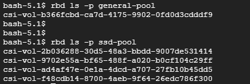

# Ceph

## 1. 사전 준비 사항
1. Rook-Ceph를 배포할 Kubernetes 클러스터
   * 최소 노드 3개 필요 - master 제외 worker 3개
   * vm 최소 요구 사양 - `cpu 4, memory 16G` worker노드 3개
     * 테스트 환경일 경우, `cpu 2, memory 8G` worker노드 3개로 돌아가긴 함
2. Ceph의 데이터 저장을 위해 각 노드에 별도의 디스크 필요
   * 최소 노드 3개에 별도의 디스크 세팅으로 총 `3개 이상의 여분의 디스크` 필요
   * 여분의 디스크는 `사용 가능한 남은 용량을 나타내는 것이 아님`
   * `lsblk`, `sudo fdisk -l` 명령어를 통해 확인할 수 있는 여분의 disk임
   * 아래의 그림을 보면 `lsblk` 명령어 결과로 MOUNTPOINT가 빈 디스크가 여분의 디스크인데 sda의 경우 파티션이 존재하므로 여분이 아님.
   * `sudo fdisk -l` 명령어 결과를 보면 연결된 모든 디스크와 파티션에 대한 자세한 정보를 확인 가능함. 아래 이미지 확인 결과 여분의 디스크가 없음
   * 

<br><br>

## 2. 추가 디스크 생성
* GCP의 vm으로 k8s cluster를 구축한 상황
* 여분의 디스크가 필요하므로 디스크를 추가
* 인스턴스 수정에서 디스크 추가가 가능함
* 모든 노드에 빈 디스크를 추가 (ceph-disk-00 ~ 03, 용량 10GB)
  * 
  * 또는 명령어로 특정 디스크 데이터 초기화
    ```sh
    sudo wipefs -a /dev/sdb # 초기화할 디스크 경로 입력
    sudo sgdisk --zap-all /dev/sdb # 초기화할 디스크 경로 입력
    ```
* 추가로 인스턴스 삭제시 디스크도 삭제되도록 설정
  * 
* `lsblk`과 `sudo fdisk -l` 명령어로 확인한 결과 빈 디스크인 sdb가 생성된 것을 확인 가능함
  * 
  * 

<br><br>

## 3. Rook-Ceph 버전 체크 및 Rook 설치 파일 다운로드
* k8s 버전과 호환되는 [rook 버전 확인](https://rook.io/docs/rook/v1.16/Getting-Started/quickstart/)
* [rook 문서](https://rook.io/docs/rook/latest-release/Upgrade/ceph-upgrade/)에서 rook버전과 호환되는 ceph버전을 확인
* ceph의 이미지 tag는 [quay의 ceph tag](https://quay.io/repository/ceph/ceph?tab=tags)에서 확인 가능
* Rook git 저장소 clone
  * rook 1.16.7 버전
  ```sh
  git clone --single-branch --branch v1.16.7 https://github.com/rook/rook.git
  cd rook/deploy/examples
  ```

<br><br>

## 4. CRD 및 Operator 배포
* `CRD(Custom Resource Definition)`: k8s의 사용자 정의 리소스
  * 아래에서 적용하는 CRD들은 Rook이 Ceph 클러스터를 관리하는데 사용되는 리소스에 해당
  ```sh
  cd rook/deploy/examples
  kubectl apply -f common.yaml
  kubectl apply -f crds.yaml
  kubectl apply -f operator.yaml
  ```

<br><br>

## 5. Ceph Cluster 설정 및 생성
* 사용하려는 노드와 디스크 구성을 확인하여 cluster.yaml 파일에 설정해 주어야 함
  * rook/deploy/examples 경로의 `cluster.yaml` 수정
* `특정 노드` 또는 `특정 디스크`를 사용하고자 한다면 아래와 같이 세팅 가능
  * cephVersion을 spec에 적어주는 이유 (필수)
    * Rook이 관리하는 새로운 Ceph 클러스터를 생성할 때는 초기 cluster.yaml 파일의 spec 섹션 안에 cephVersion.image를 명시적으로 포함해야 함
    * 누락하면 Rook Operator가 Ceph 버전을 감지하지 못하여 Rook을 통해 Ceph Cluster에 새로운 자원을 배포하지 못함
    * 따라서 rook 버전과 호환되는 ceph버전을 찾아 입력해 주어야 함
      * `quay.io/ceph/ceph:v19.2.2` 사용함. `quay.io/`생략시 docker.io로 요청되니 조심
  ```yaml
  spec:
    cephVersion:
      image: quay.io/ceph/ceph:v19.2.2 # Rook v1.16와 호환되는 Ceph 이미지 버전 v19.2
    # test 환경일 경우, resource자원 명시하지 않고 BestEffort pod로 사용하면 돌아가긴 함
    resources: # cpu, memory 자원 예약하여 사용시
      # 아래는 공식 문서에서 설명하는, mon mgr osd의 최소 사양 세팅 requests - cpu:1.5, memory:6Gi
      # https://rook.io/docs/rook/v1.16/CRDs/Cluster/ceph-cluster-crd/?h=resource+settin#cluster-settings
      mon:
        requests:
          cpu: "500m"
          memory: "1Gi"
        limits:
          cpu: "1"
          memory: "2Gi"
      mgr:
        requests:
          cpu: "500m"
          memory: "1Gi"
        limits:
          cpu: "1"
          memory: "2Gi"
      osd:
        requests:
          cpu: "500m"
          memory: "4Gi"
        limits:
          cpu: "2"
          memory: "6Gi"
    storage:
      useAllNodes: false # default: true - 사용할 노드 지정시 false
      useAllDevices: false # default: true - 사용할 디스크 지정시 false
      nodes: # 아래와 같이 노드와 디스크를 지정해 주지 않으면 알아서 빈 디스크로 설정
      - name: "k8s-worker-01"
        devices:
        - name: "sdb"
      - name: "k8s-worker-02"
        devices:
        - name: "sdb"
      - name: "k8s-worker-03"
        devices:
        - name: "sdb"
  ```
  ```sh
  kubectl apply -f cluster.yaml
  ```
* cluster.yaml 적용 이후 Pod 상태 점검
  * 모든 Pod가 정상 실행될 때까지 대기
  * `kubectl -n rook-ceph get pod`
  * 

<br><br>

## 6. ToolBox 설치 및 Ceph 상태 확인
* toolbox 설치하여 Ceph 상태 확인
  ```sh
  cd rook/deploy/examples
  kubectl create -f toolbox.yaml
  kubectl -n rook-ceph exec -it deploy/rook-ceph-tools -- ceph status
  ```
* health ok 체크 및 OSD 3up 3in 확인
  * `OSD(Object Storage Daemon)?`
    * Ceph 클러스터에서 실제 데이터가 저장되고 관리되는 스토리지 노드 또는 그 노드에서 실행되는 데몬 프로세스
  * 
* `8.rook-ceph cluster 및 PVC 점검`에서 사용법 확인

<br><br>

## 7. Storage class 생성
* StorageClass을 생성하려면 CephBlockPool(Custom Resource)를 먼저 생성해야 함
* general-rook-ceph-block이랑 stateful-rook-ceph-block 나눠서 생성함
  ```yaml
  # SSD 전용 풀 (StatefulSet용)
  apiVersion: ceph.rook.io/v1
  kind: CephBlockPool
  metadata:
    name: ssd-pool
    namespace: rook-ceph  # Rook-Ceph 설치 네임스페이스
  spec:
    replicated:
      size: 3             # size:3 설정하려면, 최소 3개의 OSD가 동작 중이어야 함
    failureDomain: host   # 데이터 복제본을 노드(호스트) 단위로 분산(ceph는 노드 장애 대비하여 데이터를 분산 저장함)
    deviceClass: ssd      # OSD 장치 클래스 지정
  ---
  # Stateful 전용 StorageClass
  apiVersion: storage.k8s.io/v1
  kind: StorageClass
  metadata:
    name: stateful-rook-ceph-block
  provisioner: rook-ceph.rbd.csi.ceph.com  # 필수 필드
  parameters:
    clusterID: rook-ceph                   # Rook-Ceph 네임스페이스
    pool: ssd-pool                         # 위에서 생성한 풀 이름
    imageFormat: "2"                       # RBD 이미지 포맷
    imageFeatures: layering,exclusive-lock # exclusive-lock - 동시 쓰기 방지로 데이터 일관성 보장
    csi.storage.k8s.io/fstype: xfs        # 파일시스템 타입
    # 시크릿 파라미터 추가
    ## Rook-Ceph CSI 드라이버가 Ceph 스토리지에 접근할 때 RBAC(Role-Based Access Control) 권한을 확인
    ## 따라서 아래의 내용을 추가하여 Ceph 클러스터의 관리자 권한이 포함된 시크릿(Secret)을 지정하고 권한을 획득해야 함
    csi.storage.k8s.io/provisioner-secret-name: rook-csi-rbd-provisioner
    csi.storage.k8s.io/provisioner-secret-namespace: rook-ceph
    csi.storage.k8s.io/controller-expand-secret-name: rook-csi-rbd-provisioner
    csi.storage.k8s.io/controller-expand-secret-namespace: rook-ceph
    csi.storage.k8s.io/node-stage-secret-name: rook-csi-rbd-node
    csi.storage.k8s.io/node-stage-secret-namespace: rook-ceph
  reclaimPolicy: Retain                    # Retain - PVC가 삭제되어도 PV와 데이터는 그대로 유지(상태저장 필요한 경우)
  allowVolumeExpansion: true               # 디스크 확장이 필요한 경우 또는 PVC가 더 큰 용량 요청 - PVC 크기 변경 가능
  volumeBindingMode: WaitForFirstConsumer  # volume을 특정 노드에 고정
  ```
  ```yaml
  # 일반 풀 (ReplicaSet용)
  apiVersion: ceph.rook.io/v1
  kind: CephBlockPool
  metadata:
    name: general-pool
    namespace: rook-ceph
  spec:
    replicated:
      size: 3
    failureDomain: host
  ---
  # 일반 용도 StorageClass
  apiVersion: storage.k8s.io/v1
  kind: StorageClass
  metadata:
    name: general-rook-ceph-block
  provisioner: rook-ceph.rbd.csi.ceph.com
  parameters:
    clusterID: rook-ceph
    pool: general-pool
    imageFormat: "2"
    imageFeatures: layering,exclusive-lock
    csi.storage.k8s.io/fstype: xfs
    csi.storage.k8s.io/provisioner-secret-name: rook-csi-rbd-provisioner
    csi.storage.k8s.io/provisioner-secret-namespace: rook-ceph
    csi.storage.k8s.io/controller-expand-secret-name: rook-csi-rbd-provisioner
    csi.storage.k8s.io/controller-expand-secret-namespace: rook-ceph
    csi.storage.k8s.io/node-stage-secret-name: rook-csi-rbd-node
    csi.storage.k8s.io/node-stage-secret-namespace: rook-ceph
  reclaimPolicy: Delete
  allowVolumeExpansion: true
  volumeBindingMode: WaitForFirstConsumer
  ```

<br><br>

## 8. PVC 생성
* **PV가 필요한 Pod가 있을때** 해당하는 namespace에 pvc를 생성해 주면 됨
* 아래의 yaml내용에 대한 pvc 생성
  ```yaml
  apiVersion: v1
  kind: PersistentVolumeClaim
  metadata:
    name: stateful-rook-ceph-pvc
  spec:
    storageClassName: stateful-rook-ceph-block
    accessModes:
    - ReadWriteOnce # 단일 노드에서만 PV를 읽고 쓸 수 있도록 제한
    resources:
      requests:
        storage: 5Gi
  ```
  ```yaml
  apiVersion: v1
  kind: PersistentVolumeClaim
  metadata:
    name: general-rook-ceph-pvc
  spec:
    storageClassName: general-rook-ceph-block
    accessModes:
    - ReadWriteOnce
    resources:
      requests:
        storage: 5Gi
  ```
* PVC 적용 확인 - `kubectl get pvc`

<br><br>

## 9. Rook-Ceph Cluster 및 PVC 점검
* storageclass, pvc 및 파드 기본 점검
  * pod는 mon파드 확인
    * `mon:` Ceph 모니터(MON) 데몬, Ceph 클러스터를 관리하는 데몬셋 pod임
  ```sh
  kubectl get pods -n rook-ceph
  kubectl get cephcluster -n rook-ceph
  kubectl get storageclass
  
  kubectl get pv
  kubectl get pvc
  kubectl get sc rook-ceph-block -o yaml
  ```

<br>

* osd prepare job은 실행됐는데 osd가 생성되지 않았다면, prepare job의 로그를 확인해야함, 또는 아래 명령어 확인
  ```sh
  kubectl logs -n rook-ceph $(kubectl get pods -n rook-ceph -l app=rook-ceph-osd-prepare -o name | head -1) -f
  ```

<br>

### ceph 점검을 위한 명령어 사용법
* 위에서 설치한 toolbox(rook-ceph-tool)를 이용하여 ceph cluster를 점검할 수 있다.
  * 아래의 명령어 입력하여 ceph명령어를 사용할 수 있다.
    * `kubectl -n rook-ceph exec -it deploy/rook-ceph-tools -- bash`
    * 
  * 또는 `kubectl -n rook-ceph exec -it deploy/rook-ceph-tools -- `명령어에 ceph 명령어를 추가하여 사용할 수 있음
    * ex. kubectl -n rook-ceph exec -it deploy/rook-ceph-tools -- ceph df
    * 
* ceph 명령어
  * `ceph health detail`: 클러스터의 상세 경고 메시지를 제공
  * `ceph -s`: 클러스터의 전체 상태를 요약
  * `ceph df`: 전체 스토리지 사용량 확인
  * `ceph osd df`: 각 OSD별 상세 사용량 확인
  * OSD 상태 점검
    * `ceph osd status`
    * `ceph osd df`
  * 생성된 rbd 확인 방법
    * `rbd ls -p {CephBlockPool의_이름}`
    * 
  * 고아 rbd 삭제하기
    * StorageClass의 설정에 **reclaimPolicy: Retain** 설정이 포함되어 있으면 pv를 삭제해도 rbd는 남아 있게 됨(고아 rbd)
    * `rbd ls -p {CephBlockPool의_이름}`명령어를 통해 rbd를 조회하면 현재 사용중인 rbd를 포함하여 고아 rbd까지 조회가 되므로 사용중인 rbd인지 확인해야 함
    * pv의 볼륨 속성 정보에서 확인 가능함
      * 
    * 사용중인 rbd 확인후, 아래 명령어로 사용중이지 않은 rbd(고아rbd)를 삭제하면 됨
      * `rbd rm -p {CephBlockPool의_이름} {rbd_UUID}`
      * ex. rbd rm -p ssd-pool csi-vol-29425550-38c6-44ec-b06d-8c60cf3f3444

<br><br>

## 10. cf. Rook-Ceph 삭제 방법
* 디스크는 삭제후 재생성 해야함
  * 디스크에 저장된 메타데이터 때문에 osd가 생성이 안되는 이슈가 있음.. -> 해결 못함
* 삭제 과정 
  * **생성한 storageClass 먼저 삭제**해야 함
  * delete-ceph.sh 스크립트 생성후 ceph관련 리소스들 전부 삭제
  ```sh
  # 생성한 storageClass 먼저 삭제
  # delete-ceph.sh 생성
  cat > delete-ceph.sh <<'EOF'
  kubectl -n rook-ceph patch cephcluster rook-ceph --type merge \
    -p '{"spec":{"cleanupPolicy":{"confirmation":"yes-really-destroy-data"}}}'

  ## finalizers 제거 작업
  kubectl -n rook-ceph patch cephcluster/rook-ceph --type json --patch='[ { "op": "remove", "path": "/metadata/finalizers" } ]'

  kubectl patch secret rook-ceph-mon -n rook-ceph \
    --type='json' \
    -p '[{"op": "remove", "path": "/metadata/finalizers"}]'

  kubectl patch configmap rook-ceph-mon-endpoints -n rook-ceph \
    --type='json' \
    -p '[{"op": "remove", "path": "/metadata/finalizers"}]'

  kubectl get cephblockpools.ceph.rook.io -A -o json | \
  jq 'del(.items[].metadata.finalizers)' | \
  kubectl replace -f -

  ## ceph 리소스들 제거
  cd rook/deploy/examples
  kubectl delete -f toolbox.yaml
  kubectl delete -f cluster.yaml
  kubectl delete -f operator.yaml

  for crd in $(kubectl get crd | grep ceph | awk '{print $1}'); do
    kubectl get crd $crd -o json | jq '.metadata.finalizers=[]' | kubectl replace --raw "/apis/apiextensions.k8s.io/v1/customresourcedefinitions/$crd" -f -
    kubectl delete crd $crd
  done

  kubectl get clusterrolebinding -o json | jq '.items[] | select(.subjects[]?.namespace == "rook-ceph") | .metadata.name' | xargs kubectl delete clusterrolebinding
  kubectl get clusterrole | grep -E 'rook-ceph|cephfs|rbd|objectstorage' | awk '{print $1}' | xargs kubectl delete clusterrole

  kubectl delete -f common.yaml

  ## 남은 커스텀 리소스 제거
  kubectl get crd | grep 'objectbucket.io' | awk '{print $1}' | xargs kubectl delete crd

  ## 네임스페이스까지 제거하면 모두 삭제 완료
  kubectl delete namespace rook-ceph

  ## 삭제 확인
  kubectl api-resources --verbs=list --namespaced -o name | xargs -n 1 kubectl get --show-kind --ignore-not-found -n rook-ceph
  EOF

  # 권한 추가 및 실행
  chmod +x delete-ceph.sh && ./delete-ceph.sh
  ```
* 디스크 설정 초기화
  ```sh
  cat > initdisk.sh <<'EOF'
  DISK="/dev/sdb"
  sudo fuser -k $DISK || true
  sudo sgdisk --zap-all $DISK
  sudo dd if=/dev/zero of=$DISK bs=1M count=100 oflag=direct,dsync
  sudo dd if=/dev/zero of=$DISK bs=1M seek=$((`sudo blockdev --getsz $DISK` / 2048 - 100)) count=100 oflag=direct,dsync
  sudo dd if=/dev/zero of=$DISK bs=1M seek=100 count=100 oflag=direct,dsync
  sudo wipefs -a $DISK
  sudo dmsetup remove_all || true
  sudo rm -rf /var/lib/rook/* /var/lib/ceph/* /etc/ceph/*
  sudo partprobe $DISK
  sudo udevadm trigger
  EOF

  chmod +x initdisk.sh && ./initdisk.sh
  ```