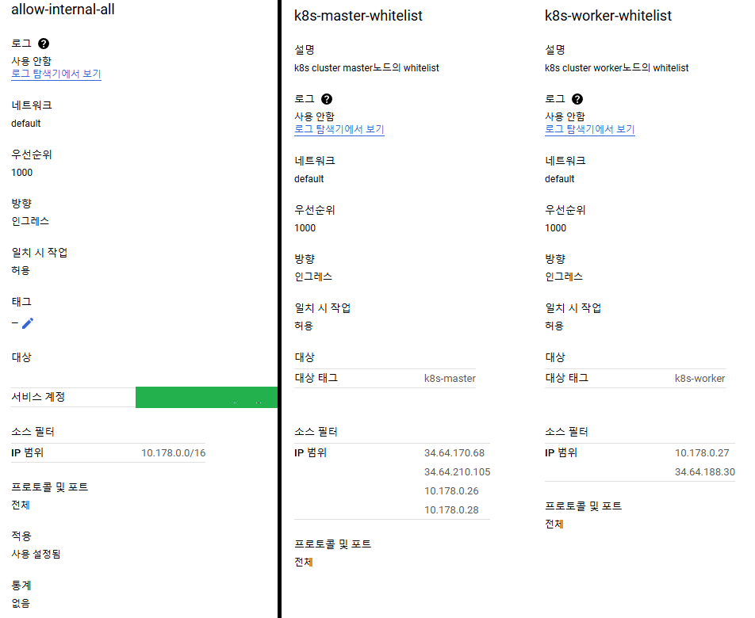
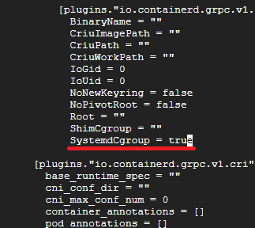

# k8s 설치 과정
* [참고한 블로그 링크 1](https://jongsky.tistory.com/112)
* [참고한 블로그 링크 2](https://jbground.tistory.com/107)
* [참고한 공식 문서 k8s 1.30](https://v1-30.docs.kubernetes.io/docs/setup/production-environment/tools/kubeadm/install-kubeadm/)

<br>

## 1. swap 메모리 비활성화
```sh
# Swap 비활성화
sudo swapoff -a

# 부팅 시 swap이 다시 활성화되지 않도록 설정
sudo sed -i '/ swap / s/^\(.*\)$/#\1/g' /etc/fstab
```

<br>

## 2. 방화벽 정책 설정
* 해당 문서에서 클러스터 구축 하는데에 네트워크 솔루션으로 `Calico`를 사용함
  * Flannel 사용시에는 8285, 8472 포트 오픈해 주어야 함
* 외부 접근을 위한 포트
  * 6443
  * 30000:32767
* 외부에서 접근 가능한 포트는 IP 화이트리스트를 설정 하는 것이 좋음
  * 6443/tcp - API 서버
  * 30000:32767/tcp - NodePort 서비스
* **클라우드 플랫폼(GCP, AWS 등)을 사용하는 경우**
  * 해당 플랫폼의 방화벽 규칙(Security Group, VPC 방화벽 등)을 통해 포트를 열어야 함
  * GCP의 경우 VPC 네트워크 - 방화벽 - 방화벽 규칙 만들기에서 규칙 생성하고 vm의 네트워크 태그에 해당 방화벽 규칙의 태그 달아주면 됨
  * 같은 VPC내에 인스턴스를 만드는 것이 좋음 - 다른 vpc라면 설정할 내용들이 많고 유지 보수하기 어려움
  * Master노드와 Worker노드 사이는 화이트리스트 설정을 해 놓는 것이 좋음
* Master Node의 Port 설정
```sh
# 클라우드 플랫폼 이용시 콘솔에서 오픈!
# master 노드 - 컨트롤 플레인 관련 포트 열기
sudo ufw allow 2379:2380/tcp # etcd 서버 클라이언트 API - kube-apiserver, etcd
sudo ufw allow 6443/tcp # Kubernetes API 서버 - 외부에서 클러스터 관리 시 필요
sudo ufw allow 10250/tcp # Kubelet API - 컨트롤 플레인
# sudo ufw allow 10252/tcp - v1.20 이후로 deprecated. 10257로 변경됨
sudo ufw allow 10257/tcp # kube-controller-manager - 컨트롤러 상태 정보 노출 및 내부 통신
# sudo ufw allow 10251/tcp - v1.20 이후로 deprecated. 10259로 변경됨
sudo ufw allow 10259/tcp # kube-scheduler - 스케줄러 상태 정보 노출 및 내부 통신
sudo ufw allow 8285/udp # Flannel 사용시에만 오픈
sudo ufw allow 8472/udp # Flannel 사용시에만 오픈
# 8000 8443 4443
```
* Worker Node의 Port 설정
```sh
# 클라우드 플랫폼 이용시 콘솔에서 오픈!
# worker 노드 관련 포트 열기
sudo ufw allow 10250/tcp # Kubelet API - 컨트롤 플레인
sudo ufw allow 10256/tcp # kube-proxy - 네트워크 라우팅 및 로드 밸런싱
sudo ufw allow 26443/tcp # 로드 밸런서 (HA 환경) - 외부 요청을 API 서버(6443)로 전달하는 엔드포인트
sudo ufw allow 30000:32767/tcp # NodePort 서비스 - 외부에서 애플리케이션 접근 시 사용
sudo ufw allow 8285/udp # Flannel 사용시에만
sudo ufw allow 8472/udp # Flannel 사용시에만
```
* 노드들을 각각 다른 vm에 배치해야 하므로 노드 사이의 접근이 가능하도록, vpc단위로 방화벽 open하거나 각각의 vm의 화이트리스트 추가
  * c.f. Master노드와 Worker노드 사이의 통신은 필수이고, Pod사이의 통신이 필요할 수도 있으므로 모든 노드끼리 통신이 가능하도록 방화벽 규칙 추가해야 함
  * 왼쪽 이미지 (allow-internal-all) - vpc 단위로 방화벽 open
    * 대상을 서비스 계정으로 설정하고, IP범위는 10.178.x.x 여서 `10.178.0.0/16`으로 설정함
    * 정책 생성후 상세 정보에서 적용된 vm들 확인 가능
  * 오른쪽 이미지 (k8s-xxx-whitelist) - master노드와 worker노드의 화이트리스트 설정 예시
  * 


<br>

## 3. 네트워크 모듈 및 sysctl 설정
```sh
# 네트워크 모듈 로드
cat <<EOF | sudo tee /etc/modules-load.d/k8s.conf
overlay
br_netfilter
EOF

sudo modprobe overlay
sudo modprobe br_netfilter

# sysctl 파라미터 설정
cat <<EOF | sudo tee /etc/sysctl.d/k8s.conf
net.bridge.bridge-nf-call-iptables  = 1
net.bridge.bridge-nf-call-ip6tables = 1
net.ipv4.ip_forward                 = 1
EOF

# sysctl 파라미터 적용
sudo sysctl --system
```

<br>

## 4. Containerd 설치 및 설정
```sh
# containerd 설치
sudo apt-get update
sudo apt install -y containerd

# **아래의 4항목(containerd 설정 파일 생성 및 수정)은 안해도 되는듯 함**
sudo mkdir -p /etc/containerd
sudo containerd config default | sudo tee /etc/containerd/config.toml
sudo vi /etc/containerd/config.toml
# SystemdCgroup = true 로 수정 후 저장
```
* 

<br>

## 5. containerd 서비스 재시작, 상태 췤
```sh
# containerd 서비스 재시작
sudo systemctl restart containerd.service

# 서비스 상태 확인
sudo systemctl status containerd.service
```
* 

<br>

## 6. Kubernetes 설치
* 설치하는 시점에 따라서 Kubernetes에서 지원하지 않는 버전의 package repository를 참조하는 경우 패키지 업데이트시 에러가 생길 수 있다.
  * 최신 버전의 k8s를 설치해야 함
* `v1.30.7-1.1` 버전으로 설치
```sh
# K8s 설치를 위한 패키지 설정
sudo apt-get update
sudo apt-get install -y apt-transport-https ca-certificates curl
sudo mkdir -p /etc/apt/keyrings

# K8s v1.30 패키지 저장소 추가
# Download and configure the GPG key for the new repository
curl -fsSL https://pkgs.k8s.io/core:/stable:/v1.30/deb/Release.key | sudo gpg --dearmor -o /etc/apt/keyrings/kubernetes-apt-keyring.gpg

# Add the new repository (v1.30)
echo "deb [signed-by=/etc/apt/keyrings/kubernetes-apt-keyring.gpg] https://pkgs.k8s.io/core:/stable:/v1.30/deb/ /" | sudo tee /etc/apt/sources.list.d/kubernetes.list

# 패키지 업데이트
sudo apt-get update

# 설치 가능한 버전 확인
sudo apt-cache madison kubeadm

# kubeadm, kubelet, kubectl 설치 (1.30.7-1.1 버전)
sudo apt-get install -y kubelet=1.30.7-1.1 kubeadm=1.30.7-1.1 kubectl=1.30.7-1.1
```
* 

<br>


## 7. Kubernetes 클러스터 초기화
> **Master Node**가 위치한 vm에만 설정하면 됨
* 클라우드 서비스 이용시 vm을 일시정지 하거나 중지시키면 외부IP가 변경될 수 있으므로 **외부IP 대신 도메인**을 사용하는 것이 좋다.
  * AWS - Route53
  * GCP - Cloud DNS
```sh
# `Calico` 사용시: --pod-network-cidr=192.168.0.0/16
# `Flannel` 사용시: --pod-network-cidr=10.244.0.0/16
sudo kubeadm init \
  --control-plane-endpoint={외부IP|도메인}:6443 \
  --apiserver-advertise-address={내부IP} \
  --pod-network-cidr=192.168.0.0/16 \
  --apiserver-cert-extra-sans={외부IP|도메인},{내부IP}

# 예시
sudo kubeadm init \
  --control-plane-endpoint=k8s-master.flowchat.shop:6443 \
  --apiserver-advertise-address=10.178.0.40 \
  --pod-network-cidr=192.168.0.0/16 \
  --apiserver-cert-extra-sans=k8s-master.flowchat.shop,10.178.0.40
```

* 클러스터 초기화가 잘 끝나면 생성된 token과 함께 `kubeadm join`명령어가 출력됨
  * worker node 추가할때 쓰면됨 - 아래의 `10. 워커 노드를 클러스터에 추가 항목` 확인
  * 

<br>

## 8. kubeconfig 파일 설정
> **Master Node**가 위치한 vm에만 설정하면 됨

```sh
# kubeconfig 설정
mkdir -p $HOME/.kube
sudo cp -i /etc/kubernetes/admin.conf $HOME/.kube/config
sudo chown $(id -u):$(id -g) $HOME/.kube/config
```

<br>

## 9. 네트워크 플러그인 설치
> **Master Node**가 위치한 vm에만 설정하면 됨

* `calico`로 설치
```sh
# calico 설치
kubectl apply -f https://docs.projectcalico.org/manifests/calico.yaml

# calico node와 controller가 Running중인지 확인
kubectl get pods -n kube-system
```
* 
* Flannel 설치 스크립트는 chatgpt에게...

<br>

## 10. 워커 노드를 클러스터에 추가
> **Worker Node**가 위치한 vm에만 설정하면 됨

* `7.Kubernetes 클러스터 초기화`에서 얻은 token으로 `kubeadm join`명령어 입력
```sh
# Worker노드 추가하는 경우 예시
sudo kubeadm join {master-node-ip}:6443 --token {token} \
    --discovery-token-ca-cert-hash sha256:{hash}

# 마스터 역할을 수행하는 추가 컨트롤 플레인 노드 생성한 경우
sudo kubeadm join {master-node-ip}:6443 \
    --token {token} \
    --discovery-token-ca-cert-hash sha256:{hash} \
    --control-plane \ # 해당 스크립트 추가하면, 해당 노드는 클러스터의 컨트롤 플레인 역할을 수행 (마스터 역할을 수행하는 추가 컨트롤 플레인 노드)
    --certificate-key {certificate-key} # 기존 컨트롤 플레인 노드에서 공유된 인증서를 다운로드하고 사용할 수 있도록 설정
```

* 토큰이 만료되었거나 분실한 경우, **Master 노드**에서 새로운 토큰을 생성 가능
  * `kubeadm token create --print-join-command`

<br>

## 11. master노드 점검 및 클러스터 상태 확인
> **Master Node**에서 확인 (kubectl)

```sh
sudo systemctl status kubelet
sudo systemctl status containerd
kubectl get nodes
kubectl get deployment -n kube-system
kubectl get svc -n kube-system
kubectl get pods -n kube-system
```
* 
* 
* **Worker 노드**에서 kubectl을 사용하려면, Master 노드에서 생성된 kubeconfig 파일(/etc/kubernetes/admin.conf)을 워커 노드로 복사해야 함
  * worker 노드에서 kubectl 명령어를 사용하면, kubeconfig 파일이 없거나 잘못된 경로를 참조하고 있기 때문에,
  * 기본적으로 localhost:8080에 연결하려고 시도하여 아래와 같은 에러가 남
  * 
* 따라서, `kubectl`은 그냥 **Master node에서 사용**하면 됨

<br>

## 12. GCP 머신 이미지 생성 및 이미지로 Worker노드 생성하기
* Worker노드를 추가할때 위의 설치 과정을 매번 수행하면 번거로움
  * GCP 이용시, 머신 이미지 생성하면 다음 Worker노드 생성시 Master노드에 쉽게 연결 가능

### 머신 이미지 생성
* `6. Kubernetes 설치` 항목에서 `kubeadm, kubelet, kubectl 설치`**전 까지**의 명령어 수행후 해당 vm의 이미지 생성하면 됨
* 이미지 생성 이후 머신 이미지의 대상이 되는 인스턴스는 지워도 상관없음
* 

### 이미지로 Worker노드 생성하기
* containerd가 잘 설치 되었는지, 설치할 k8s의 버전이 apt목록에 있는지 확인
* 해당 하는 머신 이미지로 인스턴스 생성후 **k8s를 설치**하고 `kubeadm join`커맨드로 Master노드에 연결해 주어야 함
```sh
# 설정 초기화 체크
sudo systemctl status containerd.service
sudo vi /etc/containerd/config.toml # `SystemdCgroup = true` 확인
sudo apt-cache madison kubeadm # 설치할 버전이 목록에 뜨는지 확인

# k8s를 설치하고 Worker노드를 Master노드에 연결하기
sudo apt-get update
sudo apt-get install -y kubelet=1.30.7-1.1 kubeadm=1.30.7-1.1 kubectl=1.30.7-1.1
sudo kubeadm join {master-node-ip}:6443 --token {token} \
    --discovery-token-ca-cert-hash sha256:{hash}

# kubeadm join 예시
sudo kubeadm join k8s-master.flowchat.shop:6443 --token ek38j6.dfs9qrpz26ag2ayw \
        --discovery-token-ca-cert-hash sha256:444626e4d4a266d54b4acb372bc2f431ec14d34808c2a6b0a6ac269c3da1fd61
```

<br>

## 13. Dashboard 설치하기
* [Dashboard 설치](/create-k8s-cluster/create-dashboard/create-dashboard.md)