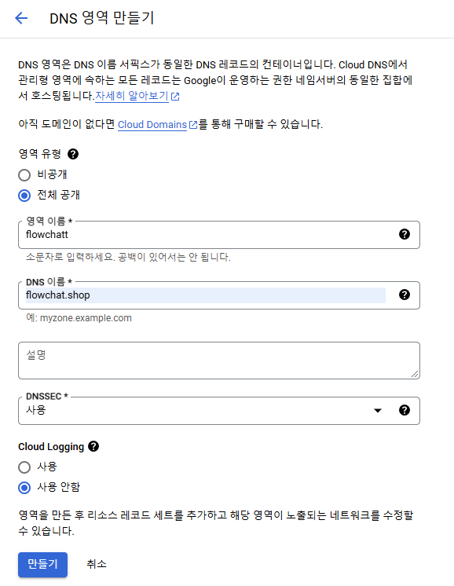
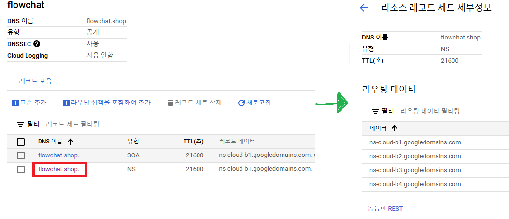
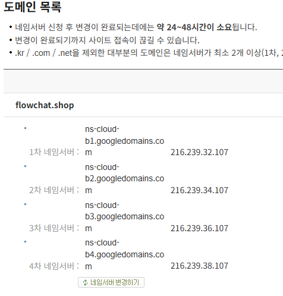
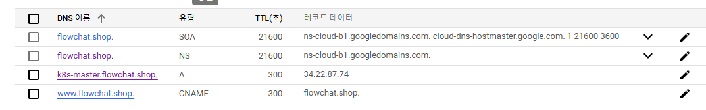

# GCP Cloud DNS 영역 만들기
* GCP의 네트워크 서비스인 Cloud DNS를 이용하여 DNS영역을 생성하고 도메인을 관리

## 도메인 구매
* 도메인 호스팅 서비스를 하는 웹사이트에서 도메인 구매
  * 카페24에서 flowchat.shop 이라는 도메인 구매함

 

## DNS 영역 만들기
* GCP의 네트워크 서비스인 Cloud DNS에서 DNS영역을 생성
* 

 

## 네임서버 변경하기
* DNS 영역을 생성하면 아래와 같이 `SOA`와 `NS`종류의 레코드가 추가된다.
* `NS`종류의 레코드가 네임서버가 들어간 레코드로, 해당 레코드를 열람하면 네임서버 리스트를 확인할 수 있다.
* 
* 도메인 구매시, 초기 DNS 네임 서버는 도메인을 구매한 웹사이트의 네임서버로 설정되는데,
* 해당 내용을 위에서 확인한 클라우드의 네임서버들로 변경해 주어야 함
  * ex. 카페24
  * 

 

## DNS 레코드란?, 레코드 추가하기
* `DNS 레코드`
  * 도메인을 통해 리소스에 접근(ex.웹페이지 접속)할때, 네임 서버에 질의를 하여 설정된 레코드를 찾아 통신
  * 즉, 레코드는 받은 요청을 어떻게 처리할 것인지에 대한 정보
  * DNS 레코드 종류 (사용해 본 것만...)
    * `A` - 도메인에 IP 주소를 매핑, 여러개 IP주소 매핑 가능
      * ex. naver.com의 A레코드는 4개로 매핑됨 - 125.209.222.141 / 125.209.222.142 / 223.130.195.200 / 223.130.195.95
    * `CNAME` - 도메인에 도메인을 매핑 (도메인 별명)
      * ex. naver.com의 CNAME레코드가 www.naver.com이라면, www.naver.com에 접속시 naver.com로 접근
    * `NS` - 네임서버 레코드
      * ex. naver.com의 네임서버 레코드는 ns1.naver.com / ns2.naver.com / e-ns.naver.com
* A유형과 CNAME유형의 레코드 추가
* 
