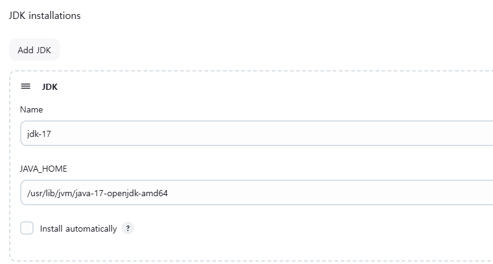
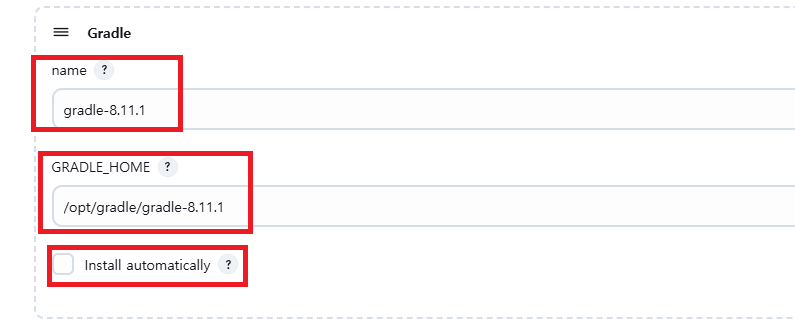
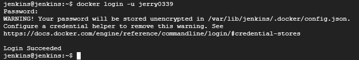
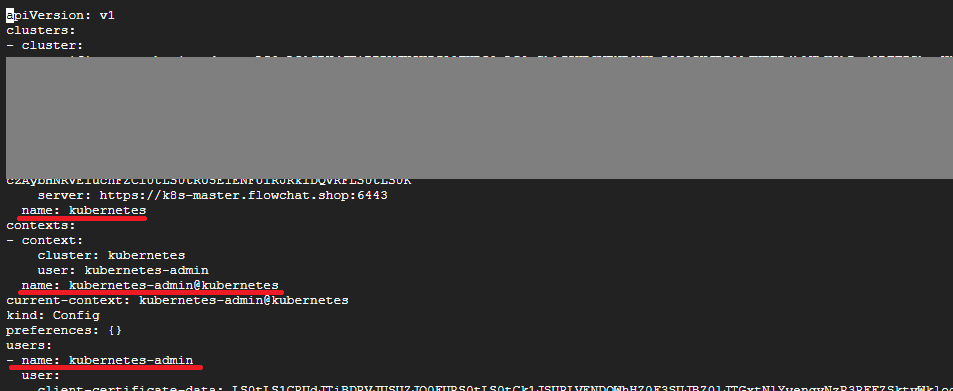
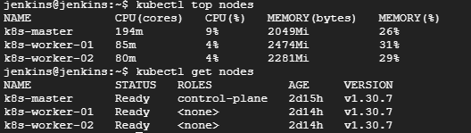
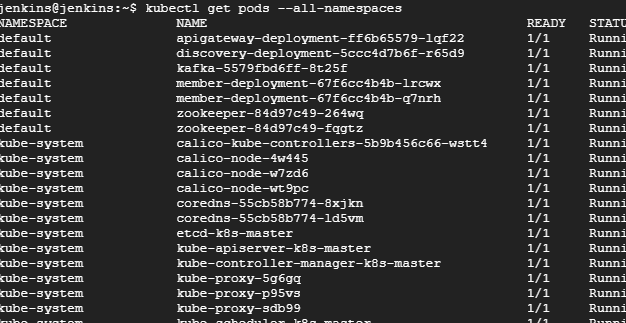

# Ubuntu에 Jenkins 설치 및 기본 setting
* k8s환경에서 배포에 필요한 내용들 모두 포함
  * Java 설치부터 Helm 설치까지

### git 설치
* git은 보통 설치되어 있음
* 되어 있지 않다면, `sudo apt install git` 설치 후 `git --version` 확인

<br><br>

## 1. Java 설치 (openjdk-17)
```sh
# Java 17 설치
sudo apt update
sudo apt install openjdk-17-jdk
java -version # 설치 확인

# JAVA_HOME 설정 (java 17로)
cd /usr/lib/jvm/{java...} # 해당 경로에서 java17 경로 확인
sudo vi /etc/environment # PATH=... 다음줄에 JAVA_HOME="/usr/lib/jvm/java-17-openjdk-amd64" 추가
source /etc/environment # 변경값 적용
echo $JAVA_HOME # 적용되었는지 확인
```

<br><br>

## 2. Jenkins 설치

```sh
# GPG 키 수동 등록
curl -fsSL https://pkg.jenkins.io/debian/jenkins.io-2023.key | sudo tee /usr/share/keyrings/jenkins-keyring.asc > /dev/null
# 저장소 설정 업데이트
echo "deb [signed-by=/usr/share/keyrings/jenkins-keyring.asc] https://pkg.jenkins.io/debian-stable binary/" | sudo tee /etc/apt/sources.list.d/jenkins.list > /dev/null
# 패키지 목록 갱신 후 설치
sudo apt-get update
sudo apt-get install jenkins
# Jenkins 동작 확인
systemctl status jenkins
```

<br><br>

## 3. Jenkins port 변경하기 (필요시)
* default는 8080으로 접속 가능
* 아래 스크립트로 jenkins.service vim 켜서 `Environment="JENKINS_PORT=8080"`의 8080포트를 변경 - ex. 18080 or 9090
    ```sh
    sudo chmod 777 /usr/lib/systemd/system/jenkins.service
    sudo vim /usr/lib/systemd/system/jenkins.service
    sudo chmod 444 /usr/lib/systemd/system/jenkins.service
    ```

* 변경 후 jenkins 재시작
    ```sh
    sudo systemctl daemon-reload
    sudo service jenkins restart
    sudo systemctl status jenkins
    ```

* 변경된 port를 open시켜주기 (Cloud 이용할 경우)

<br><br>

## 4. Jenkons 초기화
* 아래 스크립트로 초기 패스워드 확인
    ```sh
    # Jenkins 초기 패스워드 확인
    sudo cat /var/lib/jenkins/secrets/initialAdminPassword
    ```
* 8080포트 열기
* 이후 도메인:8080 으로 접속하여 Unlcok Jenkins, Install suggested plugins 수행
* 계정 생성
* Jenkins 인스턴스의 URL을 설정
  * default로 port가 8080으로 되어 있는데, 포트를 바꾸고 싶다면 변경할 포트로 입력


<br><br>

## 5. Jenkins Gradle 및 Jdk 설정
* gradle은 8.11.1 버전으로 세팅함
* gradle 설치, jdk는 위에서...
    ```sh
    sudo apt-get install unzip
    wget https://services.gradle.org/distributions/gradle-8.11.1-bin.zip -P /tmp
    sudo unzip -d /opt/gradle /tmp/gradle-8.11.1-bin.zip
    ls /opt/gradle/gradle-8.11.1
    ```

* GRADLE_HOME 설정
    ```sh
    # 아래 스크립트 입력 후,
    sudo nano /etc/profile.d/gradle.sh

    # 아래 내용을 gradle.sh에 저장
    export GRADLE_HOME=/opt/gradle/gradle-8.11.1
    export PATH=${GRADLE_HOME}/bin:${PATH}

    # gradle.sh 스크립트 저장 후, 스크립트 실행 및 환경 변수 로드
    sudo chmod +x /etc/profile.d/gradle.sh
    source /etc/profile.d/gradle.sh

    # GRADLE_HOME 및 gradle 버전 확인
    echo $GRADLE_HOME
    gradle -v
    ```

* `Jenkins 관리 - Tool`에서 아래와 같이 jdk와 gradle 설정하기
  * ex1. `/usr/lib/jvm/java-17-openjdk-amd64`
  * ex2. `/opt/gradle/gradle-8.11.1`
  * gradle의 경우 `$GRADLE_HOME`에 해당하는 경로 수동으로 작성
  * 
  * 

<br><br>

## 6. Docker설치 및 Jenkins의 Docker 사용 설정
* Docker 설치
    ```sh
    sudo apt-get install apt-transport-https ca-certificates curl gnupg-agent software-properties-common
    curl -fsSL https://download.docker.com/linux/ubuntu/gpg | sudo apt-key add -
    sudo add-apt-repository "deb [arch=amd64] https://download.docker.com/linux/ubuntu $(lsb_release -cs) stable"
    sudo apt-get update
    sudo apt-get install docker-ce docker-ce-cli containerd.io
    sudo systemctl status docker # 실행 확인
    ```

* Jenkins가 Docker hub를 사용할 수 있도록 권한 부여
  * pipeline 구성전, 초기 세팅용도로 login정보를 저장하는 것
    ```sh
    sudo chmod 666 /var/run/docker.sock
    sudo usermod -aG docker jenkins
    sudo su - jenkins -s /bin/bash
    docker login -u jerry0339
    ```
  * 

<br><br>

## 7. kubectl 설치 및 gcp cloud storage를 이용한 kubeconfig 다운로드
> jenkins가 설치된 서버에서, 다른 서버에 설치된 k8s cluster의 API서버에 접근하기 위한 과정임
> 
> **AWS의 S3**나 다른 방법으로 `kubeconfig`파일을 업로드하고 다운로드해도 됨, 아래의 내용은 **GCP의 Cloud Storage**를 이용함

<br>

### 7-1. GCP Cloud Storage 생성하기
* Cloud Storage에서 버킷을 생성
* 이름은 사용중인 도메인을 포함한 하위 도메인으로 생성하면 됨
  * ex. `upload.snowball.com`
* 이름을 도메인으로 사용할 경우, 도메인 소유 인증이 필요함
  * 서치콘솔에서 인증 가능 - https://search.google.com/search-console?hl=ko
  * 이후 서치콘솔의 안내에 따라 진행하면 되는데 txt타입으로 도메인 레코드를 생성하면 됨
* c.f. gsutil 이란?
  * Cloud Storage에 액세스하는 데 사용할 수 있는 도구
  * 사용 예시
    ```sh
    gcloud auth login # 구글 ID로 로그인
    gsutil ls gs://upload1.flowchat.shop

    # 업로드
    gsutil cp .kube/config gs://upload1.flowchat.shop
    # 다운로드
    gsutil cp gs://upload1.flowchat.shop/config config
    # 디렉토리 전체 업로드
    gsutil -m cp -R {디렉토리} gs://upload1.flowchat.shop
    gsutil -m cp -r gs://upload1.flowchat.shop/api-tester helm
    ```


<br>

### 7-2. Master Node에서 kube config파일 업로드
* kubeconfig는 k8s-master노드의 `~/.kube/config`에 위치
* master node에서 cloud storage로 kubeconfig를 업로드
  ```sh
  # 로그인
  gcloud auth login
  # config 파일 업로드
  gsutil cp .kube/config gs://upload1.flowchat.shop
  # 업로드 확인
  gsutil ls gs://upload1.flowchat.shop
  ```

<br>

### 7-3. Jenkins서버에 kubectl 설치
* jenkins가 설치된 vm에서 kubectl 설치
  ```sh
  # kubectl 설치 - 1.30.7
  curl -LO "https://dl.k8s.io/release/v1.30.7/bin/linux/amd64/kubectl"
  chmod +x kubectl
  sudo mv kubectl /usr/local/bin/
  ```

<br>

### 7-4. Jenkins서버에 kube config파일 다운로드
* config 다운로드 - jenkins user경로에 설치해야 하는지, 계정에 해당하는 user경로에 몰라서 둘 다 설치함
  * 계정에 해당하는 user경로에 설치하는 경우, 아래와 같이 `.kube` 디렉토리 하위에 config가 위치해야 `localhost:8080...` 에러가 안뜸
  ```sh
  # jenkins user가 kubectl 사용할 수 있도록 설정
  sudo su - jenkins -s /bin/bash
  mkdir .kube
  gcloud auth login
  gsutil ls gs://upload1.flowchat.shop # config 파일 위치 확인

  # 다운로드
  gsutil cp gs://upload1.flowchat.shop/config .kube/config
  # ~/.kube/config 경로에 잘 다운로드 되었는지 확인
  ```
* context-name 확인하고 kubectl 명령어 테스트하기
  * 아래 이미지는 단일 k8s cluster의 내용
  * 
  * `kubectl config use-context {context-name}`
  * 이후, kubectl명령어 이용하여 클러스터 자원 확인
  * 
  * 

<br><br>

## 8. Helm 설치
* 3.13.2 버전 설치
```sh
curl https://baltocdn.com/helm/signing.asc | gpg --dearmor | sudo tee /usr/share/keyrings/helm.gpg > /dev/null
sudo apt-get install apt-transport-https --yes

echo "deb [arch=$(dpkg --print-architecture) signed-by=/usr/share/keyrings/helm.gpg] https://baltocdn.com/helm/stable/debian/ all main" | sudo tee /etc/apt/sources.list.d/helm-stable-debian.list

sudo apt-get update
sudo apt-cache madison helm # 설치 가능한 버전 확인
sudo apt-get install -y helm=3.13.2-1
sudo su - jenkins -s /bin/bash # Jenkins로 유저 전환
helm version # 설치 잘 되었는지 확인
```