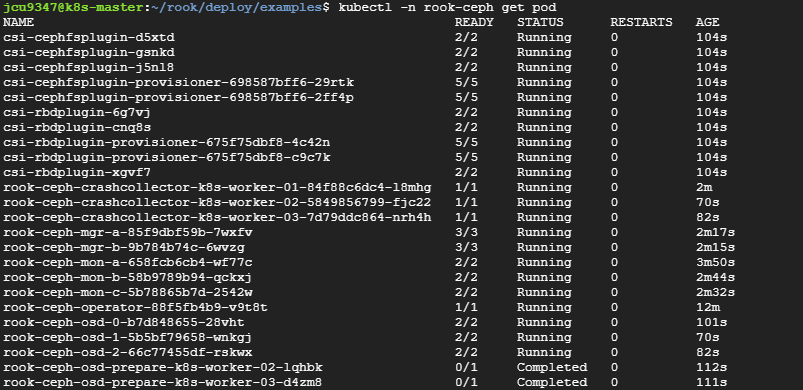
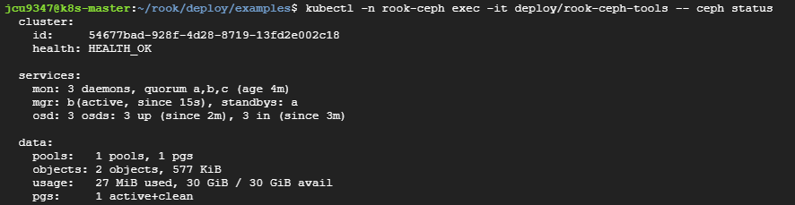
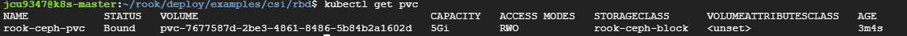

# Ceph
* [참고 링크1 - main](https://jeongchul.tistory.com/830)
* [참고 링크2](https://nairns.tistory.com/95)
* [참고 링크3](https://jeongchul.tistory.com/829)

## 1. 사전 준비 사항
1. Rook-Ceph를 배포할 Kubernetes 클러스터
  * 최소 노드 3개 필요 - master 제외 worker 3개
2. 클러스터에 접근할 수 있는 kubectl 설치
  * k8s cluster 구축시 해결
3. Ceph의 데이터 저장을 위해 각 노드에 별도의 디스크 필요
  * 최소 노드 3개에 별도의 디스크 세팅으로 총 `3개 이상의 여분의 디스크` 필요
  * 여분의 디스크는 `사용 가능한 남은 용량을 나타내는 것이 아님`
  * `lsblk`, `sudo fdisk -l` 명령어를 통해 확인할 수 있는 여분의 disk임
  * 아래의 그림을 보면 `lsblk` 명령어 결과로 MOUNTPOINT가 빈 디스크가 여분의 디스크인데 sda의 경우 파티션이 존재하므로 여분이 아님.
  * `sudo fdisk -l` 명령어 결과를 보면 연결된 모든 디스크와 파티션에 대한 자세한 정보를 확인 가능함. 아래 이미지 확인 결과 여분의 디스크가 없음
  * 

<br><br>

## 2. 추가 디스크 생성
* GCP의 vm으로 k8s cluster를 구축한 상황
* 여분의 디스크가 필요하므로 디스크를 추가
* 인스턴스 수정에서 디스크 추가가 가능함
* 모든 노드에 빈 디스크를 추가 (ceph-disk-00 ~ 03, 용량 10GB)
  * 
* 추가로 인스턴스 삭제시 디스크도 삭제되도록 설정
  * 
* `lsblk`과 `sudo fdisk -l` 명령어로 확인한 결과 빈 디스크인 sdb가 생성된 것을 확인 가능함
  * 
  * 

<br><br>

## 3. Rook-Ceph 설치 파일 다운로드
* Rook git 저장소 clone
    ```sh
    git clone --single-branch --branch v1.11.10 https://github.com/rook/rook.git
    git clone --single-branch --branch release-1.12 https://github.com/rook/rook.git
    cd rook/deploy/examples
    ```

<br><br>

## 4. CRD 및 Operator 배포
```sh
cd rook/deploy/examples

# CRDs(Custom Resource Definitions) 적용
kubectl apply -f crds.yaml

# Rook Operator 배포
kubectl apply -f common.yaml
kubectl apply -f operator.yaml
```

<br><br>

## 5. Ceph 클러스터 설정 및 생성
* cluster.yaml 파일에서 사용하려는 노드와 디스크 구성을 확인하거나 필요한 경우 수정해야 하지만 일단 기본 설정으로 적용함
  ```sh
  cd rook/deploy/examples
  kubectl apply -f cluster.yaml
  ```
* 특정 노드의 디스크만 사용하고자 한다면 아래와 같이 세팅 가능
  ```yaml
  # cluster.yaml 수정
  spec:
    storage:
      useAllNodes: false # default: true
      useAllDevices: false # default: true
      nodes: # 아래와 같이 노드를 지정해 주지 않으면 알아서 빈 디스크에 설정
      - name: "k8s-worker-01" 
        devices:
        - name: "sdb"
      - name: "k8s-worker-02"
        devices:
        - name: "sdb"
      - name: "k8s-worker-03" 
        devices:
        - name: "sdb"
  ```
* cluster.yaml 적용 이후 Pod 상태 점검
  * 모든 Pod가 정상 실행될 때까지 대기
  * `kubectl -n rook-ceph get pod`
  * 

<br><br>

## 6. ToolBox 설치 및 Ceph 상태 확인
* toolbox 설치하여 Ceph 상태 확인
  ```sh
  kubectl create -f toolbox.yaml
  kubectl -n rook-ceph exec -it deploy/rook-ceph-tools -- ceph status
  ```
* health ok 체크 및 osd 3up 3in 확인
* 

<br><br>

## 7. Storage class 생성 및 PVC 생성
* Rook 1.12 기준
```sh
cd ~/rook/deploy/examples/csi/rbd
kubectl create -f storageclass.yaml
```
* PVC 생성
  * 아무 위치에 아래의 yaml내용에 대한 pvc.yaml 생성 후,
    ```yaml
    apiVersion: v1
    kind: PersistentVolumeClaim
    metadata:
      name: rook-ceph-pvc
    spec:
      storageClassName: rook-ceph-block
      accessModes:
      - ReadWriteOnce
      resources:
        requests:
          storage: 5Gi
    ```
  * `kubectl apply -f pvc.yaml` 명령어 입력하거나
  * 대시보드에서 생성하면 됨 - 대시보드에서 생성하는 경우 yaml파일은 저장되지 않고 pvc 바로 생성됨
* PVC 적용 확인 - `kubectl get pvc`
* 

<br><br>

## 8. Rook-Ceph Cluster 및 PVC 점검
```sh
kubectl get pods -n rook-ceph
kubectl get cephcluster -n rook-ceph
kubectl get storageclass
kubectl get pvc
```

