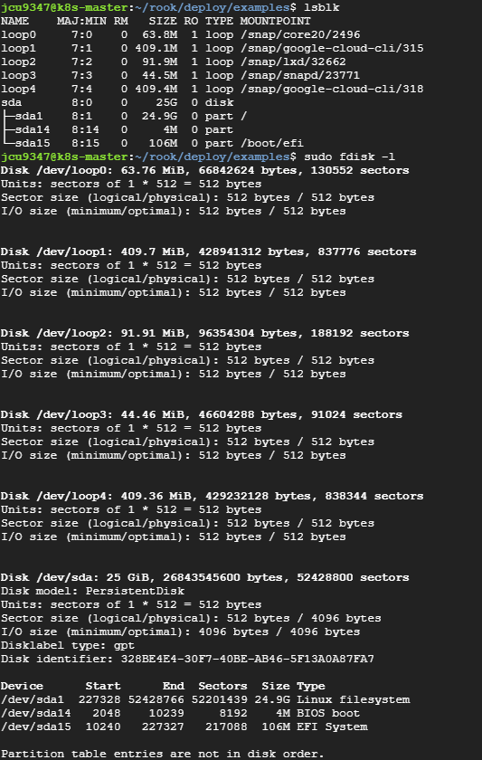
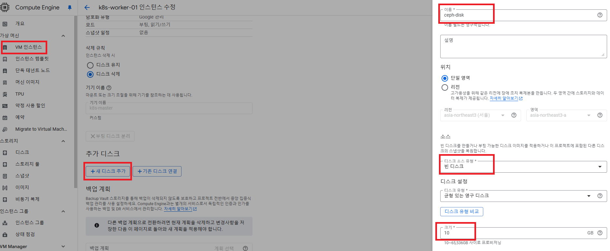
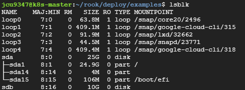
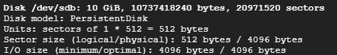
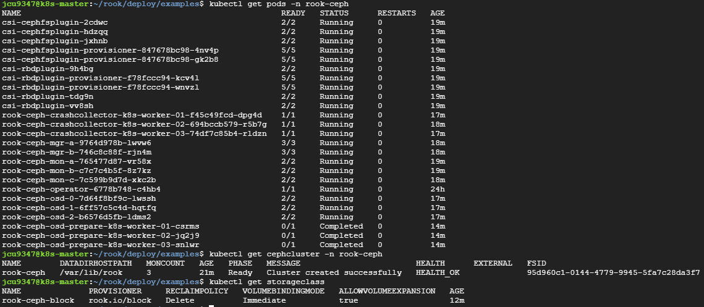

# Ceph
* [참고 링크1 - main](https://jeongchul.tistory.com/830)
* [참고 링크2](https://nairns.tistory.com/95)
* [참고 링크3](https://jeongchul.tistory.com/829)

## 1. 사전 준비 사항
1. Rook-Ceph를 배포할 Kubernetes 클러스터
  * 최소 노드 3개 필요 - master 제외 worker 3개
2. 클러스터에 접근할 수 있는 kubectl 설치
  * k8s cluster 구축시 해결
3. Ceph의 데이터 저장을 위해 각 노드에 별도의 디스크 필요
  * 최소 노드 3개에 별도의 디스크 세팅으로 총 `3개 이상의 여분의 디스크` 필요
  * 여분의 디스크는 `사용 가능한 남은 용량을 나타내는 것이 아님`
  * `lsblk`, `sudo fdisk -l` 명령어를 통해 확인할 수 있는 여분의 disk임
  * 아래의 그림을 보면 `lsblk` 명령어 결과로 MOUNTPOINT가 빈 디스크가 여분의 디스크인데 sda의 경우 파티션이 존재하므로 여분이 아님.
  * `sudo fdisk -l` 명령어 결과를 보면 연결된 모든 디스크와 파티션에 대한 자세한 정보를 확인 가능함. 아래 이미지 확인 결과 여분의 디스크가 없음
  * 

<br><br>

## 2. 추가 디스크 생성
* GCP의 vm으로 k8s cluster를 구축한 상황
* 여분의 디스크가 필요하므로 디스크를 추가
* 인스턴스 수정에서 디스크 추가가 가능함
* 모든 노드에 빈 디스크를 추가 (ceph-disk-00 ~ 03, 용량 10GB)
  * 
* 추가로 인스턴스 삭제시 디스크도 삭제되도록 설정
  * 
* `lsblk`과 `sudo fdisk -l` 명령어로 확인한 결과 빈 디스크인 sdb가 생성된 것을 확인 가능함
  * 
  * 

<br><br>

## 3. Rook-Ceph 설치 파일 다운로드
* Rook git 저장소 clone
    ```sh
    git clone --single-branch --branch v1.11.10 https://github.com/rook/rook.git
    cd rook/deploy/examples
    ```

<br><br>

## 4. Rook Operator 배포
```sh
cd rook/deploy/examples

# rook-ceph namespace 생성
kubectl create namespace rook-ceph

# CRDs(Custom Resource Definitions) 적용
kubectl apply -f crds.yaml

# Rook Operator 배포
kubectl apply -f common.yaml
kubectl apply -f operator.yaml
```

<br><br>

## 5. Ceph 클러스터 생성
* cluster.yaml 파일에서 사용하려는 노드와 디스크 구성을 확인하거나 필요한 경우 수정해야 하지만 일단 기본 설정으로 적용함
  ```sh
  cd rook/deploy/examples
  kubectl apply -f cluster.yaml
  ```

<br><br>


## 6. Storage class 생성
* 아래의 내용에 대한 storageclass.yaml 생성한 후 `kubectl apply -f storageclass.yaml` 하거나
  ```yaml
  # storageclass.yaml
  apiVersion: storage.k8s.io/v1
  kind: StorageClass
  metadata:
    name: rook-ceph-block
  provisioner: rook.io/block
  parameters:
    pool: rook-ceph-block
    clusterNamespace: rook-ceph
  reclaimPolicy: Delete
  allowVolumeExpansion: true
  ```
* k8s 대시보드에서 생성해도 됨


<br><br>

## 7. Rook-Ceph Cluster 점검
```sh
kubectl get pods -n rook-ceph 
kubectl get cephcluster -n rook-ceph
kubectl get storageclass
```
* 


<br><br>

## 8. Persistent Volume Claim (PVC) 생성
* 7에서와 같이 Rook-Ceph Cluster의 점검이 완료 됐다면, 아래와 같은 설정의 PVC를 생성할 수 있음
```yaml
# PVC 예제 (블록 스토리지용)
apiVersion: v1
kind: PersistentVolumeClaim
metadata:
  name: my-ceph-block-pvc
spec:
  accessModes:
    - ReadWriteOnce
  resources:
    requests:
      storage: 1Gi
  storageClassName: rook-ceph-block
```