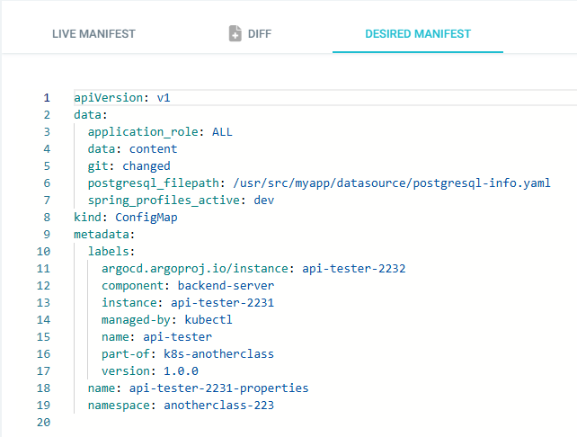
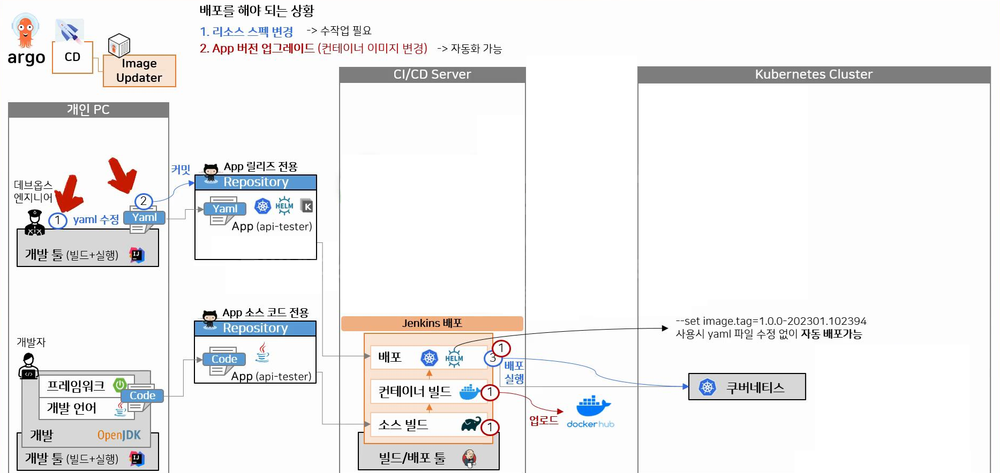

# ArgoCD 이용한 배포 환경 설정
* ArgoCD 아키텍처
* 1.ArgoCD App 생성
* 2.ArgoCD App 배포
* 3.ArgoCD의 Live Manifest vs Desired Manifest 비교
* 4.ArgoCD를 사용하면 좋은점?
* 5.ArgoCD Image Updater이용한 이미지 자동 배포 설정
* 6.Argo Rollouts를 이용한 배포 - Canary

<br>

## ArgoCD 아키텍처
* 

<br><br>

## 1. ArgoCD App 생성

### 1.1. GENERAL
* App이름, Project Name, Sync Policy - `Manual` 설정
  * App이름은 Helm Chart 이름이랑 동일하게 설정
  * 그렇지 않으면 k8s 리소스 이름 이상하게 바뀜
* 
* Sync Option - `Auto-Create Namespace` 체크해 주면, DESTINATION에 작성한 네임스페이스를 알아서 생성해 줌
* 

<br>

### 1.2. SOURCE
* git 주소, 브랜치명, 배포할 파일들 위치한 경로 지정
* Path에 지정된 경로에 해당하는 yaml파일들은 모두 배포 대상으로 간주됨, Directory항목에서 디테일하게 설정이 가능함
* 

<br>

### 1.3. DESTINATION
* cluster url은 apiserver로 접근 가능한 url임, ArgoCD는 Master Node에 설치했으므로
* k8s 초기화시 생성된 svc를 통해 `kubernetes.default.svc` 도메인으로 접근할 수 있음
  * 
* Cluster URL - `https://kubernetes.default.svc`, Namespace 지정
* 

<br>

### 1.4. Helm
* SOURCE의 Path위치에 helm 설정 파일들이 있으면 해당 파일들을 읽어서 표시해 줌
* 

<br>

* 환경에 따라 values.yaml 파일을 나누어 두었다면 배포할 values.yaml 설정 파일을 선택 가능함
* 

<br><br>

## 2. ArgoCD App 배포
* SYNC 버튼 누르면 배포 옵션 설정 가능
* 기본 OPTIONS
  * PRUNE : GIt에서 자원 삭제 후 배포시 K8S에서는 삭제되지 않으나, 해당 옵션을 선택하면 삭제시킴
  * FORCE : --force 옵션으로 리소스 삭제
  * APPLY ONLY : ArgoCD의 Pre/Post Hook은 사용 안함 (리소스만 배포)
  * DRY RUN : 테스트 배포 (배포에 에러가 있는지 한번 확인해 볼때 사용)
* SYNC OPTIONS
  * SKIP SCHEMA VALIDATION : 매니패스트에 대한 yaml 스키마 유효성 검사를 건너뛰고 배포 (kubectl apply --validate=false)
  * PRUNE LAST : 동기화 작업이 끝난 이후에 Prune(git에 없는 리소스를 제거하는 작업)를 동작시킴
  * RESPECT IGNORE DIFFERENCES : 동기화 상태에서 특정 상태의 필드를 무시하도록 함
  * AUTO-CREATE NAMESPACE : 클러스터에 네임스페이스가 없을 시 argocd에 입력한 이름으로 자동 생성
  * APPLY OUT OF SYNC ONLY : 현재 동기화 상태가 아닌 리소스만 배포
  * SERVER-SIDE APPLY  : 쿠버네티스 서버에서 제공하는 Server-side Apply API 기능 활성화
* SYNCHRONIZE 버튼 누르면 배포 시작됨
* 
* 배포중인 내용들 확인 가능
  * 초록색이면 잘 배포된것, 노란색이면 배포중이거나 뭔가 문제가 있어 pending상태거나 등, 빨간색이면 오류
* 

<br><br>

## 3. ArgoCD의 Live Manifest vs Desired Manifest
* `Live Manifest`는 k8s 환경에 배포된 Manifest
* `Desired Manifest`는 GitHub에서 관리되는 Manifest
* k8s에 배포된 리소스를 직접 수정하면 ArgoCD의 Live Manifest에 반영이 되고, ArgoCD의 Live Manifest를 수정해도 k8s의 리소스도 수정되어 반영됨
  * Desired Manifest는 변경되지 않음 (git을 통해서만 변경 가능)
* `diff`는 Live Manifest와 Desired Manifest의 차이를 보여주는것 같지만, k8s에서 리소스 변경하거나 ArgoCD의 Live Manifest에서 리소스 변경시 diff에 표시되지 않을 수도 있음
* 따라서 리소스 스펙 변경 작업시 Git에서 변경하는 것이 원칙임 (GitOps 원칙에 해당됨)
* 

<br><br>

## 4. ArgoCD를 사용하면 좋은점?
* k8s 리소스 관리하기 편함 - 깔끔하고 직관적인 UI와 Git을 이용한 Sync기능
* ArgoCD Image Updater 이용한 변경 감지 및 자동 배포
* ArgoCD Rollouts 이용한 고급 배포 지원 - Blue/Green , Canary

<br>

### 4.1. k8s환경에서 배포할때 왜 ArgoCD가 필요할까? (ArgoCD Image Updater)
* k8s환경에서 배포를 해야하는 상황은 2가지가 있음
  1. 리소스 스펙 변경
  2. App 버전 업데이트 (이미지 변경)
* ArgoCD 없을때 CD 환경
  * 리소스 스펙 변경
    * ArgoCD가 없는 환경에서는 yaml파일 수정후 커밋하고,
    * Jenkins에서 배포 파이프라인 실행하여 변경할 k8s 리소스들을 업데이트
      * 파이프라인에서 변경된 Helm 차트를 패키징하고 푸시, 업데이트하는 복잡한 과정이 필요함
  * App 버전 업데이트 (이미지 변경)
    * ArgoCD가 없는 환경에서는 App의 변경된 내용 푸시, Jenkins 배포 파이프라인으로 이미지 빌드후 registry에 업로드
    * 이후 k8s 리소스의 이미지 변경은 `helm upgrade ... --set` 명령어로 배포 자동화 가능 (helm 필요)
  * 자동화가 가능하긴 하지만 ArgoCD를 사용할때와 비교하면 다소 복잡함
  * 
* ArgoCD를 사용하면?
  * 리소스 스펙 변경
    * Git 레포에 선언된 리소스들의 상태(Manifest)와 Kubernetes 클러스터의 실제 상태를 동기화하는 작업을 수행
    * 변경할 리소스들 git에 푸시하면 ArgoCD가 변경 감지하여 자동 배포해줌
  * App 버전 업데이트시 (이미지 변경시)
    * App의 변경된 내용 푸시, Jenkins 배포 Job에서 이미지 빌드후 registry에 업로드
    * App에 추가한 Annotaions 설정에 따라, ArgoCD Image Updater가 registry에 새로 업로드된 이미지를 감지하고 자동 배포
  * 이미지 빌드(CI)만 다른 도구로 실행하면, 배포에 관련된 내용들은 ArgoCD를 통해 쉽게 자동화 가능
  * 

<br><br>

## 5. ArgoCD Image Updater이용한 이미지 자동 배포 설정
* 설치 방법은 [해당 문서 참고](/create-k8s-environment/create-argocd/create-argocd.md#6-argocd-image-updater-설치)

### 5.1. ArgoCD Image Updater?
* Argo CD로 관리되는 리소스의 컨테이너 이미지를 자동으로 최신 버전으로 업데이트하는 도구
* 배포할 내용의 설정 파일들은 helm을 사용하여 작성해야 함 (또는 kustomize)
  * 배포시 `helm upgrade ... --set` 명령어를 내부적으로 사용하기 때문
* ArgoCD 설치와 별개로 ArgoCD Image Updater를 따로 설치하고 registry관련 설정도 추가해 주어야 함
* ArgoCD App의 Sync Policy를 Auto로 설정하고 App에 Annotaion들을 추가해 주면,
  * ArgoCD Image Updater가 지속적으로 이미지의 새 버전을 확인하여 App에 해당하는 리소스의 이미지를 배포 (deployment, replicaSet, pod...)
  * ArgoCD Image Updater가 확인하는 이미지들의 조건은 argocd-image-updater-config 컨피그맵의 registry설정과 App에 등록한 Annotaion을 따름
  * 
  * 

<br>

### 5.2. Annotation 예시
  * `argocd-image-updater.argoproj.io/image-list`: 업데이트 대상 이미지를 지정함, `{alias}={image_path}` 형식임
    * `argocd-image-updater.argoproj.io/image-list = chatflow-member=chatflow/member` 의 annotation인 경우
    * chatflow-member: 이미지의 별칭(alias)으로 이후의 annotation에서 참조
    * chatflow/member: 실제 이미지 경로 (cf. DockerHub 기준, registry 설정으로 credentials정보와 docker.io/가 생략되어 있음 참고)
  * `argocd-image-updater.argoproj.io/<alias>.allow-tags`: 특정 태그 패턴에 해당하는 이미지만 업데이트 대상으로 지정
    * `argocd-image-updater.argoproj.io/chatflow-member.allow-tags = regexp:^[0-9]+\.[0-9]+\.[0-9]+-[0-9]{6}\.[0-9]{6}$` 의 경우
    * chatflow-member는 앞서 설정한 alias에 해당
    * regexp:^[0-9]+\.[0-9]+\.[0-9]+-[0-9]{6}\.[0-9]{6}$: regex 패턴에 해당하는 태그를 가진 이미지만 업데이트 대상임
    * ex. 1.0.8-250406.123456
  * `argocd-image-updater.argoproj.io/<alias>.helm.image-name`: Helm Chart의 values.yaml에서 이미지 레포지토리 경로의 key 경로를 지정
    * `argocd-image-updater.argoproj.io/chatflow-member.helm.image-name = common.rollout.image.repository`의 경우
    * chatflow-member는 앞서 설정한 alias에 해당
    * values.yaml파일의 common.rollout.image.repository 설정을 chatflow/member로 업데이트 함
  * `argocd-image-updater.argoproj.io/<alias>.helm.image-tag`: Helm Chart의 values.yaml에서 이미지 태그의 key 경로를 지정
    * `argocd-image-updater.argoproj.io/chatflow-member.helm.image-tag = common.rollout.image.tag`의 경우
    * chatflow-member는 앞서 설정한 alias에 해당
    * values.yaml파일의 common.rollout.image.tag 설정을 새로 배포된 이미지 태그로 업데이트함
    * ex. 1.0.3-240428.104512
  * `argocd-image-updater.argoproj.io/<alias>.update-strategy`: 이미지 업데이트 전략을 정의
    * `argocd-image-updater.argoproj.io/chatflow-member.update-strategy = alphabetical` 의 경우
    * chatflow-member는 앞서 설정한 alias에 해당
    * 이미지 업데이트 전략
      1. `alphabetical` (`name`에서 변경됨)
         * 알파벳순으로 정렬된 목록의 마지막 태그로 업데이트
         * 날짜 기반 또는 정렬 가능한 태그일 경우 사용
         * ex. 1.0.0-alpha, 1.0.0-beta, 1.0.0-release라면, 알파벳 순서로 가장 높은 값인 release가 선택됨
      2. `semver`
         * 주어진 이미지 제약 조건에 따라 허용되는 가장 높은 버전으로 업데이트
         * 태그가 Semantic Versioning 규칙(X.Y.Z)을 따르는 경우에 사용함
         * ex. 태그가 1.0.0, 1.1.0, 2.0.0일 때, 2.0.0이 선택됨
      3. `newest-build` (`latest`에서 변경됨)
         * 가장 최근에 생성된 이미지 태그로 업데이트
         * 최신 빌드된 이미지를 항상 사용하고자 할 때 사용
      4. `digest`
         * 특정 태그의 SHA256 해시 다이제스트를 기반으로 가장 최근에 푸시된 이미지를 선택?? (필요할때 찾아봐야 할듯)
         * CI 시스템에서 동일한 태그 이름으로 새로운 이미지를 반복적으로 푸시할 때 유용하다고 함

<br>

### 5.3. 점검
* ArgoCD App의 Sync Policy를 Auto로 설정하고 App에 Annotaion들을 잘 추가해 주었다면,
* ArgoCD Image Updater가 주기적으로 이미지의 새 버전을 확인하고 자동으로 배포해 줌
* ArgoCD Image Updater Pod에서 로그로 해당 내용을 확인해 볼 수 있음
  * 

<br><br>

## 6. Argo Rollouts를 이용한 배포 - Canary
* 설치 방법은 [해당 문서 참고](/create-k8s-environment/create-argocd/create-argocd.md#7-argo-rollouts-설치)
* Argo Rollouts란?
  * Kubernetes 환경에서 Blue/Green와 Canary 같은 배포 전략을 구현하고, 자동 롤백 및 수동 판단 기능을 제공하는 k8s 컨트롤러 및 CRD

### 6.1. Rollout CRD 설정
* Deployment 설정 대신 Rollout CRD를 사용
* Deployment의 모든 설정을 사용 가능, `strategy` 설정만 추가하면 됨
* 이외에 DestinationRule 설정과 VirtualService 설정도 필요함
  * [해당 문서 참고](/create-k8s-environment/docs/istio/istio.md)
* Rollout 설정 예시
  ```yaml
  apiVersion: argoproj.io/v1alpha1
  kind: Rollout # Rollout CRD 사용
  metadata:
    name: member-prod
    namespace: chatflow
    labels:
      app.kubernetes.io/component: backend
      app.kubernetes.io/instance: member-prod
      app.kubernetes.io/name: member
  spec:
    replicas: 1
    revisionHistoryLimit: 3
    selector:
      matchLabels:
        app.kubernetes.io/instance: member-prod
        app.kubernetes.io/name: member
    strategy: # 배포 전략 설정 가능
      canary: # Canary 배포 전략 사용
        steps: # step 설정으로 canary 배포 단계 설정 가능
          - setCanaryScale:
              replicas: 1
          - pause: {}
          - setWeight: 10
          - pause:
              duration: 60s
          - setWeight: 30
          - pause:
              duration: 120s
          - setWeight: 100
        trafficRouting: # 라우팅 설정
          istio:
            destinationRule: # App별로 destinationRule CRD를 따로 생성해 주어야 함
              canarySubsetName: canary
              name: member-prod-destinationrule
              stableSubsetName: stable
            virtualService:
              name: chatflow-routing
              routes:
                - http.0 # VirtualService CRD에 설정한 라우팅 설정의 이름
  # .....
  ```
* 