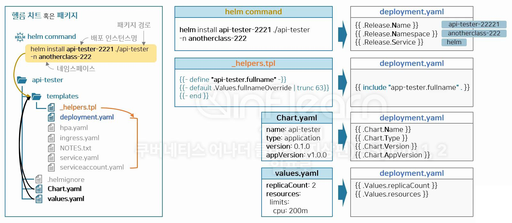
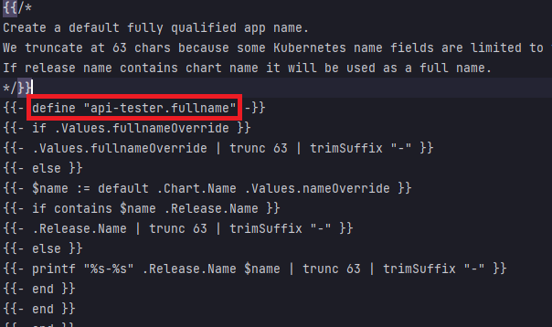
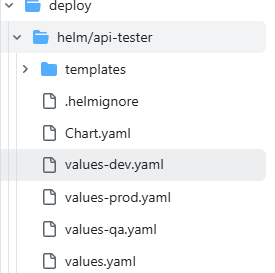

# Helm
* 참고 : https://github.com/k8s-1pro/kubernetes-anotherclass-sprint2

## helm 설치 (ubuntu)
* `k8s 1.30` 버전과 호환이 잘 되는 helm 버전은 `helm 3.15.x`
* 3.15.4 버전 설치
  ```sh
  curl https://baltocdn.com/helm/signing.asc | gpg --dearmor | sudo tee /usr/share/keyrings/helm.gpg > /dev/null
  sudo apt-get install apt-transport-https --yes

  echo "deb [arch=$(dpkg --print-architecture) signed-by=/usr/share/keyrings/helm.gpg] https://baltocdn.com/helm/stable/debian/ all main" | sudo tee /etc/apt/sources.list.d/helm-stable-debian.list

  sudo apt-get update
  sudo apt-cache madison helm # 설치 가능한 버전 확인
  sudo apt-get install -y helm=3.15.4-1
  helm version # 설치 잘 되었는지 확인
  ```

<br><br>

## helm 설치 (window 환경)
* **Chocolatey 사용함**
* PowerShell을 관리자 권한으로 실행
  ```sh
  choco install kubernetes-helm
  helm version
  ```

<br><br>

## helm 초기화 및 업로드
* Helm을 Local환경에 설치를 했다면, `helm create {chart-name}` 명령어를 이용하여 Helm Chart 생성
* create 명령어를 수행한 path를 기준으로 하므로, vscode나 intellij에서 작업하고
* manifest Repo에 바로 push 하면 편함

<br><br>

## Helm 패키지 간단 설명
* 
* helm command로 입력한 내용은 `.Release`에 대응됨
* Chart.yaml / values.yaml 은 `.Chart` / `.Values`에 대응됨
* helm command내용과 Chart.yaml 그리고 values.yaml 내용은 `/templates` 경로의 모든 파일에서 가져다 쓸 수 있음
* _helpers.tpl 의 내용 또한 `/templates` 경로의 모든 파일에서 가져다 쓸 수 있음
* _helpers.tpl 에는 아래의 그림과 같이 어떤 필드에 무슨 값이 들어갈지 로직을 정의할 수 있음
  * 아래는 `api-tester.fullname`에 어떤 내용이 들어갈지 정의해 놓은 스크립트임
  * 

<br><br>

## Helm Template 사용법 간단한 설명
* `helper.tpl`에 들어가는 내용은 yaml파일에 모두 적용 가능함
  * include 명령어 뒤의 내용에 이름이 들어감
  * ex. `{{ include "api-tester.fullname" . }}`
* Chart.yaml, values.yaml 파일
  * 모든 yaml에서 공통으로 가져다 쓸 수 있음
  * .Chart 또는 .Values 명령어 작성하면 됨
  * ex. `{{ .Values.replicaCount }}`, `{{ .Chart.Name }}`
* Helm Template에서 동적 데이터 작성 방법
  * 예시1: `{{- toYaml .Values.configmap.data.properties | nindent 2 }}`
    * `{{}}` : 안에 동적 데이터에 대한 내용을 작성하면 해당하는 위치에 데이터가 작성됨
    * `-` : 데이터가 최종적으로 출력될때, 데이터 가장 앞의 여백이 모두 삭제되도록 해줌
    * `toYaml` : Helm 템플릿에서 복잡한 데이터 구조(ex. 배열, 딕셔너리, 중첩된 데이터 구조 등)를 YAML 형식의 문자열로 변환하고 들여쓰기를 포함한 적절한 형식으로 출력
    * `.Values.configmap.data.properties` : values.yaml 파일(Values)의 configmap.data.properties 데이터를 참조(맨 앞의 `.`)
    * `nindent 2` : 데이터 출력될때, 데이터 가장 앞에 공백 2개를 추가해 줌
    * `{{- toYaml .Values.configmap.data.properties | nindent 2 }}`라는 데이터는 아래와 같이 두줄로 변경될 수 있음
      ```yaml
      # values.yaml의 아래의 데이터가
      configmap:
        data:
          properties:
            key1: value1
            key2: value2
      ```
      ```yaml
      # 아래와 같이 변경되어 {{- toYaml .Values.configmap.data.properties | nindent 2 }} 위치에 추가됨, 공백 2칸 확인
        key1: value1
        key2: value2
      ```
  * 예시2
    ```yaml
    {{- with .Values.nodeSelector }}
    nodeSelector:
      {{- toYaml . | nindent 8 }}
    {{- end }}
    ```
    * `{{- with .Values.nodeSelector }}`: with블록 - values.yaml의 nodeSelector에 값이 있을 경우에, nodeSelector에 그 값이 들어감
    * `{{- toYaml . | nindent 8 }}`
      * `-`: 데이터 앞의 공백 제거
      * `toYaml`: 데이터를 YAML 형식으로 변환
      * `.`: 해당하는 데이터 참조(Values.nodeSelector에 해당)
      * `nindent 8`: 데이터 가장 앞에 공백 8칸 생성
    * `{{- end }}`: with 블록을 종료

<br><br>

## Helm 기본 명령어 정리
* `helm install {배포명} {패키지경로} -n {네임스페이스명}`
  * Helm 차트를 설치하고 Kubernetes 클러스터에 리소스를 배포
* `helm template {배포명} {패키지경로} -n {네임스페이스명} --create-namespace`
  * Helm 차트를 기반으로 Kubernetes 설정 파일 내용을 출력
    * 해당하는 배포명 가진 설정 파일들 모두 출력
  * `--create-namespace 옵션`: 명령어에 해당하는 namespace가 없으면 생성해 줌
    * `helm upgrade` 명령어와 같이 안쓰는게 좋음. `kubectl apply ... --create-namespace` 먼저 적용 후 helm upgrade로 배포하면 됨
  * ex. helm template api-tester-2221 ./2221/deploy/helm/4.addition/api-tester -n anotherclass-222 --create-namespace
* `helm upgrade {배포명} {패키지경로} -n {네임스페이스명} --create-namespace --install`
  * 해당하는 경로에, 기존에 배포된 내용들을 업데이트하거나 새로운 버전의 차트를 적용
  * `--install 옵션`: 해당하는 차트가 없으면 helm install 역할을 함
  * cf. kubectl의 create / patch / apply와 비교
    * `helm install`: kubectl create와 비슷
    * `helm upgrade`: kubectl patch와 비슷
    * `helm upgrade --install`: kubectl apply와 비슷
* `helm uninstall {배포명} -n {네임스페이스명}`
  * Helm 차트 삭제
  * Helm으로 생성된 Kubernetes 리소스들을 모두 삭제함
  * **네임스페이스는 지워지지 않고 유지됨**
    * 네임스페이스가 지워지면 해당하는 네임스페이스로 지정된 모든 리소스가 삭제되기 때문
* `-f` 와 `--set` 쓰임새
  * 아래 스크립트는 `helm template {배포명} {패키지경로} -n {네임스페이스명} -f {적용할파일}` 에 해당
    * `-f`: 저장된 파일로 적용할때 사용
    ```sh
    helm template api-tester-${CLASS_NUM} ./${CLASS_NUM}/deploy/helm/api-tester \   
      -n anotherclass-222-${params.PROFILE} \ 
      -f ./${CLASS_NUM}/deploy/helm/api-tester/values-${params.PROFILE}.yaml
    # --set replicaCount='3' --set port='80' --set profile='dev' --set nodeport='32223'
    ```
    * 
    * 위의 values 파일이 파라미터로 결정되고 해당 파일로 적용됨
  * `--set`: 동적으로 값 넣을때 사용할 수 있음
    * 아래 스크립트에서 `-f`를 통해 해당하는 values 파일이 적용되지만, `--set`이 있으면 해당 설정 값이 최종적으로 적용됨
    * 즉, values-dev.yaml 적용으로 values-dev.yaml의 replicaCount값이 1이어도 --set에 의해 3으로 세팅되는 것임
    ```sh
    helm template api-tester-${CLASS_NUM} ./${CLASS_NUM}/deploy/helm/api-tester \   
      -n anotherclass-222-${params.PROFILE} \ 
      -f ./${CLASS_NUM}/deploy/helm/api-tester/values-${params.PROFILE}.yaml \
      --set replicaCount='3' --set port='80' --set profile='dev' --set nodeport='32223'
    ```