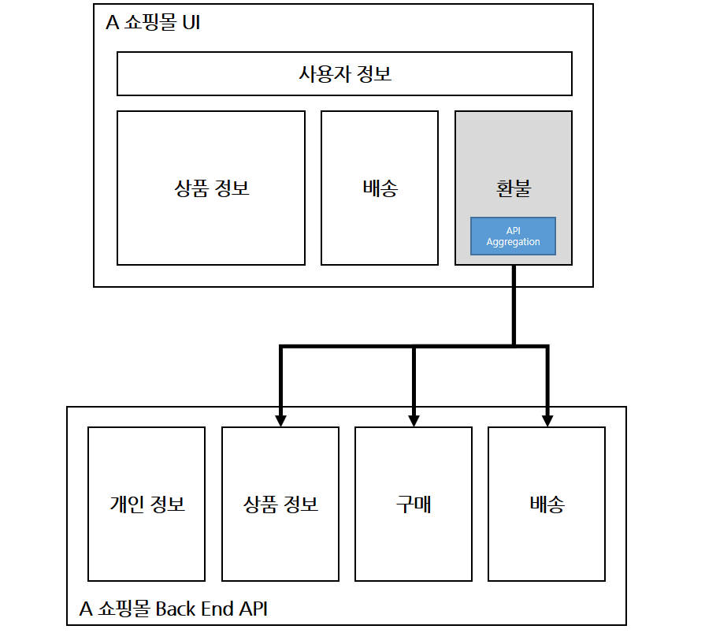
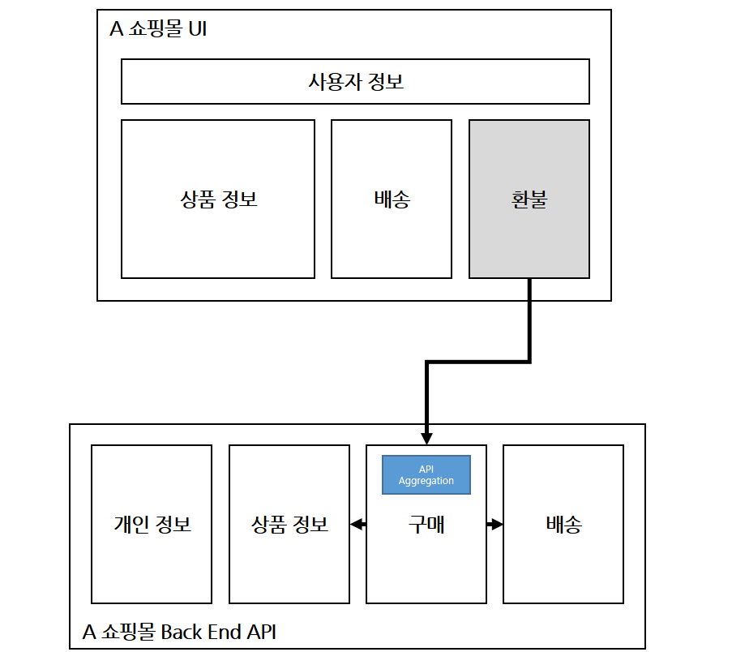
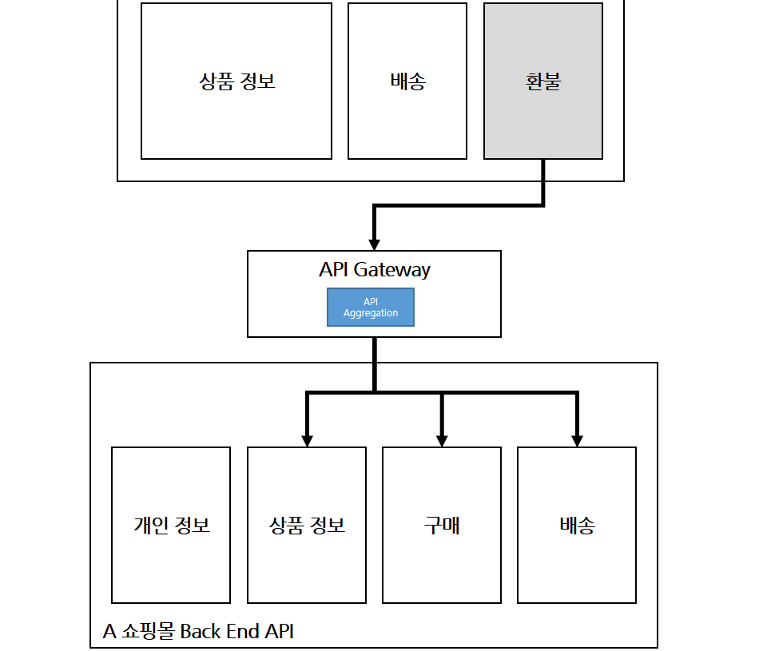

# MSA

## MSA 환경에서 데이터를 조회하는 방법
* MSA 환경에서는 API를 통해 서비스 간 데이터를 조회할 때 `서비스 독립성 유지`, `효율적인 데이터 조회`, `데이터 정합성`을 고려해야 함

### 1. API Composition
* 참고 - https://waspro.tistory.com/649
* Client Side API Composition
  * 
* Server Side API Composition
  * 마이크로서비스의 결합도가 높아짐
  * 클라이언트 상에 표출하기 위한 데이터 변경 시 서버 사이트 애플리케이션을 수정해야 하는 종속성이 발생
  * 호출 지연(latency)이 발생 (Event Sourcing과 비교하여...)
  * 
* Apigateway를 이용한 Server Side API Composition
  * 서비스 종속성이 없는 단일 마이크로 서비스로 구성도 가능
  * Hop의 증가로 인한 문제와 api 유연성 문제는 여전히 발생
  * 클라이언트 사이드에서 api 결과를 순차적으로 받아 처리해야 하는 경우에는 적합하지 않음
  * 

### 2. CQRS
* [참고 링크](https://velog.io/@everyhannn/CQRS-Event-Sourcing)
* 메시지 브로커(Kafka 등)를 활용하여 이벤트를 전달하고, 필요한 경우 CQRS(Command Query Responsibility Segregation) 패턴을 적용해 읽기(read)와 쓰기(update)를 분리
* 읽기 작업의 성능이 매우 높은 것이 특징
* update의 경우 이벤트를 발행
* 각 Service마다 필요한 데이터를 가지고 있으며 update와 read를 분리할 수 있음
  * 예시 - delivery서버를 통해 delivery중인 product를 조회해야 하는 상황
    * product service에서 product에 대한 데이터를 소유하고 있음
    * delivery service에는 delivery에 필요한 product관련 메타데이터만 포함
    * delivery조회시 delivery service를 통해 바로 delivery정보와 해당하는 product들의 정보를 read할 수 있음
    * product update시 product service를 통해 product의 정보가 업데이트 되고, 해당 product업데이트 메시지를 발행
      * 발행된 메시지에 해당하는 event를 구독중인 service(위에서는 delivery serivce)에서 product관련 정보가 업데이트 됨
* 위와 같은 구조에서 시간이 지나면 결국에는 `데이터의 정합성`이 보장됨
  * Eventual Consistency
* 하지만, 데이터 변경이 자주 일어나는 경우 리소스를 많이 잡아 먹기 때문에, **API Composition** 방법이 더 효과적일 수도 있음


### 3. Saga 패턴?
* [참고 링크](https://medium.com/@greg.shiny82/%EB%A7%88%EC%9D%B4%ED%81%AC%EB%A1%9C%EC%84%9C%EB%B9%84%EC%8A%A4-%EC%82%AC%EA%B0%80-%ED%8C%A8%ED%84%B4-544fc1adf5f3)
* MSA에서 여러 데이터베이스로 데이터를 분리할 때 필연적으로 발생하게 되는 트랜잭션 관리 이슈를 해결하기 위한 패턴임
  * `데이터의 정합성`을 유지하기 위함
* Saga패턴을 보기전에 2PC에 대해서 - Two Phase Commit (2PC)
  * 1단계: 투표(Voting) 단계
    * 코디네이터라고 불리는 `중앙 노드가 트랜잭션을 시작`하고 참여하는 모든 노드에게 트랜잭션의 준비를 요청
  * 2단계: 커밋(Commit) 또는 롤백(Abort) 단계
    * 모든 노드가 준비 완료 상태이면 변경 내용을 커밋하고 그렇지 않으면 롤백을 함
  * 2PC 는 분산 시스템에서의 데이터 일관성과 무결성을 보장하지만, 모든 노드가 응답할 때까지 코디네이터가 기다려야 하므로 
  * 네트워크 지연이나 참여 노드의 지연으로 인해 전체 트랜잭션 처리 시간이 길어질 수 있음
* 따라서, 장기 실행 트랜잭션을 관리하기 위해 `Saga 패턴`을 사용하는 것이 좋음
* 각 트랜잭션 단계는 2pc와는 다르게 `로컬`로 처리되며, 로컬 트랜잭션은 특정 마이크로서비스에서 실행
* 트랜잭션들은 순차적으로 또는 병렬로 실행될 수 있으며, 각 트랜잭션이 단일 서비스 내에서 데이터를 업데이트하고 난 후에는 다음 서비스로 이벤트를 발행하여 다음의 트랜잭션을 트리거
* 실패 시 보상 작업(compensating action)을 수행해 정합성을 유지
  * 특정 서비스에서 이벤트 처리 실패시, 이미 커밋된 트랜잭션을 되돌릴 필요가 있음
  * 보상 트랜잭션(Compensation transactions) 은 이전에 커밋된 트랜잭션을 되돌리기 위한 추가적인 연산에 해당
  * ex. 포인트 부여됐다면, 보상 작업으로 포인트 회수 작업을 추가로 수행
* Saga 패턴에서 요청 실패시
  * 롤백(트랜잭션 롤백 or 보상 트랜잭션) 연산을 줄이는 방법
    * 실패 가능성 높은 프로세스를 앞에서 진행하여 롤백 연산 줄이기
    * 보상 트랜잭션을 구현하기 어려운 프로세스를 후반부의 실행순서로 옮겨 구현의 복잡도 줄이기
  * 롤백 구현 방식
    * 역방향 복구(backward recovery): 이전에 커밋된 트랜잭션을 의미상으로 취소할 수 있는 보상 트랜잭션을 실행
    * 정방향 복구(forward recovery): 오류가 발생한 지점에서 데이터를 가져와 성공할 때까지 계속 실행하는 것을 말함
* Saga 패턴의 두 가지 구현 방식
  * 오케스트레이션 방식(Orchestration)
    * 장점: 중앙 코디네이터가 관리하기 때문에 전체 프로세스가 어떻게 동작하는지를 쉽게 이해할 수 있음
    * 단점: 결합도가 높은 구현 방식이기 때문에 확장성이 떨어짐
  * 코레오그래피 방식(Choreography)
    * 장점: 메시지 큐를 이용한, 결합도가 상당히 낮은 아키텍처이기 때문에 그만큼 확장성이 높음
    * 단점: 실행 순서와 진행 상황을 파악하기가 어렵고, 그 때문에 적절한 보상 조치를 실행하는 것조차 어려움

### 4. 트랜잭셔널 아웃박스 패턴 Transactional Outbox Pattern
* [참고 링크1](https://medium.com/@greg.shiny82/%ED%8A%B8%EB%9E%9C%EC%9E%AD%EC%85%94%EB%84%90-%EC%95%84%EC%9B%83%EB%B0%95%EC%8A%A4-%ED%8C%A8%ED%84%B4%EC%9D%98-%EC%8B%A4%EC%A0%9C-%EA%B5%AC%ED%98%84-%EC%82%AC%EB%A1%80-29cm-0f822fc23edb)
* [참고 링크2](https://curiousjinan.tistory.com/entry/transactional-outbox-pattern-microservices-kafka)
* [참고 링크3 - inbox](https://curiousjinan.tistory.com/entry/kafka-consumer-inbox-pattern)


* 'at-least-once + 멱등성' 조합을 통해 메시지 유실 없이 데이터 처리
* 중복은 허용하는 대신 중복에 의한 부작용을 방지하는 방법들을 사용
  * ex. unique key, upsert 방식, inbox 등

#### 4.1. 이벤트 순서 역전에 의한 데이터 정합성 문제
* Outbox 패턴 사용 시 발생할 수 있는 이벤트 순서 역전에 의한 데이터 정합성 문제를 어떻게 해결할 수 있을까?
* 가장 간단한 방법은 timestamp 또는 version을 기반으로 오래된 이벤트인 경우 처리를 무시하도록 설계하는 것
* ReadModel의 version으로 오래된 이벤트를 판단하고 무시하도록 하려면 이벤트 처리가 멱등(idempotent)하게 이루어 지도록 설계가 되어야 함
  * 예를들어, Member의 `접속 상태 변경`, `회원 정보 변경`과 같이 변경에 대한 이벤트를 나누는게 아니라,
  * Member 변경 이벤트(PUT방식) 하나로, Member를 변경하는 이벤트를 멱등하게 설계하는 것임

#### 4.2. @TransactionalEventListener(phase = TransactionPhase.AFTER_COMMIT) 사용시 주의점
* **AFTER_COMMIT 리스너에서 데이터 업데이트 처리시 DB에 반영이 되지 않는 문제가 발생**
* [참고한 링크](https://curiousjinan.tistory.com/entry/fixing-spring-transactionaleventlistener-after-commit-update-issue)
* 문제 발생 시나리오
  * ApplicationEventPublisher으로 이벤트 호출시 `@TransactionalEventListener(phase = TransactionPhase.BEFORE_COMMIT)`에 의한 리스너가 호출되는데
  * BEFORE_COMMIT 시점은 커밋전 단계로 아직 DB와의 Transaction이 연결되어 있으며 종료시 커밋이 이루어 진다.
  * BEFORE_COMMIT 리스너 처리 이후, `@TransactionalEventListener(phase = TransactionPhase.AFTER_COMMIT)`에 의한 리스너가 처리되는데
  * AFTER_COMMIT 시점에는 커밋이 끝나고, DB에 대한 Transaction 또한 종료된 상태이지만 Spring에 의한 Transaction 컨텍스트는 유지되어 있는 상태이다.
  * 따라서, AFTER_COMMIT 리스너에서 데이터를 저장해도 **DB에 반영이 되지 않는 문제**가 발생한다.
* 왜 업데이트되지 않는 문제가 발생할까?
  * 아래의 AFTER_COMMIT 리스너의 코드를 예시로 들어보자.
  * AFTER_COMMIT 단계에서는 DB Transaction은 끊어진 상태이지만 Spring에 의한 Transacion은 유지되고 있는 상태이다.
  * Spring에 의한 Transacion은 유지되고 있기 때문에, BEFORE_COMMIT 단계에서 생성된 outbox 데이터는 영속성 컨텍스트에 관리되고 있는 상태이다.
  * 그래서 DB Transaction이 끊겼지만 outbox 데이터 조회가 가능한 것이고 save(outbox) 코드까지 이어질 수 있다.
  * 하지만 save 요청시 DB Transaction이 끊어진 상태이기 때문에 DB에 커밋이 되지 않는 문제가 발생하는 것 (에러 메시지가 나오지 않아 찾기 어려움...)
  ```java
  // DB Transaction은 끊어진 상태이지만 Spring에 의한 Transacion은 유지되고 있는 상태
  @TransactionalEventListener(phase = TransactionPhase.AFTER_COMMIT)
  public void handleOutboxEventAfterCommit(OutboxEvent event) {
      String eventId = event.getEventId();
      // BEFORE_COMMIT단계에서 생성된 outbox는 영속성 컨텍스트에 의해 관리되고 있기 때문에 조회가 가능
      Outbox outbox = outboxRepository.findByEventId(eventId)
              .orElseThrow(() -> new EntityNotFoundException("eventId에 대한 OutBox 데이터가 존재하지 않습니다."));

      try {
          kafkaEventPublisher.sendEvent(
                  outbox.getAggregateType(),   // topic
                  outbox.getEventId(),         // eventId (header & Outbox Unique key)
                  outbox.getEventType(),       // eventType (header)
                  outbox.getAggregateId(),     // record key
                  outbox.getPayload()          // record message
          );
          outbox.markSuccess();
      } catch (Exception e) {
          outbox.markFailed();
      }
      outboxRepository.save(outbox); // DB Transaction이 끊긴 상태이기 때문에 커밋이 안됨
  }
  ```
* 어떻게 해결할까?
  * AFTER_COMMIT 리스너에 `@Transactional(propagation = Propagation.REQUIRES_NEW)` 어노테이션을 붙여주면 된다.
  * 기존에 실행되던 트랜잭션(스프링 트랜잭션 컨텍스트)과 완전히 분리된 새로운 트랜잭션을 시작해야 하기 때문
  * 이때 REQUIRES_NEW는
    * 새로운 스프링 트랜잭션 컨텍스트 생성
    * 새로운 DB 커넥션 획득
    * 새로운 DB 트랜잭션 시작


### 5. event-sourcing
* [참고 링크1](https://velog.io/@everyhannn/CQRS-Event-Sourcing)
* [참고 링크2](https://curiousjinan.tistory.com/entry/cqrs-explained-event-sourcing?category=1503500)