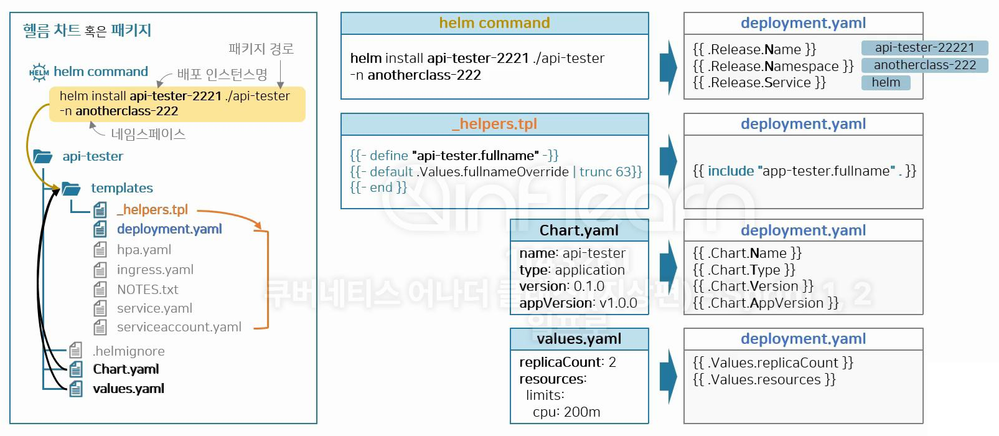
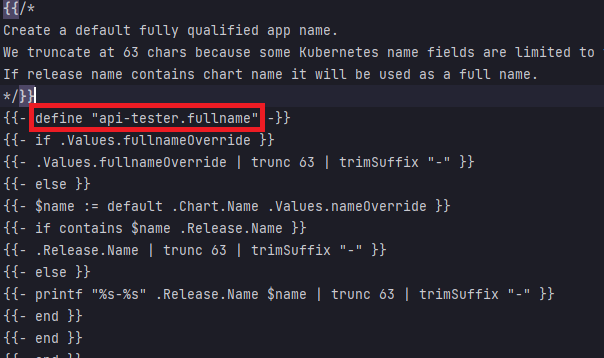

# Helm
* 참고 : https://github.com/k8s-1pro/kubernetes-anotherclass-sprint2

## helm 설치
* 3.13.2 버전 설치
```sh
curl https://baltocdn.com/helm/signing.asc | gpg --dearmor | sudo tee /usr/share/keyrings/helm.gpg > /dev/null
sudo apt-get install apt-transport-https --yes

echo "deb [arch=$(dpkg --print-architecture) signed-by=/usr/share/keyrings/helm.gpg] https://baltocdn.com/helm/stable/debian/ all main" | sudo tee /etc/apt/sources.list.d/helm-stable-debian.list

sudo apt-get update
sudo apt-cache madison helm # 설치 가능한 버전 확인
sudo apt-get install -y helm=3.13.2-1
helm version # 설치 잘 되었는지 확인
```

<br>

## Helm 패키지 간단 설명
* 
* helm command로 입력한 내용은 `.Release`에 대응됨
* Chart.yaml / values.yaml 은 `.Chart` / `.Values`에 대응됨
* helm command내용과 Chart.yaml 그리고 values.yaml 내용은 `/templates` 경로의 모든 파일에서 가져다 쓸 수 있음
* _helpers.tpl 의 내용 또한 `/templates` 경로의 모든 파일에서 가져다 쓸 수 있음
* _helpers.tpl 에는 아래의 그림과 같이 어떤 필드에 무슨 값이 들어갈지 로직을 정의할 수 있음
  * 아래는 `api-tester.fullname`에 어떤 내용이 들어갈지 정의해 놓은 스크립트임
  * 

<br>

## Helm Template 사용법 간단한 설명
* `helper.tpl`에 들어가는 내용은 yaml파일에 모두 적용 가능함
  * include 명령어 뒤의 내용에 이름이 들어감
  * ex. `{{ include "api-tester.fullname" . }}`
* Chart.yaml, values.yaml 파일
  * 모든 yaml에서 공통으로 가져다 쓸 수 있음
  * .Chart 또는 .Values 명령어 작성하면 됨
  * ex. `{{ .Values.replicaCount }}`, `{{ .Chart.Name }}`
* Helm Template에서 동적 데이터 작성 방법
  * 예시 `{{- toYaml .Values.configmap.data.properties | nindent 2 }}`
    * `{{}}` : 안에 동적 데이터에 대한 내용을 작성하면 해당하는 위치에 데이터가 작성됨
    * `-` : 데이터가 최종적으로 출력될때, 데이터 가장 앞의 여백이 모두 삭제되도록 해줌
    * `toYaml` : Helm 템플릿에서 배열 같은 객체(예: 배열, 딕셔너리, 중첩된 데이터 구조 등)를 YAML 형식의 문자열로 변환
    * `.Values.configmap.data.properties` : values.yaml 파일의 configmap.data.properties 데이터가 위치하게 됨
    * `nindent 2` : 데이터 출력될때, 데이터 가장 앞에 공백 2개를 추가해 줌
    * `{{- toYaml .Values.configmap.data.properties | nindent 2 }}`라는 데이터는 아래와 같이 두줄로 변경될 수 있음
    ```yaml
    # values.yaml의 아래의 데이터가
    configmap:
      data:
        properties:
          key1: value1
          key2: value2
    ```
    ```yaml
    # 아래와 같이 변경되어 {{- toYaml .Values.configmap.data.properties | nindent 2 }} 위치에 추가됨, 공백 2칸 확인
      key1: value1
      key2: value2
    ```

<br>

## Helm 기본 명령어
* `helm install {배포명} {패키지경로} -n {네임스페이스명}`
  * Helm 차트를 설치하고 Kubernetes 클러스터에 리소스를 배포
* `helm template {배포명} {패키지경로} -n {네임스페이스명} --create-namespace`
  * Helm 차트를 기반으로 Kubernetes 설정 파일 내용을 출력
    * 해당하는 배포명 가진 설정 파일들 모두 출력
  * `--create-namespace 옵션`: 명령어에 해당하는 namespace가 없으면 생성해 줌
  * ex. helm template api-tester-2221 ./2221/deploy/helm/4.addition/api-tester -n anotherclass-222 --create-namespace
* `helm upgrade {배포명} {패키지경로} -n {네임스페이스명} --create-namespace --install`
  * 해당하는 경로에, 기존에 배포된 내용들을 업데이트하거나 새로운 버전의 차트를 적용
  * `--install 옵션`: 해당하는 차트가 없으면 helm install 역할을 함
  * cf. kubectl의 create / patch / apply와 비교
    * `helm install`: kubectl create와 비슷
    * `helm upgrade`: kubectl patch와 비슷
    * `helm upgrade --install`: kubectl apply와 비슷
* `helm uninstall {배포명} -n {네임스페이스명}`
  * Helm 차트 삭제
  * Helm으로 생성된 Kubernetes 리소스들을 모두 삭제함
  * **네임스페이스는 지워지지 않고 유지됨**
    * 네임스페이스가 지워지면 해당하는 네임스페이스로 지정된 모든 리소스가 삭제되기 때문