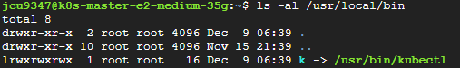

# kubectl command

~~~bash
# 명령어 사용시 노드를 제외한 오브젝트에 대한 명령은 네임스페이스를 명시해 주어야 함
# 네임스페이스의 경우, `--all-namespaces`로 입력하면 전체 네임스페이스로 선택됨
kubectl api-resources # 전체 api 리소스 확인
kubectl get all -n {네임스페이스} | grep {검색어}
kubectl get {타입1},{타입2} -n {네임스페이스}
kubectl get {타입} -n {네임스페이스} -o wide {리소스이름}
kubectl get {타입} -n {네임스페이스} -o json {리소스이름} # 리소스 정보 json형식으로 조회
kubectl describe {타입} -n {네임스페이스} {리소스이름} # 리소스 상세 조회
kubectl delete {타입} -n {네임스페이스} {리소스이름} # 리소스 삭제
kubectl patch {타입} -n {네임스페이스} {리소스이름} -p '{"spec" : {"suspend" : false }}' # -p옵션으로 JSON 또는 YAML 형식으로 전달된 패치를 적용
kubectl edit {타입} -n {네임스페이스} {리소스이름} # 리소스 설정 정보 수정
kubectl logs -n {네임스페이스} {파드 이름} # 로그 확인
kubectl logs -n {네임스페이스} -f {파드 이름} # 실시간 로그
kubectl logs {파드 이름} -c {컨테이너 이름} -n {네임스페이스} # 하나의 Pod에 여러개 컨테이너 있는 경우
kubectl get {타입} -n {네임스페이스} --show-labels # 라벨 확인하기
kubectl label {타입} -n {네임스페이스} {리소스이름} key=value # key=value 라벨 붙이기
kubectl label {타입} -n {네임스페이스} {리소스이름} key- # key로 라벨 삭제하기, key다음에 `-`붙이면 됨
~~~

## symbolic link를 이용하여 kubectl명령 줄이기
* kubectl이 어디에 있는지 확인
  * `which kubectl` 명령어
  * 보통 /usr/bin디렉토리에 있음
* `k`라는 alias를 symbolic link를 사용하여 생성
  * `ln -s /usr/bin/kubectl /usr/local/bin/k`
* 심볼릭 링크 확인
  * `ls -al /usr/local/bin`
  * 