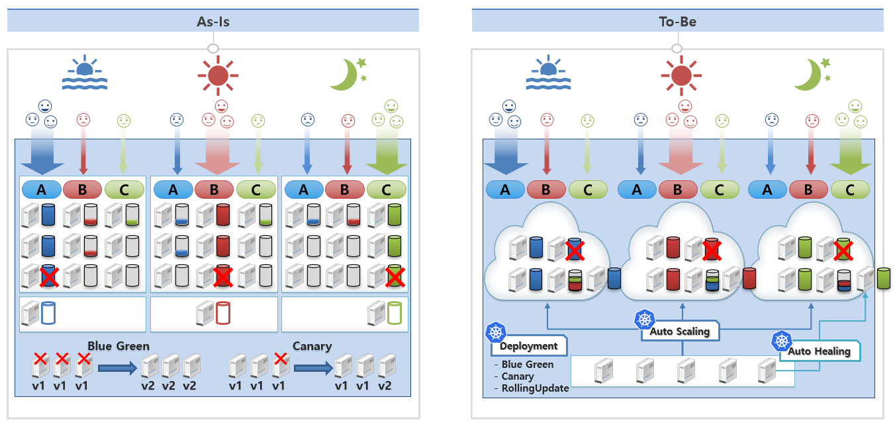
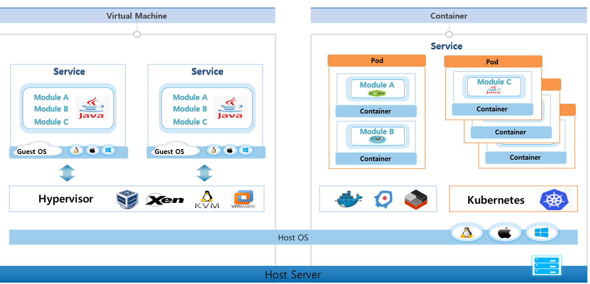
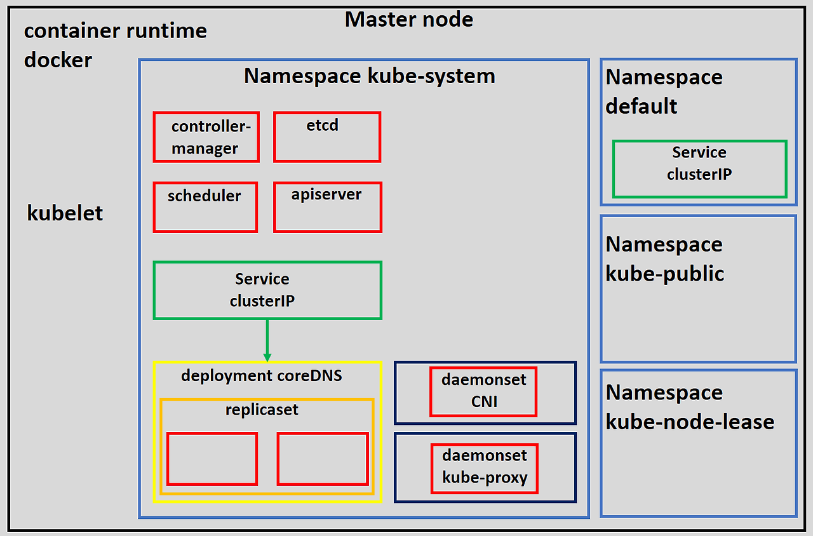
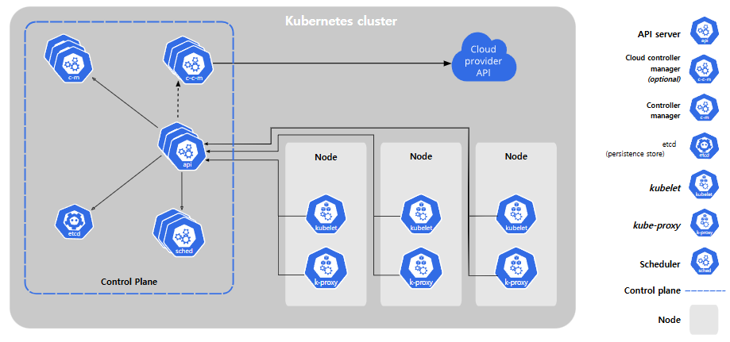
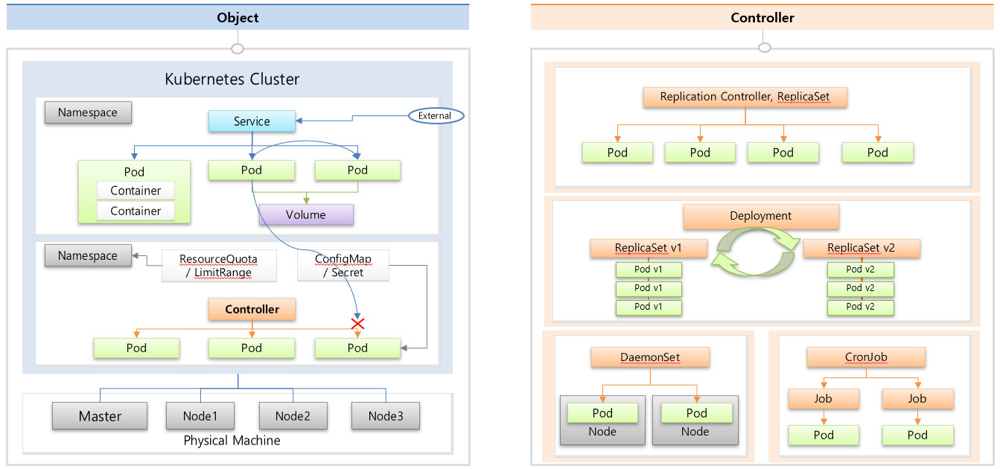

# Section 2

## 1. 왜 kubernetes를 사용함 ?
* 트래픽량이 항상 일정하지 않음 - 유지 보수 비용이 크게 발생할 수 있음
  * 시간대별로 트래픽 다름
  * 특정 시간대에 몰릴 수 있음
* 서비스 효율 증가
  * 유지 보수 비용 감소
  * Auto scaling
    * Horizontal pod auto scaler
      * 클러스터에 노드를 추가하거나 제거하여 포드를 확장 또는 축소
    * Vertical pod auto scaler
      * 개별 포드의 CPU 또는 메모리 제한을 변경하여 포드를 확장 또는 축소
* 편리한 운영 환경
  * 다양한 운영 방식에 대해 고민할 필요 없이 kubernetes기능들을 활용하여 편리하게 운영 가능
  * Auto Healing
    * 장애가 난 서버 위에있는 서비스들이 다른 서버로 자동으로 옮겨주는 기능
  * Deployment - 무중단 배포
    * Rolling Update
    * ReCreate
  * Monitoring
* 

 

## 2. VM vs Container
* [참고 링크](https://born-dev.tistory.com/39)
* 

 

## 3. kubernetes Overview (Object들 설명)
* Master Node - 클러스터에 관한 전반적인 관리 및 제어, 이벤트를 감지하고 반응하는 역할
* Worker Node - 컨테이너화된 애플리케이션을 동작하고 유지시키는 역할

### Cluster 구성
* `master 노드`
* 
* `cluster 전체 구성도`
* 

### Object와 Controller
* 

 