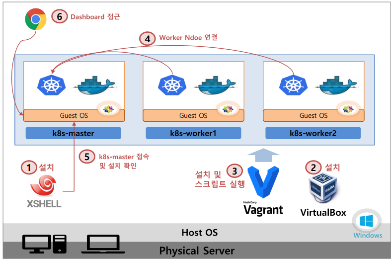

# Section 3
* [gcp 이용하여 k8s 환경 구축](/create-k8s-environment/)
* k8s Cluster 설치하기 (`v1.27`)

## k8s & Docker 버전
* k8s 1.24 버전부터 Docker를 컨테이너 런타임으로 사용하지 못함 (Containerd를 사용)
* 프로젝트에서 사용하는 버전
  * k8s 버전 - v1.27
  * Containerd 버전 - v1.6.21

 

## 설치 가이드
* [v1.27 설치 가이드](https://kubetm.github.io/k8s/02-beginner/cluster-install-case6/)

 

## 설치 순서
1. `XShell` 설치 : 생성될 Master/Woker Node에 접속할 툴 (**서버 ssh 접속용**)
2. `VirtualBox` 설치 : VM 및 내부 네트워크 생성 툴 (OS에 설치하는 **VM 생성용 툴**)
3. `Vagrant` 설치 및 k8s 설치 스크립트 실행 : **자동으로** VirtualBox를 이용해 VM들을 생성하고, K8S관련 설치 파일들이 실행됨
4. Worker Node 연결 : Worker Node들을 Master에 연결하여 쿠버네티스 클러스터 구축
5. k8s-master 접속 및 설치 확인 : Node와 Pod 상태 조회
6. 대시보드 접근 : Host OS에서 웹 브라우저를 이용해 클러스터 Dashboard에 접근
* 

 

## vagrant 명령어 참고
* [링크](https://kubetm.github.io/k8s/02-beginner/cluster-install-case6/#3-vagrant-%EC%84%A4%EC%B9%98-%EB%B0%8F-k8s-%EC%84%A4%EC%B9%98-%EC%8A%A4%ED%81%AC%EB%A6%BD%ED%8A%B8-%EC%8B%A4%ED%96%89)
* `vagrant up` : VM 생성 및 스크립트 설치
  * 최초 VM생성 할때만 사용
  * 생성 이후 부터 VM 기동/중지는 Virtualbox UI를 사용하는 것을 권장
* `vagrant destroy` : 가상머신 삭제
  * `vagrant up`으로 VM 생성 중 에러가 났을 때 이 명령으로 삭제