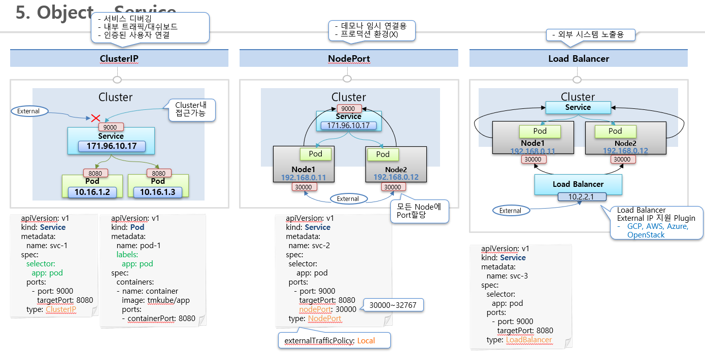

# Service
* Service는 자신의 Cluster IP를 가지고 있음
* Service를 Pod와 연결시켜 놓으면, Service의 IP를 통해서 Pod에 접근이 가능함
* Pod는 Cluster내에서 접근할 수 있는 IP가 있는데, Service의 IP를 통해서 접근하는 이유?
  * 시스템 장애 or 성능 장애로 인해 Pod는 언제든지 다시 재생성될 수 있기 때문 (재생성시 IP 변경되므로 신뢰성 떨어짐)
  * Service는 사용자가 직접 삭제하지 않는 한, 재생성되거나 삭제되는 경우가 없음
  * 따라서 Service의 IP를 통해 접근시 항상 연결되어 있는 Pod에 접근이 가능
* Service에 여러개의 Pod를 연결할 수 있음
  * Service의 `Selector`, Pod의 `Label`항목에 라벨링하여 연결
  * Service가 트래픽 분산해서 Pod에 전달
* Service 종류 - 종류에 따라 Pod에 접근하는 방식이 다름
  * **ClusterIP**
  * **NodePort**
  * **Load Balancer**

## ClusterIP
* Default type 설정이므로 입력해 주지 않아도 `type: ClusterIP` 이 들어감 (아래 그림 참고)
* Cluster내에서만 접근 가능한 IP
* Pod의 IP와 특징이 같음
* Dashboard 관리하거나 각 Pod의 서비스 상태를 Debugging 할때 쓰임

## NodePort
* `type: NodePort`를 넣어주면 됨
* NodePort타입의 Service에도 Cluster IP가 할당됨
* k8s cluster에 연결된 모든 Node에 같은 port를 할당하여 {NodeIP}:{port}로 해당하는 Service에 연결하고 Service에 연결된 Pod에 트래픽을 전달 가능
* `nodePort`항목으로 IP를 지정할 수 있음 (아래 그림 참고)
  * 따로 입력해 주지 않으면 30000~32767 범위내 port로 자동 할당
  * Port 지정할 경우, 30000~32767 범위내로 지정가능
* 아래의 그림에서 Pod에 접근하려면
  * 클러스터내에서 {ServiceIp}:9000/... 로 접근하거나
  * {node_ip}:30000/... 로 접근 가능 -> 모든 노드 ip 가능
* `externalTrafficPolicy: Local` 설정을 추가하면, 특정 노드에 해당하는 Port로 접근시 해당 노드내의 Pod에게만 트래픽을 전달해 줄 수 있음
  * Pod1이 Node1에 있고 Pod2가 Node2에 있다면
    * {node1_ip}:30000/… 접근시 Pod1으로만 요청이 감
    * {node2_ip}:30000/… 접근시 Pod2으로만 요청이 감
  * `externalTrafficPolicy: Local`설정에서 Node1에만 Pod가 있는데 {node2_ip}:30000/…로 요청한다면, 접근이 안됨

## Load Balancer
  * Node에 트래픽을 분산 시켜주는 역할
  * Load Balancer의 External IP는 기본적으로 생성되지 않음 - 별도로 외부IP를 할당해 주는 Plugin 설치가 필요함
  * AWS같은 Cloud 서비스 기반 k8s라면 Load Balancer타입의 Service를 생성하면 알아서 Plugin 설치하고 외부IP를 생성해줌
* 이외 여러가지 서비스 종류가 존재함

## Service 종류 그림 설명
* 