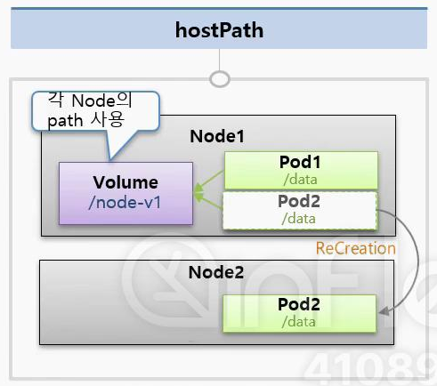
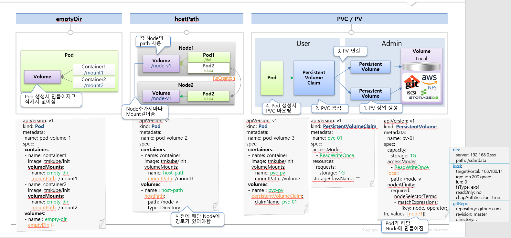

# Volume
## EmptyDir
* volume 최초 생성시에는 항상 비어 있기 때문에 EmptyDir이라고 명칭함
* **Pod내의 컨테이너들끼리 데이터를 공유**하기위해 EmptyDir Volume을 사용
* Volume path는 Pod안에 생성됨
  * Volume path는 Pod안에 생성되므로 **데이터 지속성 없음**, Pod재생성시 Volume내 데이터도 삭제됨

 

## HostPath
* Node(Pod의 host)의 path를 volume으로 사용
  * 아래 그림에서는 Node1의 `/node-v1`디렉토리를 volume으로 사용
  * Pod에서는 `/data`경로로 마운트 하는거임
* Pod가 죽어도 HostPath Volume의 데이터는 사라지지 않음
* 단, Pod 재생성시 Scheduler에 의해 해당 Pod가 다른 노드에 할당이 되면 이전 Node의 volume에는 mount할 수 없음, 따로 설정해야 함
* 
* 그래서 Pod의 데이터를 저정하는 것이 아니라, Pod가 Node(host)의 데이터를 필요로 하는 경우 HostPath Volume을 사용하면 효과적 (ex. host 설정정보)
* Pod생성시 yaml파일에서 `volumes:hostPath:path:..` 항목에 들어가는 Volume에 대한 경로는 host에 사전에 생성되어 있어야 함
  * `type: Directory` (default 설정으로 Volume에 해당하는 경로는 사전에 생성되어야 함)
  * `type: DirectoryOrCreate` (해당 type으로 설정하면 host에 경로가 없어도 알아서 생성해 줌)

 

## PVC / PV
1. PV 생성
   * `local:` 사용시 hostPath Volume처럼 로컬 경로 사용하는 것임
   * 아래 그림에서 `nodeSelectorTerms:`에 설정한 node1 -> 해당 PV에 연결되는 Pod들은 모두 node1 위에 만들어 진다는 뜻
2. PVC 생성 & PV와 연결 (PVC와 PV 바인딩)
   * accessMode와 storage 설정에 따라 PVC에 PV가 할당됨 -> 이미 바인딩된 PV는 다른 claim(PVC)에 할당이 안됨
   * PVC생성시 storage가 PV의 storage보다 큰 경우 Volume(PV)할당이 안됨, 작은 경우 매칭가능
3. Pod 생성 & PVC와 연결
  * 아래 그림에서 `persistentVolumeClaim:claimName:..`에 해당

## Volume 그림 설명
* 