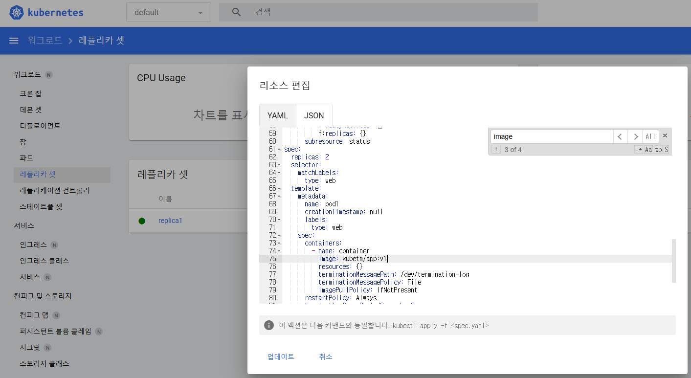
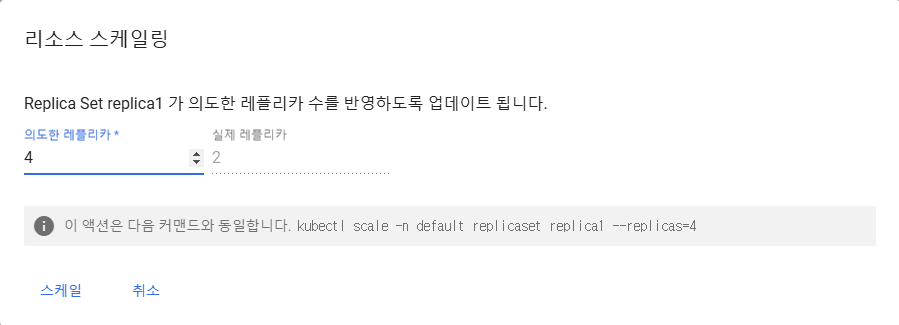
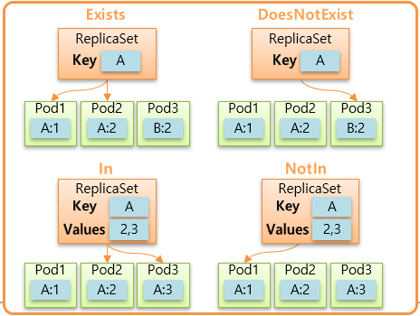
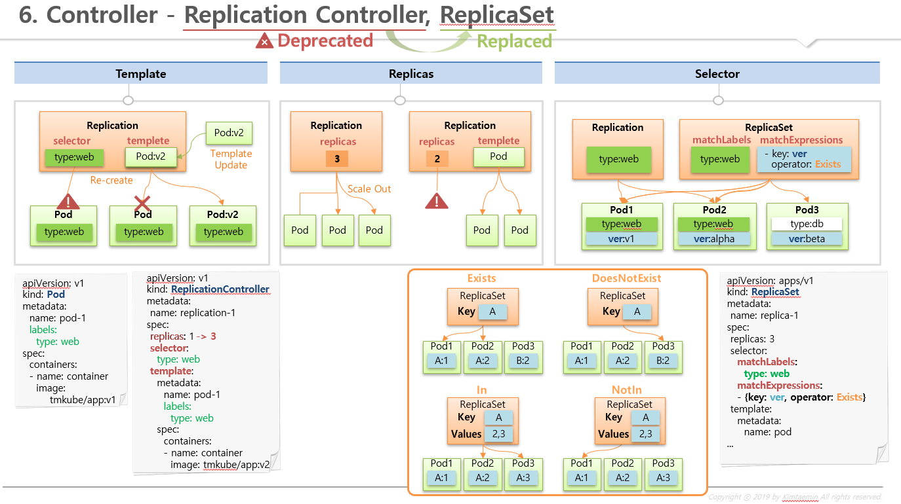

# Controller - ReplicaSet
* ReplicaSet은 Replication Controller를 계승한 Controller
* ReplicaSet과 Replication Controller는 모두 Template와 Replicas 옵션을 제공
* Replication Controller와 ReplicaSet의 차이점 ?
  * 아래의 항목에서 다룸
* [공식 문서](https://kubernetes.io/docs/concepts/workloads/controllers/replicaset/)에서는 Replication Controller보다 ReplicaSet 사용을 권장함
  * 아직 Replication Controller가 deprecate 된건 아니라 사용할 수 있음

<br>

## Template 옵션
* Pod에 장애가 생겨 Controller가 해당 파드를 재생성할때 사용하는 Pod의 Template임
* Pod와 template매칭은 Service 오브젝트처럼 Label과 Selector로 매칭할 수 있다.
* template의 버전을 업그레이드 하고 싶으면?
  * deployment를 이용하여 이미지를 update할 수 있다. deployment Controller 참고
  * ReplicaSet의 이미지를 수동으로 update 하려면 ?
    * 리소스의 이미지를 직접 수정하고나서
    * 기존의 pod를 모두 삭제하면, ReplicaSet이 Replicas 개수에 맞춰 Pod를 생성
  * 

<br>

## Replicas 옵션
* Controller가 Replicas에 설정된 수 만큼 Pod 개수를 유지
* Replicas개수 줄이면 Scale-in, 늘리면 Scale-out이라고 함
  * Auto Scaling 적용하거나 직접 Replicas 늘리면 됨
  * 대시보드에서도 Replicas 조절 가능
  * 

<br>

## Selector 옵션
* Replication Controller의 경우 Label의 key & value 가 모두 같은 Pod들만 연결이 가능
* **RelicaSet**의 경우 Label의 key 또는 value를 선택적으로 매칭 가능하다.
  * `matchLabels`와 `matchExpressions` 옵션을 사용
  * ReplicaSet만 가능한 것은 아님
    * Pod, Job, Deployment, ReplicaSet 그리고 DaemonSet과 같은 set-based 리소스들도 사용가능한 옵션
  * `matchLabels`옵션 - label의 key:value 정보를 입력
  * `matchExpressions` 옵션 - key와 operator를 입력하여 해당하는 Label을 가진 Pod와 매칭
    * ex. - {key: ver, operator: Exists}
    * operator는 여러가지가 있음
    * 
* `matchExpressions`을 이용한 선택적 Label 매칭은 잘 사용하지 않음
  * Pod를 특정 Node에 생성시키고 싶을때(Node스케줄링) 사용할 수 있음
  * ReplicaSet에서는 잘 사용하지 않음

<br>

## Replication Controller과 ReplicaSet 차이점
* Replication Controller가 업그레이드된? Controller가 ReplicaSet이다.
* 따라서 ReplicaSet은 Replication Controller의 주요 기능 모두를 가지고 있다.
* Selector 유연성
  * Replication Controller는 일치성 기반(Equality-based)의 셀렉터를 지원한다.
  * ReplicaSet은 집합 기반(Set-based)의 셀렉터를 지원한다.
    * Set-based의 셀렉터 - `matchExpressions` 옵션
      * operator - `Exists`, `DoesNotExist`, `In`, `NotIn`
* Deployment는 ReplicaSet을 사용하여 Pod를 관리한다. (Replication Controller가 대체할 수 없음)
  * RollingUpdate 배포 방식을 지원한다.
    * `type: RollingUpdate`로 Deployment를 생성
  * Update이후 기록된 revision ReplicaSet을 이용하여 Rollback이 가능하다.

<br>

## ReplicaSet 삭제
* ReplicaSet 삭제시 연결된 Pod들도 모두 삭제되므로 ReplicaSet Controller 사용시 주의
* Pod는 남기고 Replication/ReplicaSet만 삭제되도록 하는 옵션도 있음, 대신 콘솔에서 kubectl 명령어로 지워야 함
  * Pod는 남기고, Replication을 ReplicaSet으로 바꿀때 사용하면 좋음
  ```bash
  kubectl delete replicationcontrollers {replicationName} --cascade=false # Replication Controller만 삭제
  kubectl delete replicaset {replicaName} --cascade=false # ReplicaSet만 삭제
  ```


## ReplicaSet 그림 설명
* `terminationGracePeriodSeconds` 옵션의 의미
  * Pod는 삭제시 기본적으로 30초후에 삭제가 되는데 `terminationGracePeriodSeconds: 0` 으로 설정하면 바로 삭제됨
* 