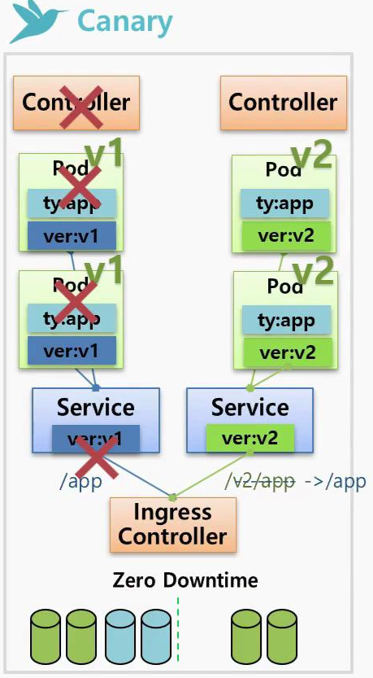
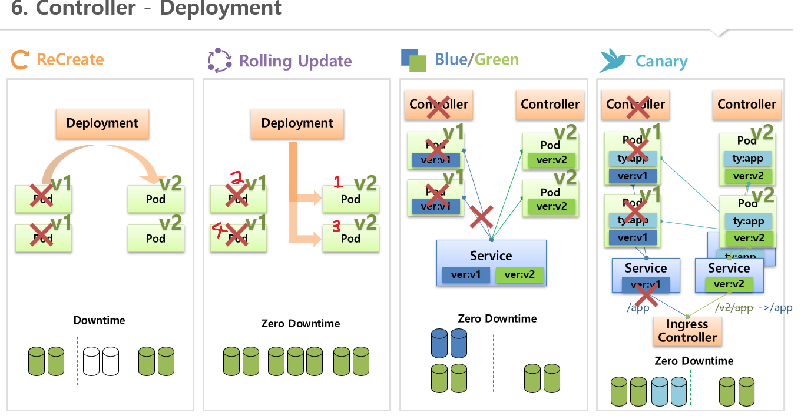
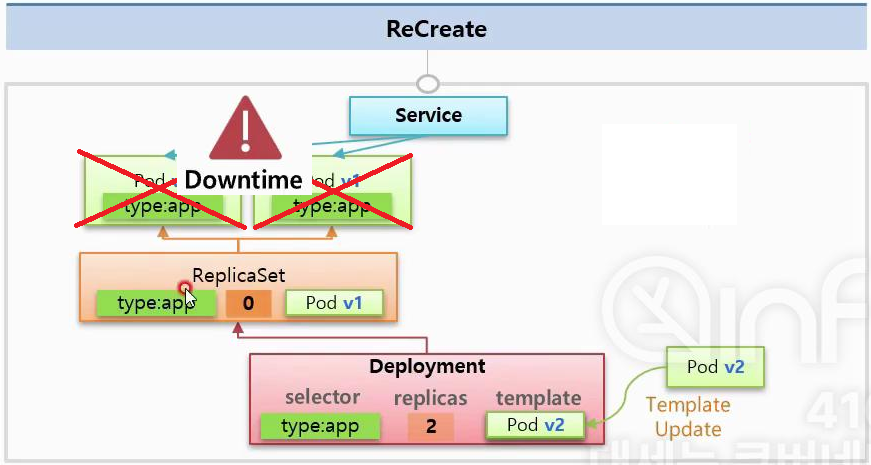
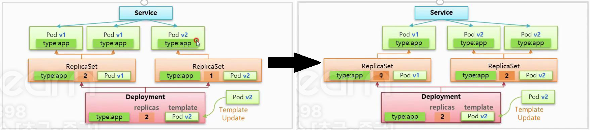
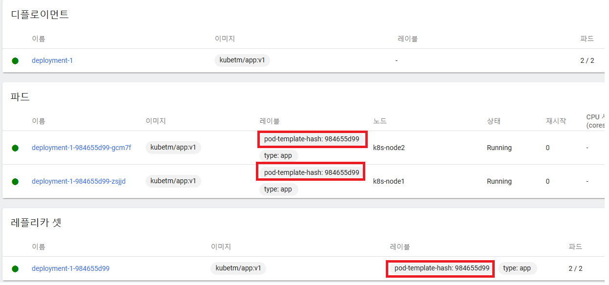
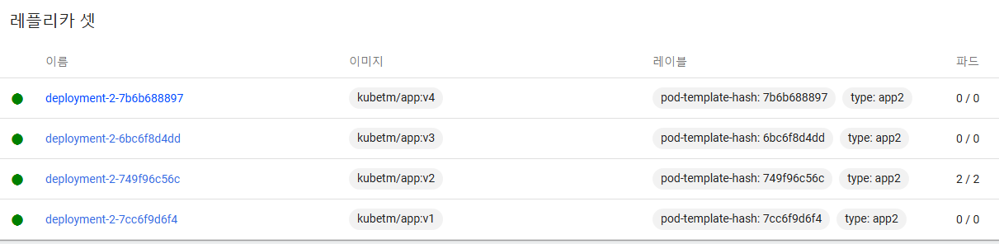
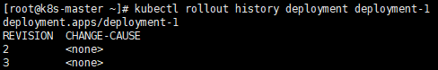
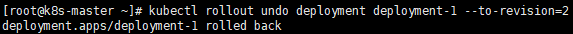
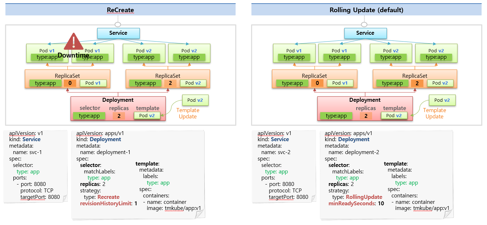

# Deployment Controller
* 배포 방식
  1. ReCreate
  2. Rolling update
  3. Blue/Green
  4. Canary
* Blue/Green과 Canary 배포 방식은 k8s에서 정식으로 제공하는 방식은 아니지만
  * ReplicaSet을 이용하여 구현할 수 있다.

<br>

## 배포 방식 그림 설명
* ReCreate
  1. 새로 배포할 이미지 변경
  2. Pod 삭제 (수동)
     * 삭제시 downtime 발생
  3. 새로운 이미지로 Pod가 재생성됨
* Rolling update
  1. 새로운 이미지가 적용된 Pod를 하나 추가 생성
     * Pod 하나 만큼의 추가 자원 발생
  2. 기존의 Pod 하나 삭제
     * downtime이 0인 무중단 배포
  3. 기존의 Pod가 모두 삭제 될 때까지 1-2의 과정을 반복
* Blue/Green
  1. 현재 동작중인 Pod의 수만큼, 새로운 이미지(v2)가 적용된 Pod를 추가 생성
     * 기존의 Pod량 만큼 추가 생성하므로 Pod 수의 2배만큼 추가 자원이 발생하는 단점
  2. Service의 selector Label을 새로운 Label(ver:v2)로 변경
     * 순간적으로 변경되기 때문에 downtime이 0이라고 볼 수 있음
  3. v2 이미지가 적용된 Container에 문제가 생길 경우 이전 버전이 적용된 Label로 다시 변경하여 Rollback
* Canary
  * 일부 트래픽만 새로운 이미지가 적용된 Pod로 요청하여 update할 이미지를 검증, (Section8. Ingress Controller 참고)
  1. 새로운 이미지가 담긴 Pod와 연결할 Service2를 생성
  2. Ingress Controller로 유입되는 트래픽을 url path에 따라서 Service에 연결해줌
     * ex. 특정 지역은 `v2/app`의 경로로 요청하여 service2를 통해 업데이트할 내용을 검증
  3. 큰 이슈가 없다면 기존의 service와 Pod들을 삭제
     * test할 Pod의 수 또는 v2 Pod를 얼마나 만들어 두고 v1 Pod를 삭제하는지에 따라 필요한 자원 사용량이 결정됨
  * 

<br><br>

## 배포 방식 그림 설명
* 

<br><br>

## ReCreate
1. selector, replicas, template 설정 및 `strategy:type:Recreate`로 Deployment Controller를 생성하면 ReplicaSet도 함께 생성됨
2. 관리자가 Deployment Controller의 template을 Pod v2이미지로 업데이트
3. ReplicaSet의 replicas가 0으로 변경되고 기존의 Pod들이 삭제됨
   * downtime 발생함
4. Pod v2의 template이 적용된 새로운 ReplicaSet2이 생성되고
5. ReplicaSet2 replicas만큼 새로운 Pod(v2)들이 생성됨
6. Pod들이 Service 연결됨
7. 기존의 ReplicaSet은 default로 10개까지 삭제되지 않고 유지됨 (rollback 가능)
   * `revisionHistoryLimit: {유지개수}` 옵션을 사용하면 설정 가능함
* 

<br><br>

## Rolling Update
1. ReCreate방식과 다르게 `strategy:type:RollingUpdate`로 Deployment Controller를 생성
2. 새로운 이미지(v2)로 template를 교체하면 새로운 이미지가 template이 적용된 ReplicaSet이 생성됨 (기존 ReplicaSet 유지)
   * 새로운 ReplicaSet이 생성될때 기존의 Pod와 연결되지 않는 이유는? 아래 항목 참고
3. ReplicaSet의 replicas가 변경되면서 새로운 Pod(v2)가 생성되고 기존의 Pod(v1)가 삭제됨
   * `minReadySeconds: {대기초}` 옵션을 주면 생성&삭제까지의 term을 줄 수 있음
4. 새로운 Pod는 service와 연결됨
5. 기존의 Pod가 모두 삭제 될 때까지 2-3의 과정을 반복
6. 기존의 ReplicaSet은 default로 10개까지 삭제되지 않고 유지됨 (rollback 가능)
* 

## Blue/Green
* 기존의 ReplicaSet(replica1) yaml파일 정보
    ```yaml
    apiVersion: apps/v1
    kind: ReplicaSet # ReplicaSet
    metadata:
    name: replica1
    spec:
    replicas: 2
    selector:
        matchLabels:
        ver: v1
    template:
        metadata:
        name: pod1
        labels:
            ver: v1
        spec:
        containers:
        - name: container
            image: kubetm/app:v1
    ```
* Service 오브젝트 yaml파일 정보
    ```yaml
    apiVersion: v1
    kind: Service # Service
    metadata:
    name: svc-1
    spec:
    selector:
        ver: v1
    ports:
    - port: 8080
        protocol: TCP
        targetPort: 8080
    ```
* ReplicaSet 이용한 Blue/Green 배포 방식
  1. `kubetm/app:v2`이미지와 `ver: v2`사용하는 ReplicaSet2 생성
  2. Service의 selector label을 `ver: v2`로 변경
  3. downtime 없이 바로 update가 적용됨(v2 image)
  4. 문제 없으면 기존의 Pod또는 ReplicaSet1 삭제

<br>

### Rolling Update시 새로운 ReplicaSet이 생성될때 기존의 Pod와 연결되지 않는 이유?
* Deployment가 ReplicaSet 생성시 관리자가 yaml파일에 입력한 Label만 생성되는 것이 아니라
* 추가적인 Label과 Selector가 생성됨
* 

<br>

### Rollback 방법
* 대시보드에서 Deployment의 image를 이전 버전으로 수정하면 됨
  * revision에 있는 ReplicaSet이라면 새로운 ReplicaSet이 생성되는 것이 아니라 자동으로 해당하는 revision의 ReplicaSet 사용
  * 
* kubectl를 이용하여 revision으로 Rollback할 수도 있음
  * revision: 이전의 ReplicaSet의 버전이라고 생각하면 됨
* revision 체크하기
  ```bash
  kubectl rollout history deployment {deployment이름}
  ```
* 
* revision 선택하여 Rollback 하기
  ```bash
  kubectl rollout undo deployment deployment-1 --to-revision={revisionNumber}
  ```
* 

<br><br>

## Deployment Controller 주의 사항
* Deployment Controller 삭제시 해당 Deployment와 관련된 워크로드(Deployment, ReplicaSet, Pod)가 모두 삭제됨
  * revision ReplicaSet도 모두 삭제됨!
  * cf. Service는 워크로드가 아님

## Deployment Controller 그림 설명
