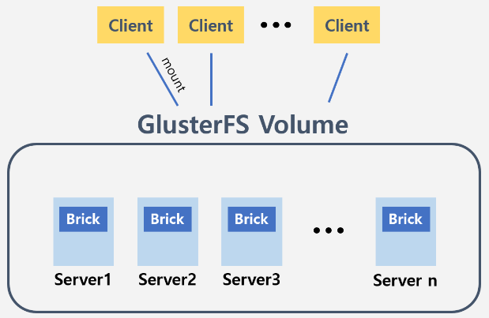
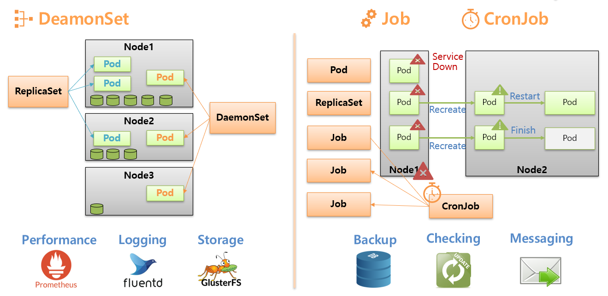
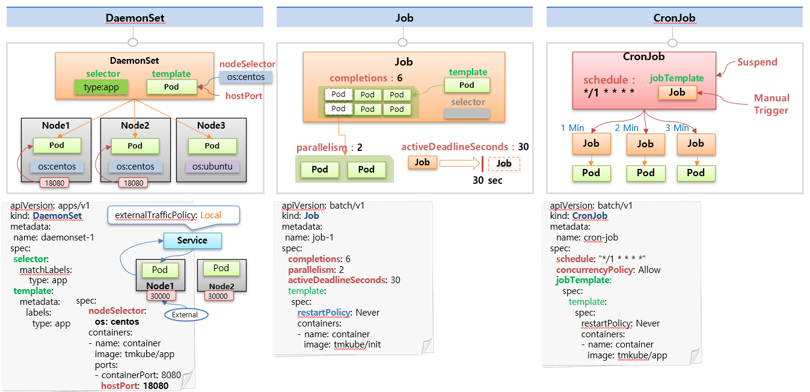

# daemonSet-job-cronJob

## DaemonSet이란 
* DaemonSet은 클러스터 내 모든 노드에서 특정 Pod를 하나씩 실행하도록 보장하는 역할을 함
* DaemonSet의 주요 역할과 용도
  * 로그 수집
    * 각 노드에서 로그 수집 (ex. Fluentd)
  * 모니터링
    * 성능 모니터링을 위해 클러스터 상태를 관찰
    * 성능 수집 에이전트 (ex. Prometheus, Datadog)
  * 네트워킹 및 보안 솔루션
    * 컨테이너 워크로드 간의 네트워크 연결 제공 에이전트 (ex. Calico, Cilium)
    * 보안 에이전트 (ex. Falco)
  * 스토리지 솔루션
    * 분산되어 있는 서버의 디스크를 묶어 하나의 분산 파일 시스템을 사용하듯이 사용할 수 있음
    * 확장 가능한 분산 파일 시스템
    * ex. GlusterFS - [그림 출처](https://gruuuuu.github.io/linux/glusterfs/)
    * 
  * 노드 유지 관리 및 시스템 관리 작업
    * 노드 간 균등하게 관리 작업을 수행

## Job & CronJob
* Job 이란
  * 하나 이상의 파드를 생성하고 지정된 수의 파드가 **성공적으로 종료될 때까지** 계속해서 파드의 실행을 재시도
  * 실행 완료되면 Pod는 종료됨(finish)
* CronJob 이란
  * 정해진 시간(Cron 표현식 사용)에 반복할 Job 실행에 사용하는 리소스
  * CronJob은 백업을 수행하거나 이메일을 보내는 것과 같이 주기적이고 반복적인 작업들을 생성할때 유용

## DaemonSet Job CronJob 개념 그림 설명
* 

  

## DaemonSet
* 모든 노드에 template에 해당하는 Pod를 **1개** 생성 (2개 안됨)
* `nodeSelector: {key:value}` 옵션으로 해당하는 레이블이 없는 노드에는 생성되지 않도록 할 수도 있음
* `hostport: {portNum}` 옵션으로 Service의 NodePort 사용하듯이 정해진 port로 해당하는 node의 Pod에 바로 접근 가능
  * 아래 그림 설명 참고

 

## Job
* template에는 특정 작업만 수행하고 종료될 Pod의 정보가 담김
* Selector는 Job이 알아서 만들어 줌
* `completions: {num}` 옵션으로 작업을 수행할 Pod의 총 개수를 설정할 수 있다.
  * 생성된 모든 Pod가 종료되어야 Job도 종료됨
  * `completions`옵션의 개수만큼 총 Pod가 생성되는데, `parallelism`옵션으로 한번에 생성되는 Pod개수를 조절 가능
  * `activeDeadlineSeconds: {sec}` 옵션으로 지정한 초만큼의 시간이 지나면 Job이 종료되도록 설정 가능
    * 오작동 및 장애가 생길 경우를 예방하기 위해 사용됨
    * 실행되고 있는 모든 Pod들은 삭제됨
    * 실행되지 못한 Pod들은 실행안됨 (todo: 실행안된 Pod들도 삭제될까??)

 

## CronJob
* jobTemplate 옵션으로 잡을 생성
* schedule 옵션에 Cron식을 작성
  * [Cron expression test](https://crontab.cronhub.io/)
* `concurencyPolicy` 옵션
  * Allow가 default 설정
  * Cron식이 `*/1 * * * *`(1분 마다) 일때,
    * Allow - 1분마다 독립적으로 작업을 수행하는 Job생성
    * todo: https://kubernetes.io/ko/docs/concepts/workloads/controllers/cron-jobs/

 

## DaemonSet Job CronJob 동작 방식 그림 설명
