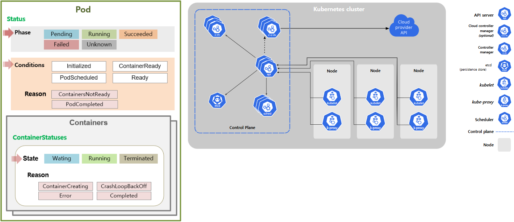
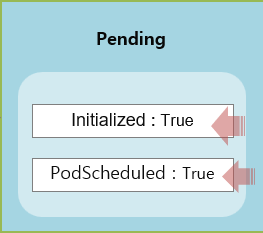
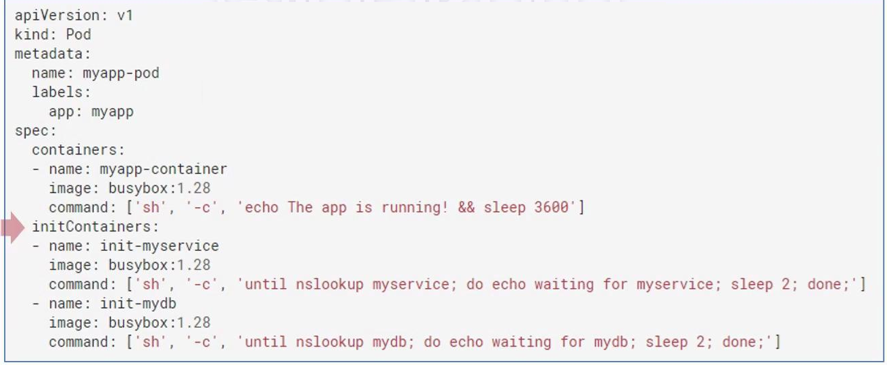
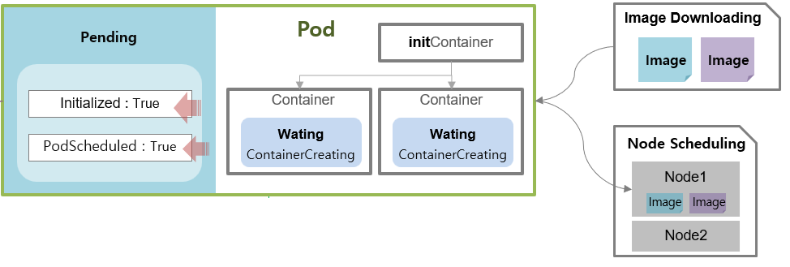
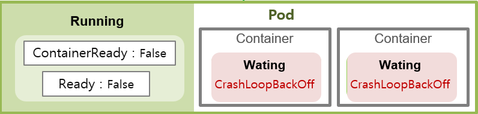
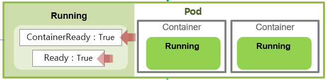
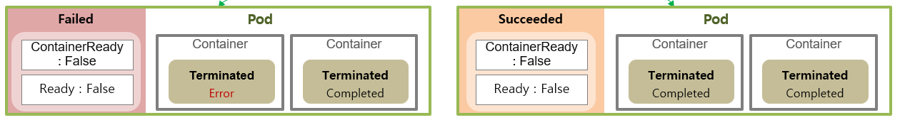
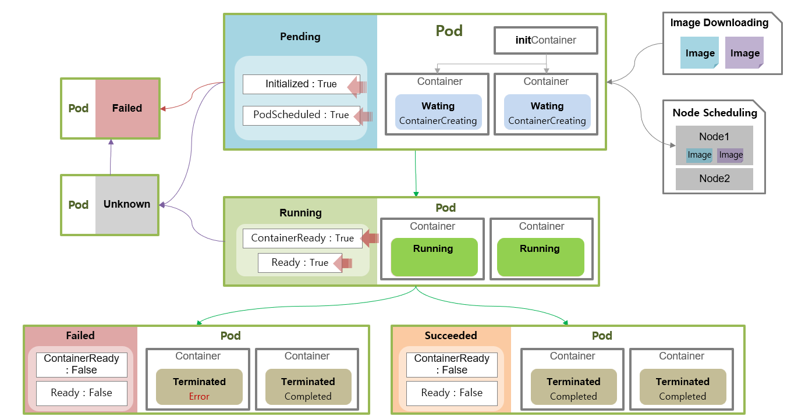

# Pod의 Lifecycle
> - 설명 참고용 이미지    

  

## Pod의 상태별 동작으로 보는 Pod의 Lifecycle
* `Pending`상태는 Pod생성시 최초의 상태
* `Running`상태는 Pod가 잘 작동되는 경우
  * 다만 문제가 생긴 Container의 경우 Container의 상태가 Running이 아닐 수 있음
* `Succeeded/Failed`상태는 Job으로부터 생성된 Pod가 작업을 마친 경우
* `Unknown`상태는 Node마다 존재하는 Kubelet이 API 서버(Control Plane)로 상태 정보를 제대로 전달하지 못하는 경우
  * Kubelet이나 API 서버(Control Plane)에 문제가 생길 수도 있지만 대부분 네트워크 통신 장애로 발생함
* Pending상태에서 문제가 생길 경우 또는 Unknown상태가 지속될 경우 `Failed`상태가 될 수도 있음

 

### Pod가 Pending 상태일때 동작
1. Pending 상태에서는 Pod가 어느 노드로 갈지 먼저 스케줄되고 초기화 작업이 이루어짐
   * Pending 상태일때 Conditions으로 보면, PodScheduled -> Initialized 순서로 이루어 짐
   * PodScheduled 상태값과 PodScheduled 상태값이 true로 바뀐 경우, 해당 작업이 잘 이루어 진 것임
   * 
   * 초기화 작업이 뭐임?
     * volume이나 보안설정 등 초기화 스크립트 실행이 필요한 경우, Pod설정에서 `initContainers`라는 항목으로 초기화 스크립트 넣을 수 있음
     * 이때 아래 이미지에서 `Containers:`에 해당하는 컨테이너 작업보다 먼저 초기화 작업이 이루어 짐
     * 
2. 컨테이너의 이미지를 다운로드하는 작업을 함
   * 이때, ContainerStatus의 Status는 Waiting이고 Reason은 ContainerCreating임
   * 
3. 이후, 컨테이너가 기동이 되면서 Pod와 Container의 상태가 **Running**으로 변경된다.
* cf. PVC가 바인딩이나 ConfigMap과 Secret 리소스가 아직 준비되지 않은 경우에도 Pending 상태가 유지될 수 있다고 함

 

### Pod가 Running 상태일때 동작
1. Pending 상태에서의 작업이 끝나고 컨테이너가 기동이 되면 Pod와 컨테이너의 상태가 Running 상태로 변경됨
2. Container 기동중 문제가 발생하면 컨테이너의 상태는 Waiting으로 변경됨
   * Container의 Reason은 CrashLoopBackOff
   * Pod의 Conditions는 ContainerReady:false, Ready:false
   * 
3. 문제가 해결되거나 정상적인 경우 Pod의 Conditions는 ContainerReady:true, Ready:true 상태임
   * 따라서 서비스가 정상적으로 운영되는지 확인하려면 **ContainerReady:true, Ready:true 상태를 지속적으로 확인하고 유지**해야 함
     * Pod의 상태가 Running이라도 컨테이너들의 상태가 Running이 아닐 수도 있기 때문
   * 

 

### Job으로 생성된 Pod의 상태 (Succeeded / Failed)
* Job이나 CronJob으로 생성된 Pod의 경우, Running상태에서 작업을 마친 경우 Succeeded 또는 Failed 상태가 될 수 있다.
* Job으로 생성된 Pod의 컨테이너중 하나라도 작업도중 문제가 생기면 Pod의 상태는 Failed가 되고
* Pod의 모든 컨테이너가 작업을 잘 마친 경우, Pod의 상태는 Succeeded가 된다.
* Job으로 생성된 Pod의 작업이 성공이든 실패이든, Pod의 Conditions가 ContainerReady:false, Ready:false 로 변경된다.
* 

 

### Pod가 Failed 상태로 바뀌는 경우
* Pending상태에서 문제가 생길 경우 Pod의 상태가 Failed로 바뀔 수 있다.
* Unknwon상태의 Pod가 문제가 해결 되지 않아 Failed상태로 변경될 수 있다.

 

### Pod의 Unknown 상태
* Pod의 상태 정보를 Kubelet이 제대로 전달하지 못할 때, Pod가 Unknown 상태가 될 수 있음
* Unknown상태에서 문제가 해결된 경우, 다시 기존 상태로 돌아갈 수도 있고 Failed 상태로 변경될 수도 있음
* 주로 네트워크 문제로 발생하는 문제로 Unknown상태로 변경된다.

  

## Pod의 Lifecycle 이미지 설명
* 