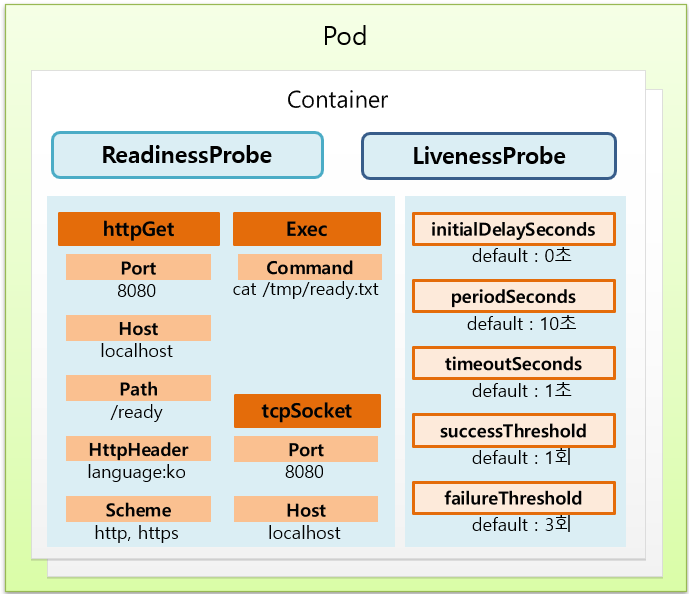
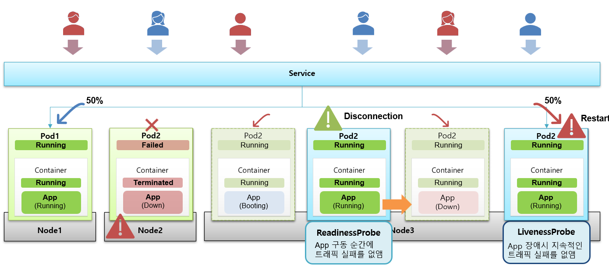
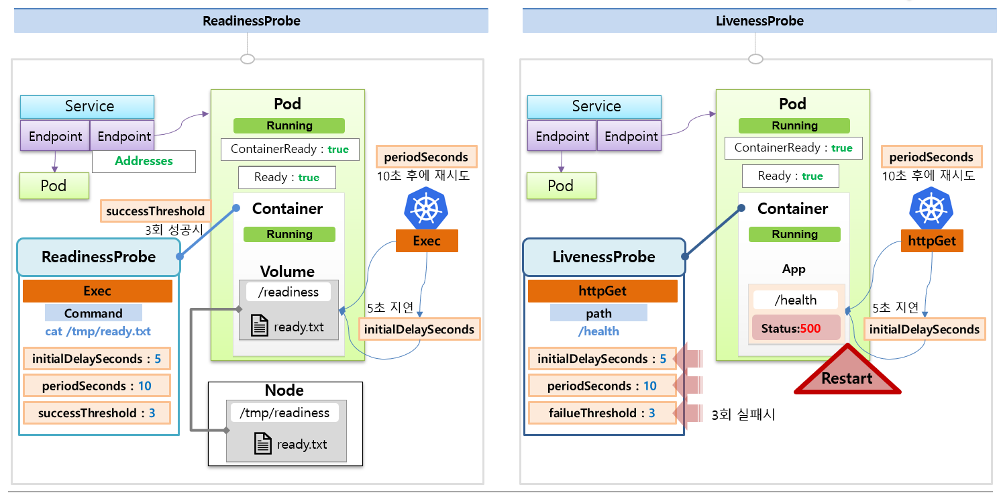

# Pod - Probe
> - 설명 참고용 이미지   
* Probe는 컨테이너에서 kubelet에 의해 주기적으로 수행되는 진단
* kubelet은 컨테이너의 상태를 진단하기 위해 Handler를 호출
* Probe를 통해 컨테이너의 상태를 주기적으로 체크
  * 문제가 있는 컨테이너를 자동으로 재시작 하거나
  * 문제가 있는 컨테이너를 서비스에서 제외할 수 있음
* [공식 문서 참고](https://kubernetes.io/ko/docs/concepts/workloads/pods/pod-lifecycle/)

  

## Probe의 종류
* Readiness probe
  * 컨테이너가 요청을 처리할 준비가 되었는지 여부를 나타냄
  * Pod가 Running 상태여도 처음에 App이 로딩하는 시간이 있기 때문에 이 시간 동안은 App에 요청하려고 하면 오류가 발생
  * Readiness probe는 App이 구동되기 전까지 Service와 연결되지 않게 해줌
  * Probe가 실패하면 엔드포인트 컨트롤러는 파드에 연관된 모든 서비스들의 엔드포인트(서비스와 연결된 Pod) 목록에서 해당 파드의 IP를 제거함
  * App 구동 순간에 트래픽 실패를 없애줌
* Liveness probe
  * 컨테이너가 동작 중인지 여부를 나타냄
  * Pod은 정상적인 Running 상태이지만, 컨테이너의 App에 장애가 생겨서 응답이 안되는 경우를 감지함
  * Probe가 실패하면 kubelet은 컨테이너를 죽이고 [컨테이너를 재시작](https://kubernetes.io/ko/docs/concepts/workloads/pods/pod-lifecycle/#restart-policy) 함
  * App 장애시 지속적인 트래픽 실패를 없애줌
* Startup probe
  * 컨테이너 내의 App이 시작되었는지를 나타냄
  * startup probe가 주어진 경우, 성공할 때 까지 다른 나머지 probe는 활성화 되지 않는다.
    * 즉, startupProbe가 OK되기 전에는 readinessProbe와 livenessProbe가 동작하지 않음
  * App 기동이 오래 걸리는 상황일때 livenessProbe가 체크가되면 무한정 pod restart를 하게되고, 
    * readinessProbe역시 App기동이 되기 전에 활성화가 되면 요청이 실패함
    * 이러한 상황에서 Startup probe를 사용하면 좀 더 안정적으로 Probe 세팅이 가능
  * startup probe가 실패하면, kubelet이 컨테이너를 죽이고 [컨테이너를 재시작](https://kubernetes.io/ko/docs/concepts/workloads/pods/pod-lifecycle/#restart-policy) 함
* 

 

### Probe fail일때 Liveness probe vs Readiness probe
* Liveness Probe는 probe 핸들러 조건 아래 fail이 나면 pod를 재실행 시키지만,
* Readiness Probe는 probe 핸들러 조건 아래 fail이 나면 pod를 서비스로부터 제외
  * 서비스들의 엔드포인트 목록에서 해당 Pod의 IP가 제거됨

 

## Probe의 Handler
* 컨테이너의 상태를 진단하기 위해 어떻게 진단할 것인지 명시한 것이 Handler
* Pod의 yaml파일에 Probe추가시, 아래의 3가지 Handler중 하나를 반드시 포함해야 함
* `Exec`
  * Command
* `TcpSocket`
  * Port
  * Host
* `HttpGet`
  * Port
  * Host 
  * Path
  * HttpHeader
  * Scheme

 

### Probe Handler의 공통 옵션
* initialDelaySeconds
* periodSeconds
* timeoutSeconds
* successThreshold
* failureThreshold

  

## ReadinessProbe와 LivenessProbe의 동작 그림 설명
* 