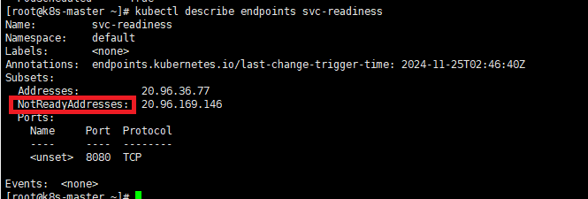
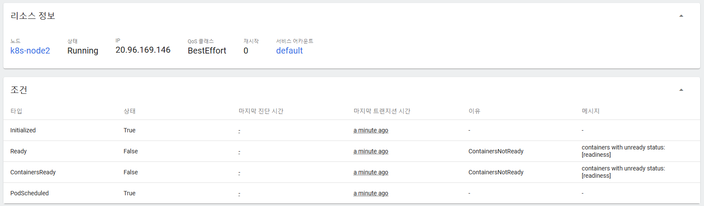
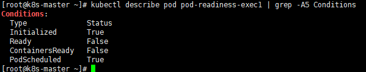
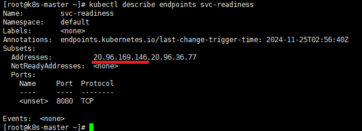
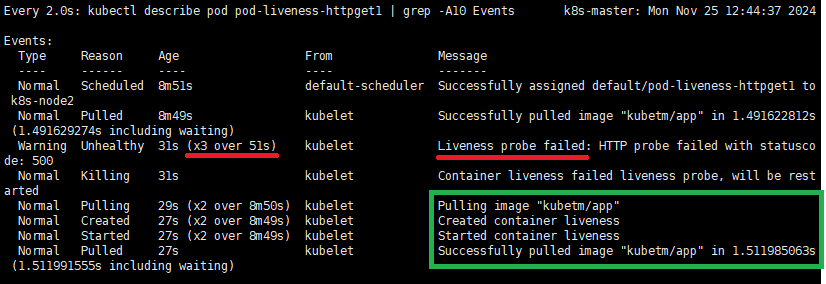

# Pod - Probe
* Probe는 컨테이너에서 kubelet에 의해 주기적으로 수행되는 진단
* kubelet은 컨테이너의 상태를 진단하기 위해 Handler를 호출
* Probe를 통해 컨테이너의 상태를 주기적으로 체크
  * 문제가 있는 컨테이너를 자동으로 재시작 하거나
  * 문제가 있는 컨테이너를 서비스에서 제외할 수 있음
* [공식 문서 참고](https://kubernetes.io/ko/docs/concepts/workloads/pods/pod-lifecycle/)

<br><br>

## Probe의 종류
* Readiness probe
  * 컨테이너가 요청을 처리할 준비가 되었는지 여부를 나타냄
  * Pod가 Running 상태여도 처음에 App이 로딩하는 시간이 있기 때문에 이 시간 동안은 App에 요청하려고 하면 오류가 발생
  * Readiness probe는 App이 구동되기 전까지 Service와 연결되지 않게 해줌
  * Probe가 실패하면 엔드포인트 컨트롤러는 파드에 연관된 모든 서비스들의 엔드포인트(서비스와 연결된 Pod) 목록에서 해당 파드의 IP를 제거함
  * App 구동 순간에 트래픽 실패를 없애줌
* Liveness probe
  * 컨테이너가 동작 중인지 여부를 나타냄
  * Pod은 정상적인 Running 상태이지만, 컨테이너의 App에 장애가 생겨서 응답이 안되는 경우를 감지함
  * Probe가 실패 횟수에 도달하면 kubelet은 컨테이너를 죽이고 [컨테이너를 재시작](https://kubernetes.io/ko/docs/concepts/workloads/pods/pod-lifecycle/#restart-policy) 함
  * App 장애시 지속적인 트래픽 실패를 없애줌
* Startup probe
  * 컨테이너 내의 App이 시작되었는지를 나타냄
  * startup probe가 주어진 경우, 성공할 때 까지 다른 나머지 probe는 활성화 되지 않는다.
    * 즉, startupProbe가 OK되기 전에는 readinessProbe와 livenessProbe가 동작하지 않음
  * App 기동이 오래 걸리는 상황일때 livenessProbe가 체크가되면 무한정 pod restart를 하게되고, 
    * readinessProbe역시 App기동이 되기 전에 활성화가 되면 요청이 실패함
    * 이러한 상황에서 Startup probe를 사용하면 좀 더 안정적으로 Probe 세팅이 가능
  * startup probe가 실패 횟수에 도달하면, kubelet이 컨테이너를 죽이고 [컨테이너를 재시작](https://kubernetes.io/ko/docs/concepts/workloads/pods/pod-lifecycle/#restart-policy) 함
* 

<br>

### Probe fail일때 Liveness probe vs Readiness probe
* Liveness Probe는 probe 핸들러 조건 아래 fail이 나면 pod를 재실행 시키지만,
* Readiness Probe는 probe 핸들러 조건 아래 fail이 나면 pod를 서비스로부터 제외
  * 서비스들의 엔드포인트 목록에서 해당 Pod의 IP가 제거됨
    * 제거? - NotReadyAddresses 목록에 추가됨
    * 성공시 - Addresses 목록에 추가
    * 

<br><br>

## Probe의 Handler
* 컨테이너의 상태를 진단하기 위해 어떻게 진단할 것인지 명시한 것이 Handler
* Pod의 spec에 Probe추가시, 아래의 3가지 Handler중 하나를 반드시 포함해야 함
  * `Exec`
    * Command - 실행할 명령어 배열
  * `TcpSocket`
    * Port - 포트 번호
    * Host - 호스트명 (선택 사항)
  * `HttpGet`
    * Port - 포트 번호
    * Host - 호스트명 (선택 사항)
    * Path - HTTP 요청 경로
    * HttpHeader - 추가 HTTP 헤더 목록 (선택 사항)
    * Scheme - HTTP 또는 HTTPS 중 선택

<br>

### Probe Handler의 공통 옵션
* initialDelaySeconds
  * 첫 Probe 실행 전 대기 시간
  * default - 0초
* periodSeconds
  * Probe 실행 주기
  * default - 10초
* timeoutSeconds
  * Probe 응답 대기 시간
  * default - 1초
* successThreshold
  * 성공으로 간주되기 전 연속 성공 횟수
  * default - 1회
  * Readiness Probe에서 설정 가능
    * Liveness와 Startup Probe에서는 항상 1로 고정
* failureThreshold
  * 실패로 간주되기 전 연속 실패 횟수
  * default - 3회

<br>

### Handler 그림 설명
* 

<br><br>

## Probe 사용시 주의 사항
* **successThreshold**는 Readiness Probe에서만 유의미하게 작동하며, Liveness와 Startup Probe에서는 항상 1로 고정
* **Startup Probe**가 정의된 경우, 해당 Probe가 성공할 때까지 **Liveness, Readiness Probe**는 비활성화
* Readiness Probe 성공 여부와 관계없이 Liveness Probe는 **독립적으로 실행**됨
* **terminationGracePeriodSeconds**는 PodSpec에서 설정하는 옵션으로, Probe 자체의 구성 옵션은 아님
  * Graceful shutdown을 위한 옵션으로 컨테이너가 종료되기 전에 대기해야 하는 시간을 지정
  * default:30
  * `K8s 1.25` 버전부터는 startup/Liveness Probe에 대해 개별적인 terminationGracePeriodSeconds를 설정할 수 있음
    * Readiness Probe는 실패해도 재시작되지 않으므로 terminationGracePeriodSeconds를 따로 설정할 수 없음
  * 설정 파일 예시
  * ```yaml
    spec:
      terminationGracePeriodSeconds: 3600  # pod-level
      containers:
      - name: test
        image: ...

        ports:
        - name: liveness-port
          containerPort: 8080

        livenessProbe:
          httpGet:
            path: /healthz
            port: liveness-port
          failureThreshold: 1
          periodSeconds: 60
          # Override pod-level terminationGracePeriodSeconds #
          terminationGracePeriodSeconds: 60
    ```

<br><br>

## Probe 별 옵션 지원 여부 정리
|         옵션 / Probe          | Readiness Probe | Liveness Probe | Startup Probe |
| :---------------------------: | :-------------: | :------------: | :-----------: |
|      initialDelaySeconds      |        ✅        |       ✅        |       ✅       |
|         periodSeconds         |        ✅        |       ✅        |       ✅       |
|        timeoutSeconds         |        ✅        |       ✅        |       ✅       |
|       successThreshold        |        ✅        |   ❌ (1 고정)   |  ❌ (1 고정)   |
|       failureThreshold        |        ✅        |       ✅        |       ✅       |
| terminationGracePeriodSeconds |        ❌        |       ✅        |       ✅       |

<br><br>

## 실습 내용 추가

### Readiness Probe
* service와 pod1이라는 Pod가 생성된 상태에서 아래의 설정 정보로 pod-readiness-exec1 이라는 Pod를 생성한 상황
  * host(node2)의 `/tmp/readiness`경로를 `/readiness`로 마운트
  * readinessProbe로 `/readiness/ready.txt` 경로에 해당하는 파일을 `cat`하는 커맨드가 들어 있음
  * host(node2)의 `/tmp/readiness` 경로에 `ready.txt`파일이 생성되어 있지 않은 상태
* pod-readiness-exec1의 설정 정보
  ```yaml
  apiVersion: v1
  kind: Pod
  metadata:
    name: pod-readiness-exec1
    labels:
      app: readiness  
  spec:
    containers:
    - name: readiness
      image: kubetm/app
      ports:
      - containerPort: 8080	
      readinessProbe:
        exec:
          command: ["cat", "/readiness/ready.txt"]
        initialDelaySeconds: 5
        periodSeconds: 10
        successThreshold: 3
      volumeMounts:
      - name: host-path
        mountPath: /readiness
    volumes:
    - name : host-path
      hostPath:
        path: /tmp/readiness
        type: DirectoryOrCreate
    terminationGracePeriodSeconds: 0
  ```
* Pod는 Running상태이지만, 마운트 경로에 `ready.txt`파일이 없어 해당 **Pod Conditions의 Ready와 ContainersReady가 false**인 상태
  * 대시보드에서 확인
  * 
  * `kubectl describe pod pod-readiness-exec1 | grep -A5 Conditions` 스크립트로 확인
  * 
* Probe가 실패한 경우, 엔드포인트 컨트롤러는 파드에 연관된 모든 서비스들의 엔드포인트(서비스와 연결된 Pod) 목록에서 해당 파드의 IP를 제거
  * 아래의 스크립트로 엔드포인트에 연결 되었는지 확인할 수 있음, 연결되지 않은 Pod의 IP가 `NotReadyAddresses`에 할당
  * `kubectl describe endpoints svc-readiness`
  * 
* 마운트된 경로에 `ready.txt`파일을 생성한 이후 다시 확인해 보면, svc-readiness 서비스의 엔드포인트 목록에 pod-readiness-exec1 파드의 IP가 추가됨
* 

<br>

### Liveness Probe 실습 내용
* livenessProbe를 포함하는 pod-liveness-httpget1 이라는 Pod 생성
  ```yaml
  apiVersion: v1
  kind: Pod
  metadata:
    name: pod-liveness-httpget1
    labels:
      app: liveness
  spec:
    containers:
    - name: liveness
      image: kubetm/app
      ports:
      - containerPort: 8080
      livenessProbe:
        httpGet:               # HttpGet 메소드로 점검
          path: /health        # 체크할 경로
          port: 8080           # 체크할 Port
        initialDelaySeconds: 5 # 최초 5초 후에 LivenessProbe 체크를 시작함
        periodSeconds: 10      # 10초마다 LivenessProbe 체크
        failureThreshold: 3    # 3번 실패시 Pod Restart
    terminationGracePeriodSeconds: 0
  ```
* `/health`경로로 요청하면 **500 에러를 내도록 임시로 설정**한 상황
  * 아래의 그림을 확인해 보면, 위의 yaml파일 설정대로 3번 실패후 LivenessProbe가 실패하고 컨테이너가 재시작된 상황
  * `watch "kubectl describe pod pod-liveness-httpget1 | grep -A10 Events"`
  * 

<br>

### ReadinessProbe와 LivenessProbe 실습 그림 설명
* 