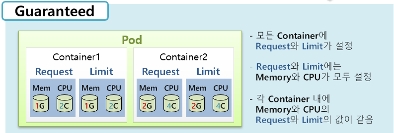
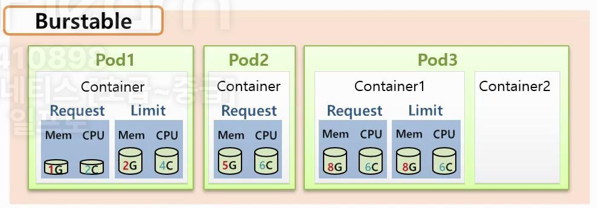
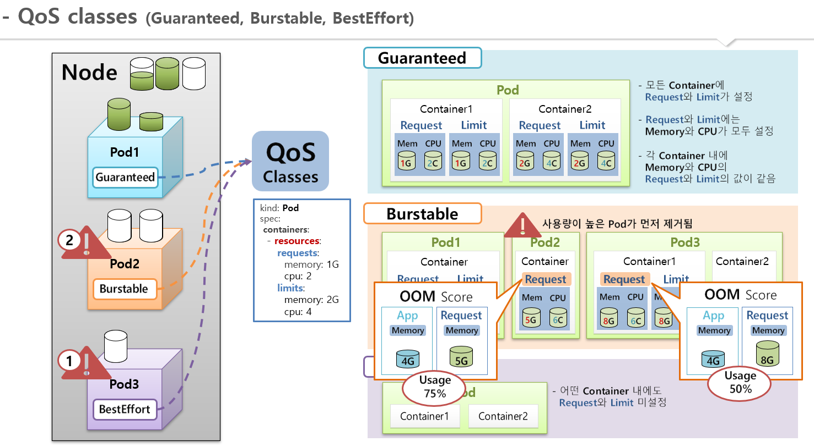
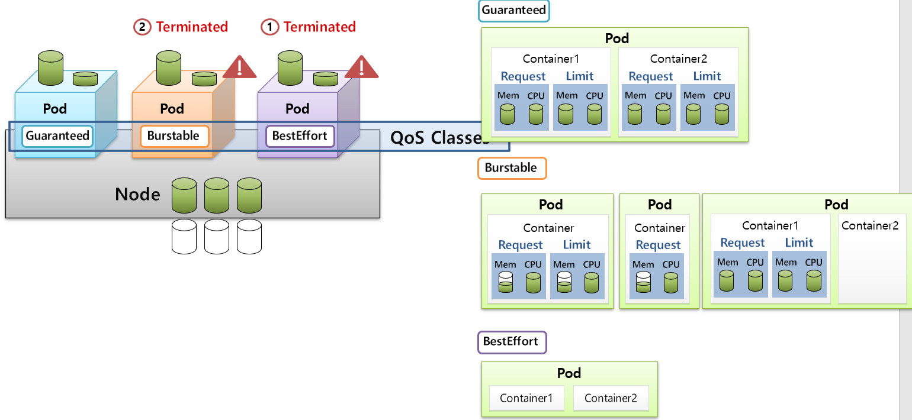
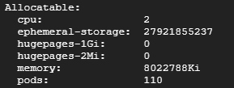
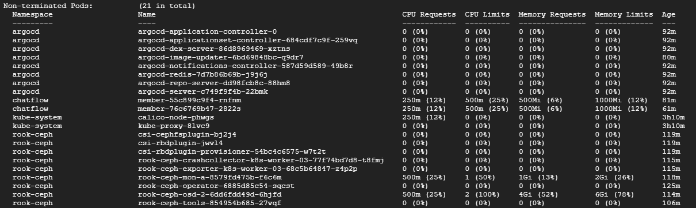
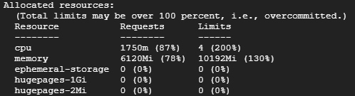

# Qos Class
* [공식 문서 참고](https://kubernetes.io/ko/docs/tasks/configure-pod-container/quality-service-pod/)
* 파드에 대한 서비스 품질(Qos:Quality of Service) 구성
* k8s에서 pod의 스케줄링과 제거 우선순위를 판단하는데 사용되는 값
* Node에서의 자원은 한정적이기 때문에, Node에서 Pod가 할당받을 리소스가 부족한 경우 스케줄러에 의해 Pod가 제거될 수 있음
* Pod-1에서 리소스가 부족한 경우 Pod-1이 항상 제거되는 것이 아니라 Qos Class에 따라서 다른 Pod가 제거되고 리소스를 반환받아 우선순위가 높은 Pod-1이 동작할 수 있음
* **제거** 우선순위 - BestEffort Pod가 가장 먼저 제거
  * 1.BestEffort
  * 2.Burstable
  * 3.Guaranteed

 

## 종류
* `Guaranteed` - 리소스를 정확히 요청하고 제한한 경우, 가장 높은 우선순위
* `Burstable` - 요청과 제한이 다르게 설정된 경우, 리소스를 버스트할 수 있음
* `BestEffort` - 리소스 요청과 제한이 설정되지 않은 경우, 우선순위가 가장 낮음

 

## Qos 기준
* `Guaranteed`
  * **모든 컨테이너**에 Memory와 CPU에 대한 Request 그리고 Limit가 설정되어 있어야 함 (4가지 모두!)
  * 컨테이너마다 Request와 Limit의 (Memory, CPU)값이 같아야 함 (Request == Limit)
* 
* `Burstable`
  * Guaranteed도 아니고 BestEffort도 아닌 경우
  * 예시
    * Pod1 - Request != Limit 인 경우
    * Pod2 - Request만 정의된 경우
    * Pod3 - 컨테이너1에는 Guarantee하게 설정되어 있지만 컨테이너2는 그렇지 않은 경우
* 
* `BestEffort`
  * Pod의 어떤 컨테이너에도 Request와 Limit가 정의되지 않은 경우에 해당

 

## Burstable Pod끼리의 제거 우선순위
* OOM(out of memory) score에 의해 제거 우선순위가 결정된다.
* OOM score 계산 방법 - (메모리사용량/메모리설정값*100)%
  * OOM score가 더 큰 Pod가 먼저 제거됨 - 대충, 메모리 초과 사용량이 많은 Pod부터 우선적으로 제거된다고 보면 된다.
  * 예시
    * Pod1의 컨테이너 Request Memory 5G
    * Pod3의 컨테이너 Request Memory 8G
    * Pod1의 실제 사용중인 메모리 - 4G
    * Pod3의 실제 사용중인 메모리 - 8G
    * 위와 같은 조건에서 Pod1의 메모리 사용률은 **75%**, Pod2의 메모리 사용률은 **50%**이므로 Pod1이 먼저 제거됨

  

## 참고 그림 설명
* 
* 

  

# 실습 추가 내용
## 노드의 Resource Allocatable Resource 및 Allocated Resource 확인하기
* k8s에서 Resource 라고 하면 cpu와 memory를 체크해야 한다.
* `kubectl describe node {노드명}`을 입력하면 노드의 정보를 확인할 수 있다.
* 그중 Allocatable 이라는 항목을 찾아볼 수 있다.
  * 아래 이미지를 보면 해당 노드의 Allocatable cpu는 2, memory는 8G로 확인된다.
  * 
* 조금 더 내려보면 각 Pod마다 예약받은 cpu와 memory정보를 확인할 수 있다.
  * 해당 이미지를 보면 **Requests와 Limits가 모두 0**인 Pod들이 있다. 해당 경우는 리소스 미설정(BestEffort)으로 메모리 부족시 제거 우선순위가 가장 높다.
  * **Request나 Limits중 하나만 설정**할 수도 있다. 이때 아래와 같이 동작하는데, 제거 우선순위는 위 내용에서 `Pod끼리의 제거 우선순위`항목을 참고하자.
    * Requests가 0인 경우
      * 해당 컨테이너(Pod)는 최소 리소스를 요청하지 않음
      * 노드에 남는 리소스가 1m라도 있으면 스케줄러가 이 Pod를 해당 노드에 올릴 수 있음
      * 즉, 최소 보장 리소스가 없으므로, 노드에 리소스가 거의 없어도 배치될 수 있음
    * Limits가 0(미설정)인 경우
      * 컨테이너는 노드의 남는 리소스를 제한 없이 사용할 수 있음
      * CPU의 경우, 노드에 여유가 있으면 얼마든지 사용할 수 있지만 다른 Pod와 경쟁 시 우선순위가 낮아짐
      * 메모리의 경우, 컨테이너가 노드의 메모리를 모두 사용할 수도 있지만, OOM이 발생하면, 우선순위(QoS)가 낮은 Pod부터 강제 종료 됨(Eviction)
    * 이때, 우선순위에 대한 
  * 
* 그리고 노드에서 예약받은 리소스의 Requests와 Limits 총량을 확인 가능한데, 아래 이미지의 Limits 자원을 보면 100%가 넘어간 상태이다.
  * 
  * 이렇게 리소스의 오버커밋(Overcommit)이 가능한 이유는 Requests와 Limits의 차이에 있다.
    * `Requests`: 노드에 스케줄링 시 보장되어야 하는 최소 리소스
      * Requests는 절대 100%를 초과할 수 없음
      * Kubernetes는 Requests 자원을 기반으로 Pod를 노드에 배치하기 때문
    * `Limits`: 컨테이너가 사용할 수 있는 최대 리소스
      * Limits는 100%를 초과할 수 있도록 설계됨, 200%까지 가능한듯
      * Limits는 실행 중 컨테이너 리소스 사용량 제한에 사용되기 때문

 

## 노드에서 OOM은 어떻게 발생하며 어떤 작업이 이루어질까?
* 다수의 파드가 메모리를 과도하게 사용하여 노드의 Allocatable 메모리를 초과하는 경우 OOM이 발생됨
* OOM 발생시 kubelet이 MemoryPressure를 감지하고 Pod Eviction을 시작함
* Eviction 순서는 QoS(Quality of Service) 클래스에 따라 결정됨
* Eviction 후에도 메모리가 부족하면 Linux 커널의 Global OOM Killer가 동작