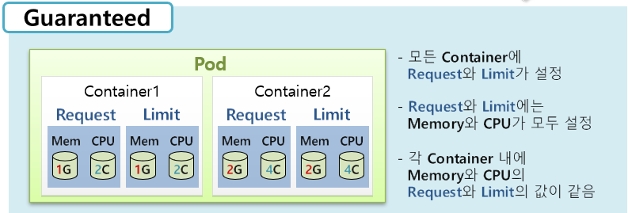
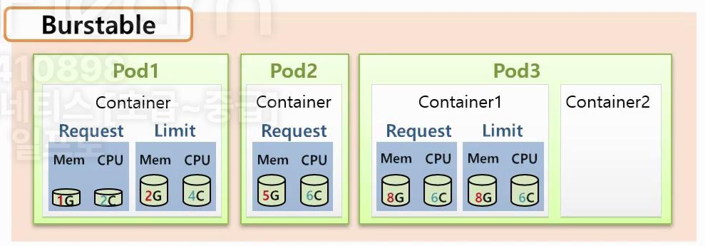
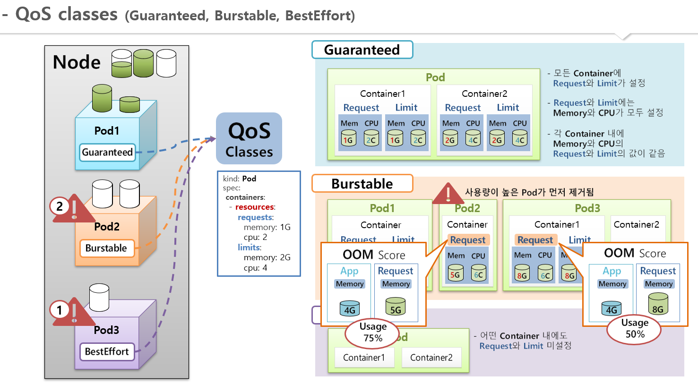
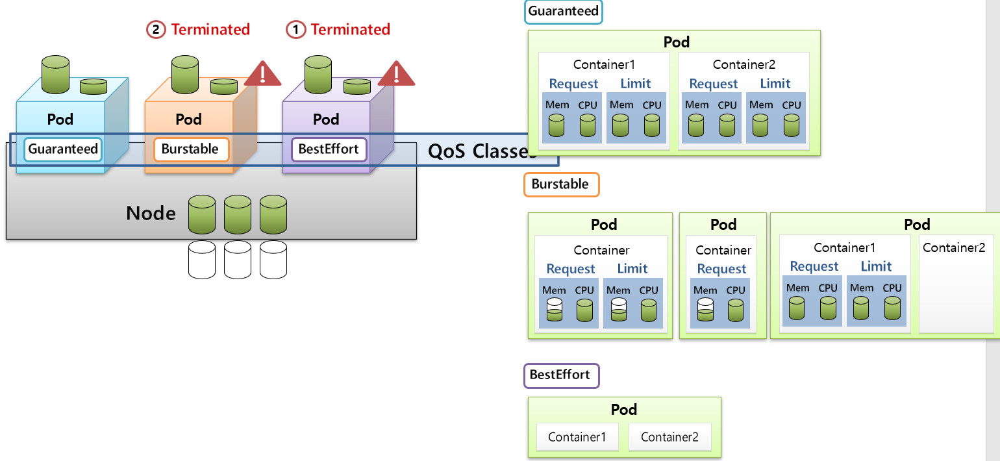

# Qos Class
* [공식 문서 참고](https://kubernetes.io/ko/docs/tasks/configure-pod-container/quality-service-pod/)
* 파드에 대한 서비스 품질(Qos:Quality of Service) 구성
* k8s에서 pod의 스케줄링과 제거 우선순위를 판단하는데 사용되는 값
* Node에서의 자원은 한정적이기 때문에, Node에서 Pod가 할당받을 리소스가 부족한 경우 스케줄러에 의해 Pod가 제거될 수 있음
* Pod-1에서 리소스가 부족한 경우 Pod-1이 항상 제거되는 것이 아니라 Qos Class에 따라서 다른 Pod가 제거되고 리소스를 반환받아 우선순위가 높은 Pod-1이 동작할 수 있음
* **제거** 우선순위 - BestEffort Pod가 가장 먼저 제거
  * 1.BestEffort
  * 2.Burstable
  * 3.Guaranteed

 

## 종류
* `Guaranteed` - 리소스를 정확히 요청하고 제한한 경우, 가장 높은 우선순위
* `Burstable` - 요청과 제한이 다르게 설정된 경우, 리소스를 버스트할 수 있음
* `BestEffort` - 리소스 요청과 제한이 설정되지 않은 경우, 우선순위가 가장 낮음

 

## Qos 기준
* `Guaranteed`
  * **모든 컨테이너**에 Memory와 CPU에 대한 Request 그리고 Limit가 설정되어 있어야 함 (4가지 모두!)
  * 컨테이너마다 Request와 Limit의 (Memory, CPU)값이 같아야 함 (Request == Limit)
* 
* `Burstable`
  * Guaranteed도 아니고 BestEffort도 아닌 경우
  * 예시
    * Pod1 - Request != Limit 인 경우
    * Pod2 - Request만 정의된 경우
    * Pod3 - 컨테이너1에는 Guarantee하게 설정되어 있지만 컨테이너2는 그렇지 않은 경우
* 
* `BestEffort`
  * Pod의 어떤 컨테이너에도 Request와 Limit가 정의되지 않은 경우에 해당

 

## Burstable Pod끼리의 제거 우선순위
* OOM(out of memory) score에 의해 제거 우선순위가 결정된다.
* OOM 계산 방법 - (메모리사용량/메모리설정값*100)%
  * OOM이 더 큰 Pod가 먼저 제거됨
  * 예시
    * Pod1의 컨테이너 Request Memory 5G
    * Pod3의 컨테이너 Request Memory 8G
    * Pod1의 실제 사용중인 메모리 - 4G
    * Pod3의 실제 사용중인 메모리 - 8G
    * 위와 같은 조건에서 Pod1의 메모리 사용률은 **75%**, Pod2의 메모리 사용률은 **50%**이므로 Pod1이 먼저 제거됨

  

## 참고 그림 설명
* 
* 