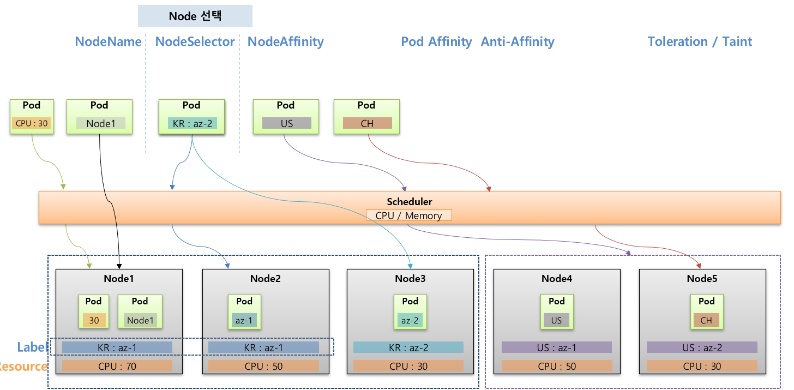
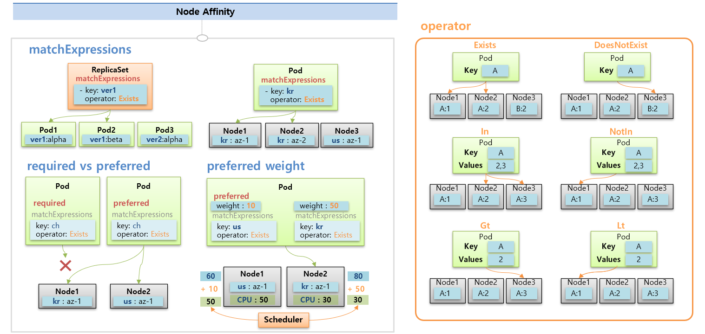
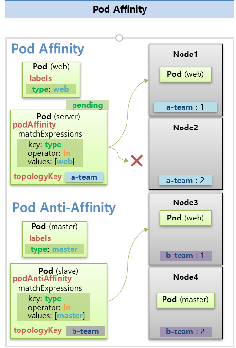
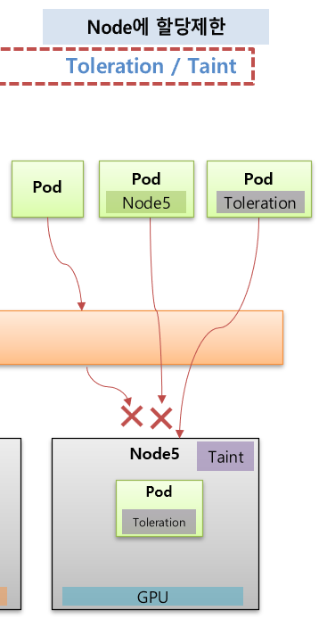

# Node Scheduling
* [공식 문서 링크](https://kubernetes.io/ko/docs/concepts/scheduling-eviction/kube-scheduler/)
* **스케줄러**는 k8s의 컨트롤 플레인의 일부로 실행됨
* **스케줄링**은 **Kubelet**이 파드를 실행할 수 있도록, **스케줄러**가 해당 파드가 노드에 적합한지 확인하는 과정을 말함
* **스케줄러**는 노드가 할당되지 않은 새로 생성된 파드를 감시
* **스케줄러**가 발견한 모든 파드에 대해 스케줄러는 해당 파드가 실행될 최상의 노드를 찾는 책임을 가짐
* 파드는 스케줄러에 의해 기본적으로 **자원이 많은 노드**에 할당이 되지만 Pod설정에서 다양한 옵션으로 원하는 노드에 선택적으로 할당시킬 수 있음
  * **Node선택**
    * NodeName
    * NodeSelector
    * NodeAffinity
  * **Pod집중/분산**
    * PodAffinity
    * AntiAffinity
  * **Node할당제한**
    * Toleration
    * Taint
* 또는 API를 사용하면 파드를 생성할 때 노드를 지정할 수도 있다 (잘 안쓰긴 함)

  

## 1. Node 선택 - Node Affinity
* 파드가 특정 노드에 할당되도록 선택하기 위한 용도로 사용 가능
* `NodeName`
  * 스케줄러 상관없이 정해진 NodeName에 할당되도록 설정 가능
  * 노드 이름이 변경되는 경우가 빈번하기 때문에 잘 사용하지 않는 방식
* `NodeSelector`
  * 해당하는 라벨이 달려있는 노드에 파드가 할당됨 (key:value 모두 일치해야 함)
  * 해당하는 라벨이 여러개인 경우, 스케줄러에 의해 자원이 더 많은 노드에 할당됨
  * 매칭되는 라벨이 없는 경우, 파드가 할당되지 않아 **에러 발생**
* `NodeAffinity`
  * 위의 NodeName과 NodeSelector방법의 단점들을 보완한 방법
  * key만 기재되어 있어도 스케줄러가 파드를 할당해 줌
  * 일치하는 라벨이 없어도 자원이 많은 노드에 알아서 할당해 줌
  * 

### 1.1. NodeAffinity 추가 설명 (아래의 그림 참고)
* `matchExpressions` 설정에 따라 조건에 맞는 노드에 파드를 할당할 수 있음
* `required`설정으로 반드시 포함되어야 하는 matchExpression 설정이 가능함
* `preferred`설정으로 우선 순위가 높은 matchExpression 설정이 가능하며 weight를 할당할 수도 있음
* 

  

## 2. Pod간 집중/분산 - Pod Affinity
* 여러 파드들을 하나의 노드에 집중시켜 할당하거나 파드들간의 겹치는 노드없이 분산해서 할당 가능
* `Pod Affinity`
  * 예시 - Web파드와 Server라는 파드가 노드의 PV를 공유해야 하는 경우, 두 파드는 모두 같은 노드에 할당 되어야 함(어느 노드든)
    * Server파드 설정에 **Pod Affinity**옵션을 넣고 Web파드와 같은 라벨을 지정하면 Web파드가 할당된 노드에 같이 할당됨
* `Pod Anti Affinity` - 예시로 설명
  * 예시 - Master파드가 중지 되었을때 Slave파드가 백업을 해줘야 하는 경우, 두 파드는 각각 다른 노드에 할당 되어야 함
    * Slave파드 설정에 **Anti Affinity**옵션을 넣고 Master파드와 같은 라벨을 지정하면 Master파드와 다른 노드로 할당됨
* 

### 2.1. podAffinity & podAntiAffinity 추가 설명
* `podAffinity와 podAntiAffinity의 matchExpressions`설정을 통해 매칭되는 파드와 같거나(podAff) 다른(podAntiAff) 노드에 파드를 할당할 수 있음
  * 즉, 파드의 라벨과 매칭되는 matchExpressions설정
* topologyKey 옵션을 통해 적용되는 노드의 범위를 지정할 수 있음
  * ex1. podAffinity설정의 matchExpressions에서 해당되는 Pod가 있다고 해도 toplogyKey에 해당하는 노드에 매칭되는 Pod가 없다면 해당 파드는 생성되지 않음
  * `todo:test` ex2. podAntiAffinity설정의 matchExpressions에서 해당되는 Pod가 있다고 해도
* 

  

## 3. Node에 할당 제한 - Taint & Toleration
* `Taint`설정으로 특정 노드에 Pod가 할당되지 않도록 제한할 수 있음
  * Taint설정된 노드에는 Pod설정에 NodeName으로 지정해도 해당 노드에 할당이 되지 않음
  * ex1. GPU bound Application 파드가 스케줄링되는 노드
  * ex2. Batch Job 파드가 스케줄링되는 노드
* `Toleration`설정을 Pod에 추가해 주면, Taint설정이 들어간 노드에 해당 Pod가 할당될 수 있음
  * Toleration 설정은 기본적으로 해당 Pod가 Toleration설정과 매칭되는 **Taint설정된 노드에 스케줄링하기 위함이 아님**
  * 따라서 Toleration설정한 Pod를 Taint설정된 특정 노드에 스케줄링 되도록 하고 싶다면, NodeSelector나 NodeAffinity를 설정해 주어야 함
* 

### Taint & Toleration 추가 설명
* NoSchedule 설정
  * Master 노드의 default 설정으로 NoSchedule이 설정되어 있어 기본적으로 Pod가 할당되지 않음
  * NoSchedule 설정된 노드에 특정 파드를 스케줄링하고 싶다면, Pod의 Toleration설정에 effect:NoSchedule 옵션과 함께 노드의 Taint labels도 기재해 주어야 함
  * 파드가 이미 스케줄링 되어있는 노드에 NoSchedule설정을 추가해도, 기존의 파드들은 삭제되지 않음
* NoExecute 설정
  * NoSchedule과는 다르게, 파드가 이미 스케줄링 되어있는 노드에 NoExecute설정을 추가하면, 이미 스케줄링되어 있는 노드들도 삭제가 되고 replicaSet에 의해 다른 노드에 할당
  * cf. 특정 노드에 장애가 발생하면 해당 노드에 Taint:NoExecute 설정이 추가되고 스케줄링된 Pod들이 삭제된다. Pod가 옳바르지 않게 동작할 수 있기 때문.
* 