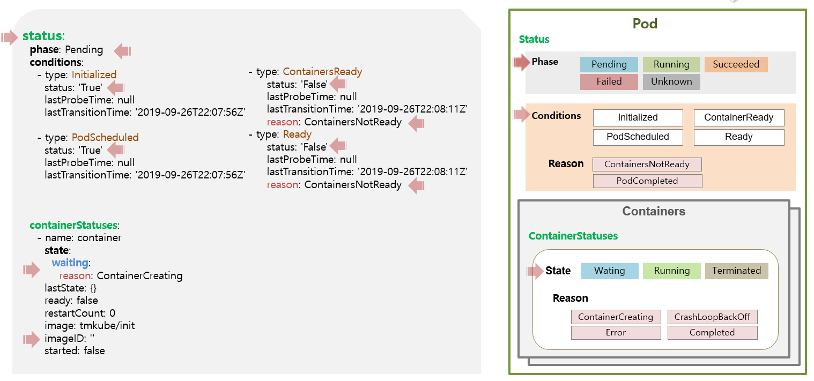
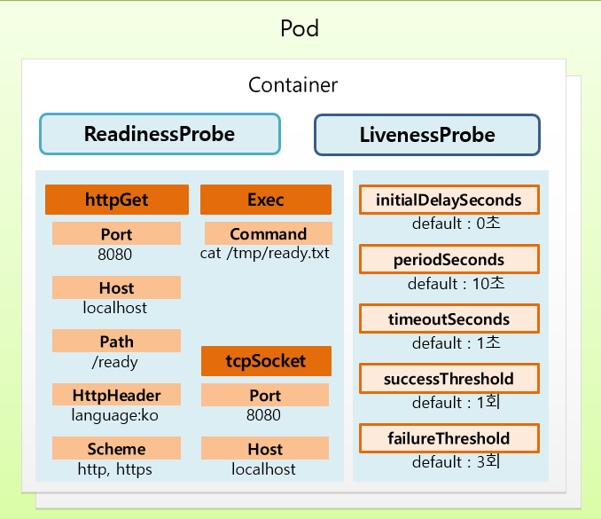

# Section 6
* Pod에 대한 심화 개념 설명
* 해당 페이지는 아래의 항목에 대한 종류만 나열
  * Pod의 Life Cycle에 대해
  * Pod의 Probe에 대해
  * Pod의 QoS Classes
  * Pod의 Node Scheduling

  

## Pod의 `Life Cycle`
### Pod의 `Status`
* `Phase` 5가지 - Pod의 메인 상태를 나타냄
  * Pending
  * Running
  * Succeeded
  * Failed
  * Unknown
* `Conditions` 4가지 - Pod가 생성되면서 실행하는 단계와 속성
  * Initialized
  * ContainerReady
  * PodScheduled
  * Ready
  * `Conditions의 Reason` 2가지 - Conditions의 세부 내용
    * ContainerNotReady
    * PodCompleted
    * cf. 아래의 이미지에서 status가 False인 이유로 ContainerNotReady가 표기됨

### Container의 `ContainerStatus`
* Pod의 컨테이너 마다 `ContainerStatus`가 있음
* ContainerStatus `State` 3가지 - 컨테이너의 상태
  * Waiting
  * Running
  * Terminated
  * `ContainerStatus의 Reason`4가지 - State에 대한 세부 내용
    * ContainerCreating
    * CrashLoopBackOff
    * Error
    * Completed
    * cf. 아래의 이미지에서 상태가 waiting인 이유로 ContainerCreating이 표기됨

### Pod & Container 상태 이미지 설명
* 

  

## Pod의 `Probe`
### Probe 종류
* Liveness probe
* Readiness probe
* Startup probe (강의에서는 다루지 않음)
### Probe의 `Handler`
* Pod의 yaml파일에 Probe추가시, 아래의 3가지 Handler중 하나를 포함해야 함
* `Exec`
  * Command
* `TcpSocket`
  * Port
  * Host
* `HttpGet`
  * Port
  * Host
  * Path
  * HttpHeader
  * Scheme
### Probe Handler의 공통 옵션
* initialDelaySeconds
* periodSeconds
* timeoutSeconds
* successThreshold
* failureThreshold

### Probe 별 옵션 지원 여부 정리
|         옵션 / Probe          | Readiness Probe | Liveness Probe | Startup Probe |
| :---------------------------: | :-------------: | :------------: | :-----------: |
|      initialDelaySeconds      |        ✅        |       ✅        |       ✅       |
|         periodSeconds         |        ✅        |       ✅        |       ✅       |
|        timeoutSeconds         |        ✅        |       ✅        |       ✅       |
|       successThreshold        |        ✅        |   ❌ (1 고정)   |  ❌ (1 고정)   |
|       failureThreshold        |        ✅        |       ✅        |       ✅       |
| terminationGracePeriodSeconds |        ❌        |       ✅        |       ✅       |

### 이미지 설명
* 

  

## Pod의 Qos
### QOS 종류
* `Guaranteed`
* `Burstable`
* `BestEffort`

### **제거** 우선순위
* 1.BestEffort
* 2.Burstable
* 3.Guaranteed

  

## Pod의 Node Scheduling
* **Node선택** - NodeName, NodeSelector, NodeAffinity
* **Pod집중/분산** - PodAffinity, AntiAffinity
* **Node할당제한** - Toleration, Taint