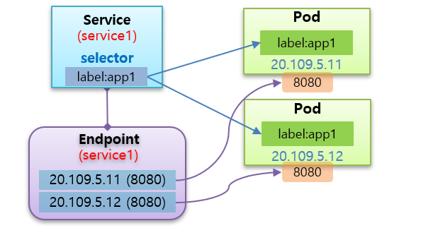
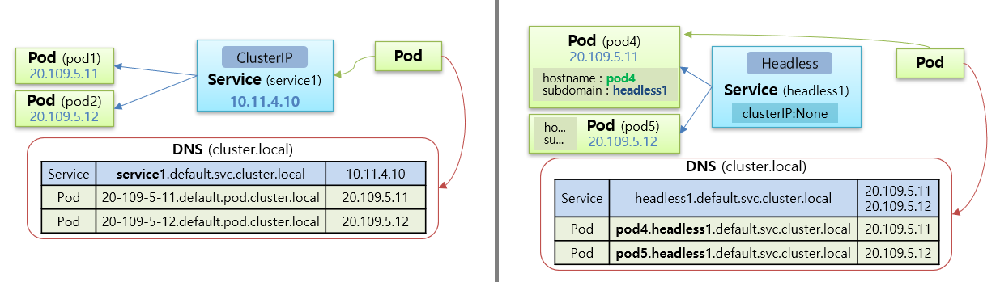
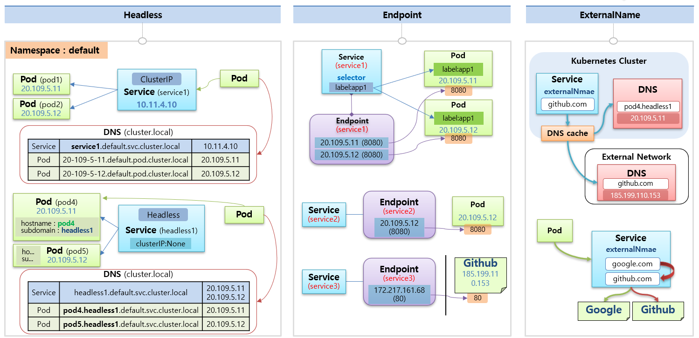

# Service
* Service를 더욱 심도있게 이해하기 위해서 Endpoint, CoreDNS, 그리고 kube-proxy의 개념에 대해 먼저 확인이 필요함

 

## Endpoint
* Endpoint는 Kubernetes의 **Service와 연결된 Pod들의 IP 주소 및 포트**를 나타냄
* Endpoint는 Service가 트래픽을 라우팅할 수 있도록 하는 핵심 정보를 가지고 있음
* ex. 특정 서비스에 여러 파드가 연결된 경우
  * 서비스가 여러 Pod로 트래픽을 분산시키기 위해, 해당 서비스의 Endpoint 객체는 연결된 Pod들의 IP 주소 목록을 포함
  * 

  

## CoreDNS
* CoreDNS는 Kubernetes 클러스터 내에서 **서비스 디스커버리**를 담당
* 서비스와 파드에 대한 Domain을 생성
* 서비스와 파드의 도메인과 해당하는 ip가 저장되어 있음
* 생성된 Domain 통해 클러스터 내부의 오브젝트(서비스, 파드)가 IP 주소 대신 Domain 이름으로 통신할 수 있도록 함
* 왜 도메인으로 접근이 필요할까?
  * k8s환경에서 Pod는 빈번하게 동적으로 할당, 변경, 제거됨
  * DNS를 이용하면 이러한 변화에 대응하여 안정적인 네트워크 연결을 제공할 수 있음

  

## CoreDNS와 Endpoint 통신
* CoreDNS는 Kubernetes API 서버를 통해 **Endpoint 정보를 조회**하여, Service에 대한 Domain 요청을 해당하는 Pod로 라우팅할 수 있도록 함
* Headless Service의 경우, CoreDNS는 ClusterIP Service를 거치지 않고 직접 Pod의 Endpoint IP 주소를 반환
* ex. Pod가 다른 Pod와 통신하고자 하는 경우 
  * Cluster IP Service 이용(아래 그림의 왼쪽) - Service 도메인을 통해 Pod1, Pod2와 통신
  * Headless Service 이용(아래 그림의 오른쪽) - Pod 도메인 이용하여 바로 Pod4, Pod5와 통신
  * 

  

## kube-proxy
* kube-proxy는 **각 노드마다** 실행되는 네트워크 프록시로, **노드 레벨에서 트래픽을 처리**하고 라우팅 규칙을 설정하는 역할을 함
* kube-proxy는 Service와 연결된 여러 Pod들의 **엔드포인트 목록을 관리**하는 역할을 함
* Service에 트래픽이 유입되면, 각 노드마다 존재하는 kube-proxy에 의해 **트래픽이 분산**됨

  

## Service 관련 추가 내용
* Service의 설정은 Kubernetes API 서버에 저장되어 있음
* Service 자체는 물리적으로 특정 노드에 배치되지 않으며, **클러스터 전역에서 논리적으로 동작**
* Service는 클러스터 전역에서 동작하지만, 네임스페이스 기반으로 분리되어 있어 이름이 동일한 서비스라도 네임스페이스가 다르면 생성될 수 있음
* Service는 클러스터 내부에서 엔드포인트(ClusterIP 등)를 제공하는 역할을 함
* Service는 워크로드에 포함되지 않음 
  * 워크로드가 아니기 때문에 Deployment Controller 삭제시 함께 삭제되지 않음
  * 
* 즉, Service는 Pod들의 로드 밸런싱을 지원하는 추상화된 개념이라고 볼 수 있음

  

## 트래픽 분산 과정 - Service와 kube-proxy
* `kube-proxy`는 각각의 노드마다 실행되며, Service로부터 들어오는 트래픽을 관련된 Pod(Endpoint)로 라우팅 되도록 함
* `NodePort` 타입의 Service의 경우, 클라이언트가 직접 `특정 노드`를 지정하거나 외부 로드 밸런서를 통해 `여러 노드`로 분산할 수 있음
* `LoadBalancer` 타입의 Service의 경우, Plugin으로 설치된 로드밸런서가 트래픽을 `여러 노드`로 분산시켜줌
* `ClusterIP` 타입의 Service의 경우에는, Service에 연결된 Pod들이 각각 `다른 노드`에 위치할 수 있음
  * 해당 요청은 각 노드마다 존재하는 kube-proxy에 의해 처리되는데,
  * ClusterIP Service에 들어오는 요청들의 자세한 처리 과정은 아래와 같음
    1. ClusterIP Service로 들어오는 요청은 클러스터 내의 어느 노드로든 전달될 수 있음
    2. 도달한 노드의 kube-proxy가 iptables 또는 IPVS 규칙을 사용해 적절한 Pod로 트래픽을 라우팅합니다.
    3. kube-proxy는 Service의 Endpoint 목록 중 하나를 선택하여 로드 밸런싱하며,
    4. **선택된 Pod가 다른 노드에 있다면**, CNI(ex.calico)를 통해 패킷이 전달됨

  

## Service - 중급편 내용
* [이전(section 4)](/k8s-basic/section-04/2.Service/service.md)에는 service를 통해 파드에 접근하는 방법을 다뤘음
* section 7 에서는 **파드 입장**에서 원하는 서비스(파드)에 접근하거나 외부 서비스에 접근하는 방법을 다룸
  * 파드에서 서비스로 접근 - `Headless` Service와 Cluster내의 DNS Server 이용
  * 파드에서 외부 서비스 - `ExternalName` Service 이용
* Service를 통해 분산된 트래픽이 Pod에 전달됨
  * 트래픽 분산은 k8s의 kube-proxy에 의해 이루어 짐
  * kube-proxy는 각 노드에서 실행되며, 서비스와 연결된 Pod들의 **엔드포인트 목록을 관리**
* `todo`

 

### 그림 설명
* 