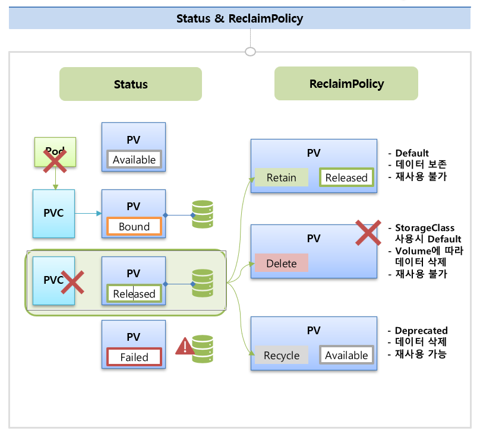

# Volume
* `todo`: 추후 Storage Solution 설치시 다시 정리
* Storage Solution
  * [RookCeph or GlusterFS설치]()
* Dynamic Provisioning

## Provisioning?
* `Static Provisioning` ?
  * 정적 프로비저닝에서는 클러스터 관리자가 수동으로 Persistent Volume(PV)을 생성
  * 해당 PV의 용량, 액세스 모드 및 저장소 유형과 같은 하위 저장소의 세부 정보를 지정
  * 이러한 PV는 사용자가 생성하는 Persistent Volume Claim(PVC)에서 요청될 수 있음
  * 사용자가 PVC를 생성하면 쿠버네티스는 해당 PVC의 요구 사항과 일치하는 사용 가능한 PV에 바인딩
* `Dynamic Provisioning` ?
  * 동적 프로비저닝에서는 PVC요청에 대한 PV를 생성하는 과정을 자동화 함 - 클러스터 관리자의 수동 개입을 없애줌
  * 클러스터 관리자는 PV생성을 위한 템플릿인 StorageClass를 정의해야 함
  * 각 StorageClass는 PV를 생성하는 책임이 있는 프로비저너를 지정
  * 사용자가 특정 StorageClass를 참조하는 PVC를 생성하면 프로비저너는 PVC의 요구 사항과 일치하는 PV를 자동으로 생성

## Volume의 Status와 ReclaimPolicy
* 