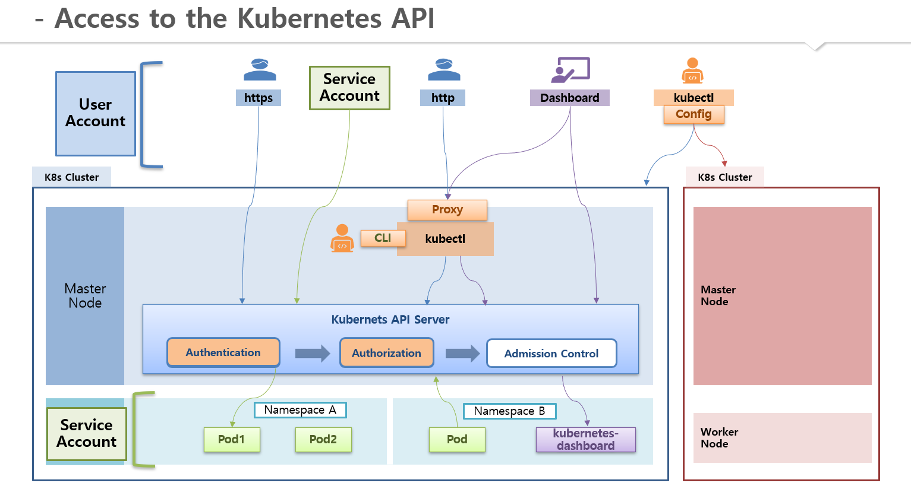

# Authentication
* k8s의 자원을 생성하거나 조회를 하려면 k8s의 API Server를 거쳐야 함
* 클러스터 내부에서는 kubectl명령어로 API Server에 접근할 수 있지만, 외부에서 접근하려면 **인증서**를 가지고 있어야 API Server에 접근가능함

 

## k8s API Server에 어떻게 접근?
* 사용자는 `User Account`로 접근 가능
  * 즉, 인증서가 필요함
* Pod에서(클러스터내에서) API Server에 접근하려면? `Service Account`를 통해 접근 가능함
  * Service Account를 외부에서 접근 가능하도록 설정할 수도 있음
* User Account나 Service Account를 사용할 수 있다고 해도 API Server의 모든 기능을 사용할 수는 없음
  * Account에 해당하는 권한이 추가되어 있어야 함
    * [Authorization 문서](/k8s-basic/section-07/4.Authorization/authorization.md) 확인
* 

 

## 외부에서 k8s API Server에 접근하는 3가지 방법
* **X509 Client Certs**로 접근
  * 인증서(`client key`와 `client crt`)를 가지고 https통신하면 접근 가능
  * kubectl에는 kubeconfig정보가 복사되어 있어 API Server에 접근할 수 있는데,
    * kubectl에`accept-host`옵션으로 8001번 포트로 proxy를 열어두면 외부에서 인증서 없이 http로도 접근이 가능함
* **kubectl**로 접근
  * 외부 서버에 kubectl을 설치하여 k8s클러스터에 접근하는 방법임
  * 멀티 클러스터 환경에서 각 클러스터의 kubeconfig가 사용자의 kubectl에 있다면, 원하는 k8s 클러스터에 접근할 수 있음
  * kubeconfig 구성
    * contexts 안에 cluster정보와 연결한 user의 정보가 담겨 있음
    * 
    * 멀티 클러스터 환경은?
      * 아래의 그림과 같은 구성이고, `kubectl config user-context context-A`와 같은 명령어로 클러스터를 지정하고 kubectl명령어로 자원을 생성&조회할 수 있음
      * 
* **Service Account**로 접근
  * Namespace를 생성하면 해당하는 Namespace의 ServiceAccount가 자동으로 생성됨
  * Pod 생성시 해당하는 Namespace의 ServiceAccount가 연결되며,
  * ServiceAccount에는 Secret이 하나 연결되어 있고 그 안에는 token이 있음
  * 따라서 token만 알고 있으면 외부 사용자가 k8s의 API Server에 접근할 수 있음
  * 
  
 

### 그림 설명
* 