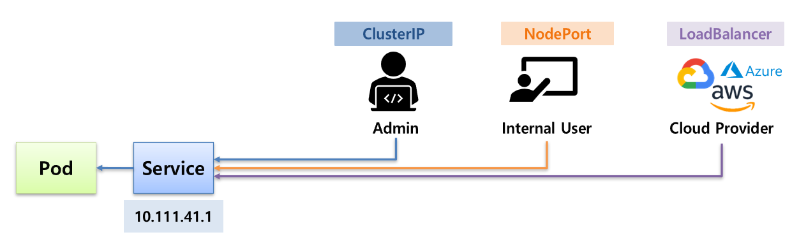
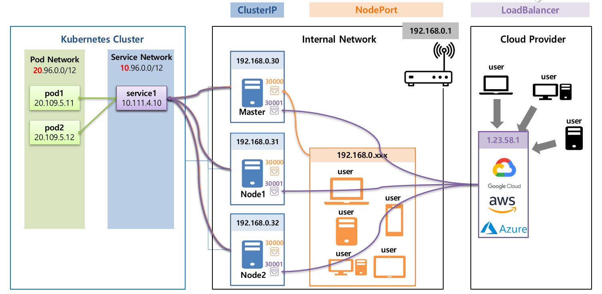

# Section 7
* Service 오브젝트에 대한 추가설명
  * 이전(section 4)에는 service를 통해 파드에 접근하는 방법을 배웠음
  * 
  * section 7 에서는 **파드 입장**에서 원하는 서비스(파드)에 접근하거나 외부 서비스에 접근하는 방법을 다룸
  * cf. 초급에서 다뤘던 내용
    * ClusterIP 타입의 Service를 통해 클러스터 내에서 파드에 접근하는 방법
    * NodePort 타입의 Service를 통해 외부에서 파드에 접근하는 방법
      * port와 파드가 위치한 노드의 ip를 알고 있어야 함
    * 클라우드 서비스를 이용하는 경우, LoadBalancer 타입의 서비스를 이용하여 도메인으로 접근하는 방법
    * 
* Volume 오브젝트에 대한 추가 설명
  * storage solution
  * Dynamic Provisioning
  * Volume의 Status & Reclaim Policy